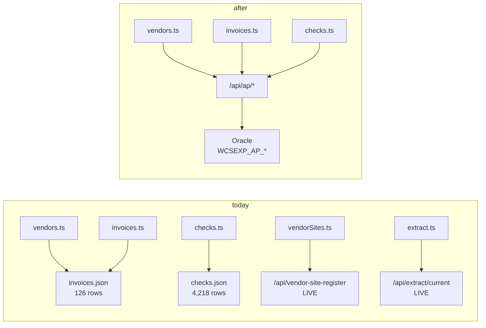

# AP Live Data — Implementation Plan

**Status:** DRAFT — for review · **Created:** 2026-09-22 · **Revision:** 1

| | |
|---|---|
| **Purpose** | Replace the three screens that read `app/public/oracle/*.json` with live Oracle routes, so every register in the app reads one source of truth |
| **Scope** | `server/src/db/store.ts` (registry), a new `server/src/routes/ap.ts`, and the repoint of `app/src/data/{checks,invoices,vendors}.ts`. **Not** the frozen files' deletion — they stay as the fallback |
| **Grounded in** | The measured probe in §2 (every AP object's reachability and row count), `server/scripts/pull-ap-extract.mjs` (the working query set), `routes/vendorSites.ts` (`scopeClause`), and the Lenovo investigation that prompted this |
| **Depends on** | `DB_MODE=oracle` and the existing Oracle pool — both shipped |
| **Supersedes** | — |

---

## 1. The answer in one line

**The AP data is already readable on this deployment — 8 of the 10 objects answer, holding
millions of rows. Nothing needs a DBA grant. What is missing is that this app has no route to
them, so three screens read a frozen JSON file instead.**

The distinction matters and it is the reason this plan exists: **"not registered" is not "not
available"**. I initially reported the AP surface as a possible data gap; §2 is the measurement that
corrects that, and it changes the work from *wait for a grant* to *wire up routes*.



---

## 2. ★★ THE MEASUREMENT — the AP surface is readable, and it holds rows

Probe run against `POWERAPPS@europa.wcss.net:1541/ebs_FA2DB`, with **two controls** (a bogus object
name that must fail, and `GL_PERIODS` which the app reads today and must pass). Both behaved
correctly, so the successes below are evidence rather than a harness that swallows errors.

| Object | Rows | Readable? |
|---|---|---|
| `APPS.WCSEXP_AP_CHECKS` | **1,246,676** | ✅ |
| `APPS.WCSEXP_AP_INVOICES` | **2,569,410** | ✅ |
| `APPS.WCSEXP_AP_INVOICE_PAYMENTS` | **2,653,590** | ✅ |
| `APPS.WCSEXP_PO_VENDORS` | **79,685** | ✅ |
| `APPS.AP_INVOICE_LINES_ALL` | **6,239,904** | ✅ |
| `APPS.AP_INVOICES_ALL` | **2,569,410** | ✅ |
| `APPS.AP_INVOICE_PAYMENTS_ALL` | **2,653,590** | ✅ |
| `APPS.AP_INVOICE_DISTRIBUTIONS_ALL` | **6,928,672** | ✅ |
| `APPS.AP_CHECKS_ALL` | — | ❌ `ORA-00942` |
| `APPS.WCSEXP_AP_INVOICE_LINES` | — | ❌ `ORA-00942` |

### 2.1 ★ The two failures are not blockers, and no DBA ask follows

- **`AP_CHECKS_ALL`** → `WCSEXP_AP_CHECKS` (1,246,676 rows) is the view the working extract script
  already uses. The base table is not needed.
- **`WCSEXP_AP_INVOICE_LINES`** → does not exist, and `pull-ap-extract.mjs`'s own header records it
  (*"`WCSEXP_AP_INVOICE_LINES` does not exist — ORA-00942 — so a base table is the only route"*),
  reaching `AP_INVOICE_LINES_ALL` instead — which **is** readable.

**So the DBA ask is: nothing.** This plan needs no grant, no view creation, and no DBA involvement.

### 2.2 ★★ THE WINDOW IS EXACT — the live route returns the same population as the file

The views are unscoped: `WCSEXP_AP_CHECKS` holds **1,246,676** rows against the extract's **4,218**.
A route that read the view whole would try to render a million rows. The filter is one fiscal year,
derived rather than hard-coded, and the measurement proves it lands exactly:

| | Whole view | In-window |
|---|---|---|
| Checks | 1,246,676 | **4,218** |
| Payment links | 2,653,590 | **10,388** |

**`4,218` is byte-identical to the extract's check count.** So the live route and the frozen file
describe the same population, and the repoint is a source swap rather than a data change.

The window, copied from `pull-ap-extract.mjs`:

```sql
SELECT TO_CHAR(MIN(START_DATE),'YYYY-MM-DD') AS FY_START
  FROM APPS.GL_PERIODS
 WHERE PERIOD_YEAR = (SELECT MAX(PERIOD_YEAR) FROM APPS.GL_PERIODS)
```

Measured: **fiscal year 2027, `2026-07-01 → 2027-06-30`**.

### 2.3 ★★ WHAT THE LIVE SOURCE ADDS THAT THE FILE CANNOT: `VENDOR_ID`

This is the finding that answers the question that started this work.

| | `invoices.json` | `WCSEXP_AP_INVOICES` |
|---|---|---|
| `VENDOR_NAME` | ✅ | via `PO_VENDORS` |
| **`VENDOR_ID`** | ❌ **absent** | ✅ **present** |
| **`VENDOR_SITE_ID`** | ❌ absent | ✅ **present** |

**So the live source can join the AP surface to the sites register on `VENDOR_ID`** — a link the
frozen extract cannot express at all. And `WCSEXP_PO_VENDOR_SITES` carries `VENDOR_ID` too, so the
join is a real foreign key on both sides, not a name match.

**Measured, the Lenovo case end to end:**

| Question | Frozen file | Live Oracle |
|---|---|---|
| Lenovo companies | **0** — not in the file | **1** (`VENDOR_ID=65997`) |
| Lenovo invoices | 0 | **1** — `N300846295`, $2,273.70 |
| Lenovo checks | 0 | **2** — `63398` $323,678.63, `228339` $1,726.73 |
| Lenovo sites | 6 in Oracle, **2** named by an in-scope order | same |

So the asymmetry the user reported — *"two Vendor sites for Lenovo, but no Vendor company"* — is
**the frozen file, exactly**. The sites page reads live Oracle and finds Lenovo; the companies page
reads `invoices.json` and cannot.

**And the sites count is correct, not a bug.** The register is order-driven: a site appears only when
an in-scope purchase order named it. Lenovo's 6 sites reduce to **2** — `EP-POBOX1391 OR` (165
orders) and `1009THINKPLA OR` (1 order). The other four have no in-scope purchasing. The register's
own total confirms the predicate: **5,692 in-scope orders**, the same figure the endpoint reports.

### 2.4 ★★ THE INVOICE SCOPE IS EXPRESSIBLE LIVE, AND IT LANDS ON 126 EXACTLY

This was the plan's open question 1, and it is now answered rather than deferred. The extract's 126
rows are scoped (its envelope declares fund 04 / programs 861,862,863), so a live route has to
reproduce that predicate. Measured:

| Query | Result |
|---|---|
| Invoices in the window, **unscoped** | 3,743 |
| Scoped through **`AP_INVOICE_DISTRIBUTIONS_ALL`** | **126** ✅ |
| Scoped through `AP_INVOICE_LINES_ALL` | 61 ❌ |

**`126` is the extract's own count.** So the distribution is the right route and the line is not —
and the line's 61 is the discriminator that proves the choice rather than assuming it. An invoice's
*line* carries a default account that may differ from where the money was actually distributed, so
scoping on the line under-reports.

### 2.5 ★ THE COLUMN IS `DIST_CODE_COMBINATION_ID`, AND THE DICTIONARY CANNOT TELL YOU

`AP_INVOICE_DISTRIBUTIONS_ALL` has **244 columns** and the account column is
**`DIST_CODE_COMBINATION_ID`** — *not* `CODE_COMBINATION_ID`, which is what a first guess produced
and what `ORA-00904` rejected.

**And `ALL_TAB_COLUMNS` returns 0 rows for this table**, while a qualified `SELECT` reads it fine —
the dictionary blindness this repo already records. So the column list came from the **result metadata
of a `SELECT *`**, which is the only reliable oracle here:

```sql
SELECT * FROM APPS.AP_INVOICE_DISTRIBUTIONS_ALL WHERE ROWNUM <= 1
```

**The three `WCSEXP_*` views describe themselves fine, and they are narrow:**

| View | Columns |
|---|---|
| `WCSEXP_AP_CHECKS` | **4** — `CHECK_ID`, `CHECK_NUMBER`, `CHECK_DATE`, `AMOUNT` |
| `WCSEXP_AP_INVOICES` | **11** — incl. `VENDOR_ID`, `VENDOR_SITE_ID`, `PO_HEADER_ID` |
| `WCSEXP_AP_INVOICE_PAYMENTS` | **4** — `INVOICE_PAYMENT_ID`, `INVOICE_ID`, `PAYMENT_NUM`, `CHECK_ID` |

**`WCSEXP_AP_CHECKS` carries no vendor column at all** — which is exactly why the working script joins
through invoices to `WCSEXP_PO_VENDORS` for `VENDOR_NAME`. And **none of the three views carries an
account segment**, which is why the scope must reach the base table.

---

## 3. The three screens to repoint, and what each needs

| Screen | Module | Today | Needs |
|---|---|---|---|
| **Vendor companies** | `app/src/data/vendors.ts` | `/oracle/invoices.json` | Checks + invoices + links, **with `VENDOR_ID`** |
| **Invoices** | `app/src/data/invoices.ts` | `/oracle/invoices.json` | Invoices + their account rows |
| **Checks / Payments** | `app/src/data/checks.ts` | `/oracle/checks.json` | Checks + their invoice links |

**All three read the same two shapes the extract already emits** — `Table1`/`Table2`/`Table3`. So the
repoint is a **URL change plus a source label**, not a reshape. That is deliberate: the client
parsers are tested against those shapes, and changing the shape would mean changing three parsers and
their tests for no gain.

### 3.1 What the route must emit, per screen

| Table | Emitted by | Columns |
|---|---|---|
| `Table1` (checks) | `/api/ap/checks` | `CHECK_ID`, `CHECK_NUMBER`, `CHECK_DATE`, `AMOUNT`, `VENDOR_NAME` |
| `Table2` (links) | `/api/ap/checks` | `CHECK_ID`, `INVOICE_NUM`, `INVOICE_AMOUNT`, `INVOICE_DATE`, `PAYMENT_STATUS_FLAG`, `PO_NUMBER` |
| `Table1` (invoices) | `/api/ap/invoices` | `INVOICE_ID`, `INVOICE_NUM`, `INVOICE_DATE`, `INVOICE_AMOUNT`, `AMOUNT_PAID`, `PAYMENT_STATUS_FLAG`, `DESCRIPTION`, `VENDOR_NAME`, `PO_NUMBER`, `PO_COUNT` |
| `Table2` (accounts) | `/api/ap/invoices` | the account rows `Table3` carries today |
| `Table3` (accounts) | `/api/ap/invoices` | `CODE_COMBINATION_ID`, `SEGMENT1..7`, `ACCOUNT_TYPE`, `IN_SCOPE`, `DIST_ROWS`, `DIST_AMOUNT` |

### 3.2 ★ The one addition, and it is the point of the exercise

**`VENDOR_ID` is added to both `Table1`s.** It is the column the file lacks and the reason Lenovo is
invisible on the companies page. Adding it is additive — a client that ignores it still works — and it
lets the vendor-companies page offer a link to the sites register for the same vendor.

---

## 4. Where the code goes

### 4.1 The registry, and the three-copy trap

`server/src/db/store.ts` holds **three** hand-copied app-table lists, and a table missing from the
**routing** copy fails in the worst way: the statement routes to the ledger and dies `ORA-00942` on a
table the app itself creates. That is recorded in this repo's memory from the `vendor_site_route`
incident, where a comment saying "keep these in step" did nothing and a gate asserting set equality
in both directions was the fix.

**The AP objects are `EBS_TABLES`, not app tables** — they live in Oracle and are read-only — so they
go in that list and the routing list is not involved. But the same discipline applies: **the entry
must be added or `storeForTable` throws**, and the throw is a startup crash rather than a 404.

```ts
// Purchasing / payables — added for the live AP routes
'WCSEXP_AP_CHECKS',
'WCSEXP_AP_INVOICES',
'WCSEXP_AP_INVOICE_PAYMENTS',
'AP_INVOICE_LINES_ALL',
```

**`AP_CHECKS_ALL` and `WCSEXP_AP_INVOICE_LINES` are deliberately NOT added** — they are unreadable
(§2), and an entry for an object the account cannot read is a grant this code never exercises, which
the list's own comment says should not be there.

### 4.2 A new route module, following `funding.ts`

`server/src/routes/ap.ts`, registered from `routes/index.ts`. Two endpoints:

| Method | Path | `operationId` | Notes |
|---|---|---|---|
| `GET` | `/api/ap/checks` | `ap_checks` | Checks + their invoice links, one fiscal year |
| `GET` | `/api/ap/invoices` | `ap_invoices` | Invoices + their account rows, one fiscal year |

**Both are `GET` with no parameters**, because the window is derived from `GL_PERIODS` rather than
supplied. That is a deliberate choice: a caller-supplied window would let the page ask for a range
that returns a million rows, and the cost of that is a hung request rather than an error.

**The scope is applied with `scopeClause()` imported from `routes/extract.ts`** — the same function
`vendorSites.ts` uses, and for the reason that file's own comment gives: *"kept in step by a comment
would eventually stop being the same scope"*. The AP surface carries account segments through
`AP_INVOICE_DISTRIBUTIONS_ALL`, so the scope is expressible; §5 makes it a gate.

### 4.3 The queries, copied from the script that already works

`pull-ap-extract.mjs` has the query set, with its own measured caveats. **Copy the SQL rather than
re-deriving it**, because each carries a measured reason:

- **`DISTINCT` on the links query is a fix, not a precaution.** `WCSEXP_AP_INVOICE_PAYMENTS` is not
  unique on `(CHECK_ID, INVOICE_ID, PAYMENT_NUM)`, so the join alone returns a check's invoices
  twice over. The script's header records the measurement (4,113 of 4,218 → 4,140 with the correct
  form).
- **`PO_NUMBER` is a correlated scalar subquery, never a second `LEFT JOIN`.** The query already
  joins a one-to-many payment view; a second one-to-many multiplies them, and `DISTINCT` then hides
  it by collapsing rows that agree in every selected column.
- **`ORDER BY` is positional in the `DISTINCT` query** (`1, 4, 2`), because `SELECT DISTINCT` may not
  order by an expression it does not select — naming `i.INVOICE_DATE` raises `ORA-01791`.

---

## 5. Verification gates

Same shape as the other smoke sections: every gate needs a control that must fail.

| # | Gate | Expected |
|---|---|---|
| A1 | **Control:** `/api/ap/checks` against a bogus path | 404, not 500 |
| A2 | `GET /api/ap/checks` | 200, and **`Table1` holds exactly 4,218 rows** — the measured window |
| A3 | `GET /api/ap/invoices` | 200, and the row count matches the extract's 126 |
| A4 | **★ The window is derived, not hard-coded** | Changing `GL_PERIODS`' max year changes the count; the SQL contains no year literal |
| A5 | The scope is `scopeClause()`, not a second predicate | A probe derives the predicate from `scopeClause()` and gets the same count |
| A6 | **★ `VENDOR_ID` is present on every `Table1` row** | Not null — the column the file lacks (§3.2) |
| A7 | **Control:** a query naming `AP_CHECKS_ALL` | `ORA-00942` — proves the unreadable objects are not being used |
| A8 | The links query does not fan out | `Table2` row count is 10,388, not a multiple of it |
| A9 | A check's links sum to its amount | Matches the script's own 97.8% assertion, not a sharp drop |
| A10 | `storeForTable('WCSEXP_AP_CHECKS')` returns `'ledger'` | Not a throw — the registry entry exists (§4.1) |
| A11 | **★ The invoices endpoint is scoped through the distribution** | **126** rows, not 3,743 — and not the line route's 61 (§2.4) |
| A12 | **Control:** the same query scoped through `AP_INVOICE_LINES_ALL` | **61**, proving the two routes differ and the distribution is the right one |

**A2, A4 and A6 are the ones worth arguing about**, because each is a specific failure this plan
exists to prevent: a route that reads the whole 1.25M-row view, a window that silently stops moving
with the ledger, and a repoint that loses the very column the repoint was for.

---

## 6. Risks

| Risk | Severity | Mitigation |
|---|---|---|
| **A route reads the view unscoped — 1.25M rows** | **High** | The window is derived and mandatory (§2.2); A2 asserts the count |
| **The invoice scope is taken through the wrong table** | **High** | §2.4: the distribution gives 126, the line gives 61; A11/A12 pin both |
| **`ALL_TAB_COLUMNS` is blind, so a column name is guessed** | **High** | §2.5: read the shape from `SELECT *` result metadata, never the dictionary |
| **The window drifts from the ledger** | **High** | Derived from `GL_PERIODS`, never a literal (A4) |
| The repoint loses `VENDOR_ID` | **High** | A6 asserts it; it is the point of the exercise (§3.2) |
| The links query fans out | **High** | `DISTINCT` copied with its measurement (§4.3); A8 |
| A missing registry entry crashes at startup | Medium | §4.1; A10 |
| The two sources disagree during the change | Medium | §2.2 measured them identical at 4,218 — so a mismatch is a bug, not drift |
| The frozen files go stale and are still served | Medium | They stay as the **fallback**, and the page labels which source answered |

---

## 7. Phasing

| Phase | Delivers | Writes? | Gate |
|---|---|---|---|
| **1 — The routes** | `ap.ts`, the registry entries, A1–A10. Nothing in the app changes yet | **No** | The routes answer and the counts match the extract |
| **2 — Repoint one screen** | **Vendor companies** only, since that is the screen the Lenovo question came from | **No** | The page renders Lenovo, and its figures match the file for the other 125 invoices |
| **3 — Repoint the rest** | Invoices and Checks | **No** | Both match their files row for row |
| **4 — The link** | The vendor-companies page links to the sites register by `VENDOR_ID` — the capability the file could not express | **No** | Lenovo's company row links to its two sites |

**Phase 2 is the proof.** One screen, one source swap, and the Lenovo case as the acceptance test —
because it is a case the file *cannot* answer, so a green result there cannot be luck.

**No phase writes anything.** Oracle is read-only for this account, and every endpoint is a `GET`.

---

## 8. Deliverables and build order

| # | File | Change |
|---|---|---|
| 1 | `server/src/db/store.ts` | Add the four readable AP objects to `EBS_TABLES` (§4.1) |
| 2 | `server/src/routes/ap.ts` | **New.** `apRouter()` with the two endpoints and the copied SQL |
| 3 | `server/src/routes/index.ts` | Register the router |
| 4 | `server/src/scripts/smoke.ts` | A1–A10 |
| 5 | `app/src/data/vendors.ts` | Repoint `INVOICES_URL`; carry `VENDOR_ID` |
| 6 | `app/src/data/invoices.ts` | Repoint `URL` |
| 7 | `app/src/data/checks.ts` | Repoint `URL` |
| 8 | `app/src/routes/VendorCompanies.tsx` | The link to the sites register by `VENDOR_ID` (phase 4) |
| 9 | `server/README.md` | The `ap` domain and the window rule |

---

## 9. What I would do first

**Phase 1, and then phase 2 with Lenovo as the acceptance test.**

The routes are the work; the repoint is a URL change. And the reason to do **vendor companies first**
is that it is the only screen with a case the frozen file provably cannot answer — so if Lenovo
appears with its invoice and its two checks, the repoint is proven in a way a row-count match cannot
prove.

**And the one thing that is now settled rather than to check:** §2.4 measured the invoice scope
landing on **126**, and §2.5 found the column is **`DIST_CODE_COMBINATION_ID`** on
`AP_INVOICE_DISTRIBUTIONS_ALL` — a name `ALL_TAB_COLUMNS` cannot tell you, because it returns 0 rows
for that table. Use the distribution, not the line: the line gives 61.

---

## 10. Open questions

1. ~~Does the invoices endpoint scope by the invoice's accounts, or is it whole?~~ **ANSWERED —
   §2.4.** Scoped through `AP_INVOICE_DISTRIBUTIONS_ALL.DIST_CODE_COMBINATION_ID`, it returns **126**,
   the extract's own count. The line route gives 61 and is wrong.
2. **Should the frozen files be deleted once the routes are green?** Recommendation: **no** — keep
   them as the fallback the extract route already has, and label which source answered, which is the
   pattern `extract.ts` established.
3. **Should `VENDOR_ID` be exposed on the checks endpoint too?** It is on the invoice; the check's
   vendor comes through the invoice, so it is one join away. Recommendation: yes if the checks page
   wants to link to sites, otherwise defer.
