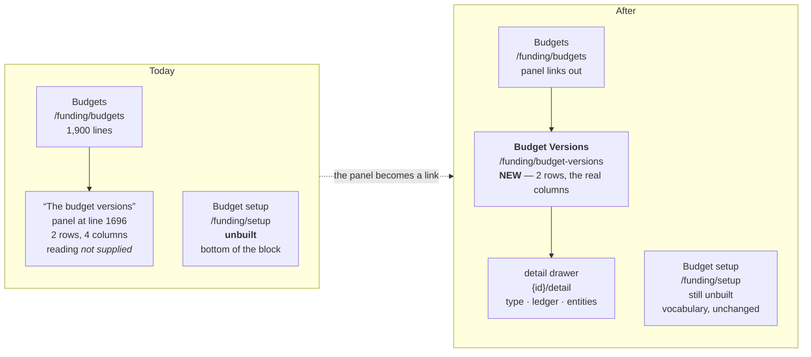

# Budget Versions — a page below Budgets

| | |
|---|---|
| **Status** | DRAFT — for review |
| **Created** | 2026-02-14 |
| **Revision** | 1 |
| **Purpose** | Give the budget *versions* a page of their own, sitting directly under **Budgets** in the Funding block, so a reader can see which version a budget position belongs to without scrolling to the bottom of a 1,900-line screen. |
| **Scope** | Frontend only. `GET /api/funding/budget-versions` and `GET /api/funding/budget-versions/{id}/detail` are already served. **One API defect must be fixed first** (§2.4) — the detail route is a 500 today. |
| **Grounded in** | A live measurement of the four budget tables under `DB_MODE=oracle` on 2026-02-14 (§2), not the resource descriptor. The descriptor is wrong for this deployment. |
| **Depends on** | `app/src/routes/Budgets.tsx` (the versions panel it supersedes), `app/src/data/budgets.ts`, `app/src/nav/menu.ts` |
| **Supersedes** | Nothing. The `Budget setup` leaf (§5) is **not** replaced — see the placement decision. |

---

## 1. The answer in one line

**The live ledger holds exactly two budget versions — `WCPSS` and `WCPSS BUDGET`, both of type `standard` — and the endpoint that serves them declares five columns this database does not have, so the versions page is a small page about two rows plus a real API fix, not a large page about a version model.**



---

## 2. ★★ THE MEASUREMENT

Everything below was read from the live ledger on 2026-02-14 through a throwaway probe that carried **two controls**: `GL_LEDGERS` (known to answer, must pass) and `NO_SUCH_ZZZ9` (must fail). Both behaved, so the run is evidence rather than a harness that swallows errors.

### 2.1 What each table actually holds

| Table | Rows | Real key | Real columns of interest |
|---|---|---|---|
| `GL_BUDGET_VERSIONS` | **2** | `BUDGET_VERSION_ID` | `BUDGET_TYPE`, `BUDGET_NAME`, `VERSION_NUM`, `STATUS`, `DATE_OPENED`, `CREATION_DATE`, `DESCRIPTION` |
| `GL_BUDGET_TYPES` | **1** | **`BUDGET_TYPE`** (VARCHAR) | `DESCRIPTION`, `AUDIT_TRAIL_FLAG` |
| `GL_BUDGET_ENTITIES` | **5** | `BUDGET_ENTITY_ID` | `NAME`, `STATUS_CODE`, `DESCRIPTION` |
| `GL_BUDGET_ASSIGNMENTS` | **234,074** | `CODE_COMBINATION_ID` | `BUDGET_ENTITY_ID`, `RANGE_ID`, `ORDERING_VALUE` |

The two versions, verbatim:

```
BUDGET_VERSION_ID  BUDGET_NAME     BUDGET_TYPE  VERSION_NUM  STATUS  DATE_OPENED   DESCRIPTION
1000               WCPSS           standard     1            F       1999-11-11    first version
1001               WCPSS BUDGET    standard     1            C       2000-07-05    first version
```

### 2.2 ★★ The descriptor names five columns this database does not have

`GET /api/funding/budget-versions` returns **HTTP 200 in 0.5 s, total=2**, with `BUDGET_TYPE_ID`, `STATUS_CODE`, `LATEST_FLAG`, `FIRST_PERIOD_NAME` and `LAST_PERIOD_NAME` **all empty on both rows**. The obvious reading — "this ledger supplies no version model" — is **wrong**, and the mistake is worth recording because it is the kind that survives review.

The columns are not absent. **They are named differently.** `server/src/routes/funding.ts` declares four column lists (lines 80–116) and *every one of them* names columns the live tables lack:

| Declared (line) | Table | Live table has | Verdict |
|---|---|---|---|
| `BUDGET_TYPE_ID`, `BUDGET_TYPE_CODE`, `BUDGET_NAME`, `ENABLED_FLAG` (80) | `GL_BUDGET_TYPES` | `BUDGET_TYPE`, `DESCRIPTION`, `AUDIT_TRAIL_FLAG` | **no overlap** |
| `BUDGET_TYPE_ID`, `FIRST_PERIOD_NAME`, `LAST_PERIOD_NAME`, `DEFAULT_PERIOD_NAME`, `STATUS_CODE`, `LATEST_FLAG`, `BUDGET_ENTRY_STATUS` (88) | `GL_BUDGET_VERSIONS` | `BUDGET_TYPE`, `VERSION_NUM`, `STATUS`, `DATE_OPENED` | **`BUDGET_NAME` and `CREATION_DATE` only** |
| `BUDGET_TYPE_ID`, `BUDGET_ENTITY_NAME`, `ENABLED_FLAG` (102) | `GL_BUDGET_ENTITIES` | `NAME`, `STATUS_CODE`, `DESCRIPTION` | **`BUDGET_ENTITY_ID` only** |
| `BUDGET_VERSION_ID`, `RANGE_FROM`, `RANGE_TO`, `BUDGET_ENTITY_ID` (109) | `GL_BUDGET_ASSIGNMENTS` | `BUDGET_ENTITY_ID`, `RANGE_ID`, `ORDERING_VALUE`, `CODE_COMBINATION_ID` | **`BUDGET_ENTITY_ID` only** |

**So the page has real data to show** — a type, a status, a version number, an open date and a description — under names the API does not currently read.

### 2.3 ★ The list endpoint survives; the detail endpoint does not

`GET /api/funding/budget-versions` answers 200 because a `ResourceDescriptor` **selects only the columns it declares and tolerates the rest being absent** — the five missing ones come back `null`, which is why the page reads *not supplied* rather than erroring. `GET /api/funding/budget-versions/1001/detail` **throws**:

```
ORA-00942: table or view does not exist
  at server/src/routes/funding.ts:762
```

Line 762 is the budget-type lookup, which builds its `SELECT` from `BUDGET_TYPE_COLUMNS` — the list with **no overlap at all** with `GL_BUDGET_TYPES`. The route then looks the type up by `BUDGET_TYPE_ID`, a column that does not exist either. **A detail page that 500s is not a page that needs a frontend; it is a route that needs fixing first.**

### 2.4 ★ Assignments cannot be attributed to a version — do not claim they can

`GL_BUDGET_ASSIGNMENTS` holds **234,074 rows** for a ledger with **two** versions, and:

- `FUNDING_BUDGET_VERSION_ID` is **NULL on all 234,074 rows** (`COUNT(FUNDING_BUDGET_VERSION_ID) = 0`).
- The rows are keyed on `CODE_COMBINATION_ID` — **234,074 distinct of 234,074**, one row per account combination, no duplicates.
- They span **7 entities** (1003–1010) and **30 ranges**. A range is a *segment-value span*, not a version: `RANGE_ID 26917` covers `ORDERING_VALUE` 5110–9999 across 110,439 rows.

**There is no join path from an assignment to a version.** The versions page must therefore **not** print "N assignments" per version. It may print the population (`234,074 assignments across 7 entities`) as a fact about the ledger, and it must say plainly that the assignment table carries no version id, so the two cannot be tied together — which is itself the most useful thing a reader can learn about this model.

### 2.5 Two tables the plan must not assume

`GL_BUDGET_BALANCES` and `GL_BUDGET_INTERFACE` **both throw `ORA-00942`**. There is no budget-amount table in this deployment. Every budget figure the app already shows comes from `GL_BALANCES where ACTUAL_FLAG = 'B'` via the existing Budgets page — so the versions page shows **no money of its own**, and links to Budgets for it.

### 2.6 Controls

| Control | Expected | Observed |
|---|---|---|
| `SELECT LEDGER_ID, NAME FROM GL_LEDGERS` | passes | **1 row** — `1, Wake County Public Schools` |
| `SELECT 1 FROM NO_SUCH_ZZZ9` | fails | **`ORA-00942`** ✓ |
| `GET /api/funding/budget-versions?limit=50` | 200 | **200 in 0.5 s, total=2** ✓ |
| `GET /api/funding/budget-versions/1001/detail` | 200 | **500 — `ORA-00942` at line 762** ✗ |

The last row is the finding: a control that was *expected* to pass and did not.

---

## 3. The layout

The app's established shape for a register page: a `page-head`, a row of `Stat` figures, a filter bar, one table, and a right-hand drawer for the selected row. `ReadCaps.tsx` is the closest existing precedent (620px drawer, `ResizeGrip`, focus trap, Escape to close).

```
┌──────────────────────────────────────────────────────────────────────────────┐
│  Funding › Budget Versions                                                    │
│                                                                              │
│  Budget versions                                            [ 2 versions ]    │
│  Which version a budget position belongs to. A version spans a budget type —  │
│  funding is held per account and per period, so a version's dates are not the │
│  dates any one account was funded.                                            │
├──────────────────────────────────────────────────────────────────────────────┤
│  ┌────────────┐  ┌────────────┐  ┌────────────┐  ┌────────────────────────┐  │
│  │ 2          │  │ 1          │  │ 2          │  │ 234,074                │  │
│  │ versions   │  │ budget type│  │ accounts   │  │ assignments            │  │
│  │ read from  │  │ standard   │  │ funded     │  │ across 7 entities      │  │
│  │ the ledger │  │            │  │ (see §2.4) │  │ ★ no version id        │  │
│  └────────────┘  └────────────┘  └────────────┘  └────────────────────────┘  │
├──────────────────────────────────────────────────────────────────────────────┤
│  ┌──────────────────────────────────────────────────────────────────────────┐│
│  │ [ Search name…            ]   Type [ All ▾ ]   Status [ All ▾ ]          ││
│  └──────────────────────────────────────────────────────────────────────────┘│
├──────────────────────────────────────────────────────────────────────────────┤
│  ID     Name              Type       Ver  Status        Opened      Created  │
│  ─────  ────────────────  ─────────  ───  ────────────  ──────────  ──────── │
│▸ 1001   WCPSS BUDGET      standard   1    ● Current     2000-07-05  2000-…   │
│  1000   WCPSS             standard   1    ○ Frozen      1999-11-11  1999-…   │
│                                                                              │
│  2 of 2 versions                                                             │
└──────────────────────────────────────────────────────────────────────────────┘
                                    │
        click a row ────────────────┘
                                    ▼
        ┌────────────────────────────────────────────────────┐
        │  Version 1001                                   ✕  │
        │  WCPSS BUDGET                                      │
        ├────────────────────────────────────────────────────┤
        │  Type          standard                            │
        │  Version no.   1                                   │
        │  Status        Current            ← status 'C'     │
        │  Opened        2000-07-05                          │
        │  Created       2000-07-05                          │
        │  Updated       2026-06-25                          │
        │  Description   first version                       │
        ├────────────────────────────────────────────────────┤
        │  Ledger        Wake County Public Schools          │
        │                LEDGER_ID 1 · USD                   │
        ├────────────────────────────────────────────────────┤
        │  ⚠ This ledger's budget tables are not shaped      │
        │    like the ones this resource declares. The       │
        │    version's own fields above are read in full;    │
        │    period range, LATEST_FLAG and the type's        │
        │    code are not supplied by this database.         │
        ├────────────────────────────────────────────────────┤
        │  Assignments   not attributable to a version —     │
        │                234,074 rows carry no version id.   │
        │                [ See the entities → ]              │
        └────────────────────────────────────────────────────┘
```

### 3.1 The columns, and why each is there

| Column | Source | Note |
|---|---|---|
| **ID** | `BUDGET_VERSION_ID` | The link target. Monospace, right-aligned. |
| **Name** | `BUDGET_NAME` | The row's identity. Wraps; never truncated. |
| **Type** | `BUDGET_TYPE` | ★ **The real column.** Lowercase `standard` as stored — do not title-case it, or the page invents a value. |
| **Ver** | `VERSION_NUM` | A string in the database (`"1"`), not a number. |
| **Status** | `STATUS` → word | ★ `C` → **Current**, `F` → **Frozen**. A single letter is not a status a reader can act on; the mapping is stated once, in the legend, and the raw code stays available in the drawer. |
| **Opened** | `DATE_OPENED` | |
| **Created** | `CREATION_DATE` | |

### 3.2 What is deliberately NOT a column

- **`LATEST_FLAG`** — does not exist here. The existing Budgets panel already refuses to guess it (*"an absent flag is not `N`"*), and that reasoning holds: the column is **omitted**, not rendered empty.
- **Period range** (`FIRST_PERIOD_NAME` / `LAST_PERIOD_NAME`) — do not exist. Omitted, with the drawer note explaining why.
- **Assignments per version** — cannot be computed (§2.4). Shown as a population stat, never as a per-row count.
- **Any money column** — there is no budget-amount table (§2.5).

---

## 4. The API fix this page needs

The page cannot be built honestly against a 500. Three changes, all in `server/src/routes/funding.ts`:

1. **Repoint the four column lists at the real columns** (§2.2). `BUDGET_TYPE_COLUMNS` becomes `BUDGET_TYPE, DESCRIPTION, AUDIT_TRAIL_FLAG`; `BUDGET_VERSION_COLUMNS` gains `BUDGET_TYPE, VERSION_NUM, STATUS, DATE_OPENED` and drops the five that do not exist.
2. **Key the type lookup on `BUDGET_TYPE`, not `BUDGET_TYPE_ID`** (line ~763). The version's `BUDGET_TYPE` is the string `"standard"` and `GL_BUDGET_TYPES.BUDGET_TYPE` is `"STANDARD"` — **case differs between the two tables**, so the lookup needs `UPPER()` on both sides or it silently finds nothing. *This is the fix for the 500.*
3. **Return the gap explicitly.** The descriptor should report which declared columns the store could not supply, so the frontend's `ledgerGap` derivation stops inferring it from all-null rows and reads a stated fact.

★ **Do not "fix" the descriptor by deleting the missing columns and saying nothing.** The Budgets page's note and this page's drawer both *depend* on being able to say "this ledger does not supply `LATEST_FLAG`". A silent removal turns a stated absence into an unexplained one.

---

## 5. Placement — the decision the request leaves open

The request says *"below Budgets"*. The Funding block already has **six** leaves, and the last one, **Budget setup**, is unbuilt and reads *the same four tables*:

```
Budgets                              /funding/budgets            built ✓
Budget adjustments                   /funding/adjustments        unbuilt
Budget changes                       /funding/changes            unbuilt
Journal entries                      /funding/journals           unbuilt
Allocations & available funds        /funding/allocations        unbuilt
Budget setup                         /funding/setup              unbuilt  ← same tables
```

**Recommendation: add `Budget Versions` as a new leaf directly under `Budgets`, and leave `Budget setup` where it is.**

The two are not the same page, and the menu notes already say why:

- **Budget setup** is *"vocabulary rather than questions"* — the four setup tables as a reference, which is why it sits at the bottom. Its own note: *"types, versions, entities and their assignments."*
- **Budget Versions** is a *question*: which version does this position belong to, and is it current? That is a question a reader arrives with from the Budgets page, so it belongs next to Budgets.

Two consequences to accept:

1. **`Budget setup` will then be partly redundant** — it lists versions, and so does the new page. When it is eventually built, it should either drop versions and point at this page, or be re-scoped to types/entities/assignments only. **The plan does not build it, and does not delete it.**
2. **The order of the block changes.** `Budget Versions` goes second (under Budgets); the other four leaves shift down one. That is a one-line edit in `menu.ts` and it reorders the sidebar, so it is a visible change and worth calling out in review.

**Rejected alternative:** folding this into `/funding/setup`. It would put the answer three leaves below the question and leave `Budget setup` as a page that still has not been built, while the thing it is named after lives inside it.

---

## 6. What the page says when the ledger supplies nothing

This is the same problem the Budgets panel already solved, and the solution carries over unchanged: **derive the gap from the rows, not from `DB_MODE`.** The existing `ledgerGap` memo (`Budgets.tsx:1111`) checks whether *every* version row came back null in each of four groups, and returns `null` when the rows are populated — so if the ledger ever starts serving the missing columns, the note retires itself with no code change.

On this ledger, after the API fix in §4, the gap shrinks to **period range and `LATEST_FLAG`** — because type, status and version number become readable. The drawer note must be rewritten to say exactly that, rather than repeating the Budgets panel's broader claim. ★ **The note is a measurement, so it has to be re-measured when the columns change.**

---

## 7. Files

| File | Change |
|---|---|
| `server/src/routes/funding.ts` | Repoint four column lists; fix the type lookup (§4). **Prerequisite.** |
| `app/src/nav/menu.ts` | New leaf under `Budgets`; reorder (§5). |
| `app/src/routes/BudgetVersions.tsx` | **New.** Register + drawer. |
| `app/src/data/budgetVersions.ts` | **New.** `getList` + `getOne` wrappers. |
| `app/src/styles/budget-versions.css` | **New.** Table + drawer, reusing `readcaps.css` conventions. |
| `app/src/routes/Budgets.tsx` | The versions panel becomes a link to the new page (§8). |

---

## 8. The Budgets panel becomes a pointer

The panel at `Budgets.tsx:1696` currently renders the version rows inline, with the `ledgerGap` note. After this page exists:

- Keep the panel and its count — *"Every movement above belongs to one of these"* is still the right sentence in that position.
- Replace the inline table with the **two version names and a link** to `/funding/budget-versions`.
- **Keep the `ledgerGap` note**, because the absence it describes is a property of the ledger, not of the page it is printed on.

★ **Do not delete the panel.** A reader on the Budgets page needs to know a version exists before they know to go looking for one.

---

## 9. Open questions for review

1. **Status vocabulary** — is `C` → *Current* / `F` → *Frozen* the right reading? The mapping is a claim about Oracle's `GL_BUDGET_VERSIONS.STATUS`; the plan states it as a legend so it can be corrected in one place.
2. **Read-only?** The descriptor declares `writes: { create, update }`. This plan builds a **read-only** page. If editing is wanted, it is a separate plan — and the write path would have to survive the same column mismatch, which it does not today.
3. **The `Budget setup` overlap** (§5) — accept the partial redundancy, or re-scope that leaf now?
4. **`VERSION_NUM`** is a string. Confirm it should render as `1` and not be padded or parsed.

---

## 10. Order of work

1. Fix the API (§4) and add a gate asserting `{id}/detail` answers 200 with a real type name — **the current 500 is the one thing here that is unambiguously broken.**
2. Add the menu leaf and reorder (§5).
3. Build the page and drawer (§3).
4. Point the Budgets panel at it (§8).
5. Re-measure the gap note (§6) and correct its wording.
