# Menu Structure — Grouping Plan

**Status:** DRAFT — for review · **Created:** 2026-09-18 · **Revision:** 1

> **Status note (added retrospectively):** this plan names objects as the extract presented them,
> using `WCSEXP_*` views. Those views are **retired**; the app and SQL read the base tables
> directly. Read every `WCSEXP_X` below as the base table behind it — strip the prefix, and add
> `_ALL` on the PO and AP tables (`WCSEXP_PO_VENDORS` → `PO_VENDORS`, `WCSEXP_AP_INVOICES` →
> `AP_INVOICES_ALL`). See [`../../data/oracle/db-schema.md`](../../data/oracle/db-schema.md).

| | |
|---|---|
| **Purpose** | Decide how the app's navigation is grouped into top-level blocks and their leaves |
| **Scope** | The left rail and its routes — **not** the visual design of the pages themselves |
| **Grounded in** | The 36 tables / 24 views actually in the Turso sample (`data/sql/turso/00-schema.sql`), the 21 production objects in [`db-schema.md`](../../data/oracle/db-schema.md), the 11 planned screens in [the tracker plan](./oracle-project-tracker-plan.md) §9, and the five analysis queries in [`data/sql/`](../../data/sql/) |
| **Supersedes** | The hand-built groups in [`Rail.tsx`](../../app/src/components/Rail.tsx) |

---

## 1. The answer in one line

**Group the menu by what staff are trying to find out — never by Oracle module, and never by table.**

A menu that mirrors the schema would need 60 entries. A menu built from the five analysis queries
needs about six. The queries already encode the questions; §6 maps them one-to-one onto leaves.

---

## 2. The two axes, and why neither alone works

There are exactly two ways to organize this menu, and each is wrong on its own.

| | **Axis A — by Oracle module** | **Axis B — by business question** |
|---|---|---|
| Groups look like | GL · PO · AP · Shared reference | Funding · Spend · Vendors · Procurement |
| Reads like | the database | how staff talk |
| Good at | admin, data integrity, "does the extract cover this?" | finding an answer |
| Bad at | every-day use — nobody asks "show me the AP module" | precision — one question can span three modules |

**The tell that Axis B is primary:** the five analysis files in `data/sql/` are already organized by
question (*does this ledger hold budget data at all? → budgets → adjustments → changes → is committed
the same as spent?*), and they cross modules freely — `04-spend-and-actuals.sql` joins PO
distributions to invoices to GL balances in one statement. Module boundaries are an implementation
detail that the questions walk straight through.

**But Axis A cannot be dropped**, because three things genuinely are structure rather than
questions: the seven segments, the account combinations, and the lookup/period reference data. Those
have no "question" framing — they are the vocabulary everything else is written in.

### Recommended: Axis B for the work, Axis A for the reference

Six question-shaped blocks for the work, one reference block for the vocabulary, one utility block
for configuration. That is §4.

---

## 3. The rule for deciding where something lives

Use this test. It resolves every "where does X go?" question, including the three you asked.

> **If a thing makes sense as a tab on a single Project's page, it is a block.
> If it only makes sense once you have picked a Project, it is a tab — not a menu item.**

### Why this matters more than it looks

You raised the real difficulty yourself: *"a main Project might have related information from multiple
sources."* That is exactly the tension, and it has a clean resolution:

| | **Blocks (the menu)** | **Project detail (the page)** |
|---|---|---|
| Scope | one Oracle domain, **across everything** | **every** domain, for **one** project |
| Question | "all invoices in the portfolio" | "this project's invoices" |
| Example | Vendors › Vendor spend | Project › Spend tab |

So there is **no duplication and no "Invoices under Projects or under Spend?" dilemma** — both
exist, because they answer different questions. Every block row deep-links into the project that
owns it. A block is a *portfolio-wide* lens; the project page is the *convergence point*.

**Consequence worth accepting:** a row in a block view must always show *which project it belongs
to*, including "unclaimed". A portfolio-wide list of POs with no project attribution is just the
Oracle table again, which is what we are trying to get away from.

---

## 4. Proposed structure

### 4.1 The tree

```mermaid
graph TD
    A["Overview"] --> A1["Dashboard"]
    A --> A2["Needs attention"]

    B["Projects"] --> B1["All projects"]
    B --> B2["Portfolios"]
    B --> B3["Unclaimed combinations"]

    C["Funding"] --> C1["Budgets"]
    C --> C2["Budget adjustments"]
    C --> C3["Budget changes"]
    C --> C4["Journal entries"]
    C --> C5["Allocations &amp; available funds"]
    C --> C6["Budget setup"]

    D["Commitments &amp; Spend"] --> D1["Encumbrances"]
    D --> D2["Invoices"]
    D --> D3["Payments &amp; checks"]
    D --> D4["Commitments vs actuals"]

    E["Procurement"] --> E1["Purchase orders"]
    E --> E2["Line items"]
    E --> E3["Shipments"]
    E --> E4["Distributions"]
    E --> E5["Line types &amp; lookups"]

    F["Vendors"] --> F1["Vendor companies"]
    F --> F2["Vendor sites"]
    F --> F3["Vendor contacts"]
    F --> F4["Vendor spend"]

    G["Chart of Accounts"] --> G1["Account combinations"]
    G --> G2["Segments &amp; values"]
    G --> G3["Balances by period"]
    G --> G4["Periods"]
    G --> G5["Lookups"]

    H["Administration"] --> H1["Segments"]
    H --> H2["Combinations"]
    H --> H3["Overrides"]
    H --> H4["Extract runs"]
    H --> H5["Users &amp; roles"]
```



### 4.2 The leaves, with their real data source

Every leaf is given the object it reads. **This column is the point of the table** — it is what
stops the menu drifting into invented screens.

| Block | Leaf | Route | Reads | Backed today? |
|---|---|---|---|---|
| **Overview** | Dashboard | `/` | derived | ✅ built |
| | Needs attention | `/attention` | derived | ⬜ §9.1 attention list |
| **Projects** | All projects | `/projects` | `ExtractLine[]` | ✅ built |
| | Portfolios | `/portfolios` | app-side | ⬜ §9.5 |
| | Unclaimed combinations | `/projects/unclaimed` | `combinationKey` | ⬜ §9.4 |
| **Funding** | Budgets | `/funding/budgets` | `GL_BALANCES` `ACTUAL_FLAG='B'` | ⬜ |
| | Budget adjustments | `/funding/adjustments` | `GL_JE_HEADERS` + `JE_LINES` | ⬜ |
| | Budget changes | `/funding/changes` | `GL_JE_LINES` (trend) | ⬜ |
| | Journal entries | `/funding/journals` | `GL_JE_HEADERS`, `GL_JE_LINES` | ⬜ |
| | Allocations & available funds | `/funding/allocations` | `GL_BUDGET_VERSIONS` + `GL_BALANCES` | ⬜ |
| | Budget setup | `/funding/setup` | `GL_BUDGET_TYPES`, `_VERSIONS`, `_ENTITIES`, `_ASSIGNMENTS` | ⬜ |
| **Commitments & Spend** | Encumbrances | `/spend/encumbrances` | `PO_DISTRIBUTIONS.ENCUMBERED_AMOUNT`, `GL_BALANCES` `'E'` | ⬜ |
| | Invoices | `/spend/invoices` | `AP_INVOICES` | ⬜ empty |
| | Payments & checks | `/spend/payments` | `AP_INVOICE_PAYMENTS` | ⬜ empty |
| | Commitments vs actuals | `/spend/vs-budget` | `04-spend-and-actuals.sql` | ⬜ |
| **Procurement** | Purchase orders | `/procurement/purchase-orders` | `PO_HEADERS_ALL` | ✅ via extract |
| | Line items | `/procurement/lines` | `PO_LINES_ALL` | ✅ via extract |
| | Shipments | `/procurement/shipments` | `PO_LINE_LOCATIONS_ALL` | ⬜ |
| | Distributions | `/procurement/distributions` | `PO_DISTRIBUTIONS_ALL` | ⬜ |
| | Line types & lookups | `/procurement/reference` | `PO_LINE_TYPES`, `PO_LOOKUP_CODES` | ⬜ |
| **Vendors** | Vendor companies | `/vendors/companies` | `PO_VENDORS` | ✅ via extract |
| | Vendor sites | `/vendors/sites` | `PO_VENDOR_SITES_ALL` | ⬜ |
| | Vendor contacts | `/vendors/contacts` | `PO_VENDOR_CONTACTS` | ❌ **not in sample** |
| | Vendor spend | `/vendors/spend` | `PO_HEADERS_ALL` + `AP_INVOICES` | ⬜ |
| **Chart of Accounts** | Account combinations | `/coa/combinations` | `GL_CODE_COMBINATIONS` | ✅ built (Funding search) |
| | Segments & values | `/coa/segments` | `FND_ID_FLEX_STRUCTURES`, `_SEGMENTS`, `FND_FLEX_VALUES` | ⬜ |
| | Balances by period | `/coa/balances` | `GL_BALANCES` (all flags) | ✅ in sample |
| | Periods | `/coa/periods` | `GL_PERIODS` | ✅ in sample |
| | Lookups | `/coa/lookups` | `GL_LOOKUPS`, `PO_LOOKUP_CODES` | ✅ in sample |
| **Administration** | Segments | `/admin/segments` | app-side | ⬜ §9.7 |
| | Combinations | `/admin/combinations` | app-side overlay | ⬜ §9.8 |
| | Overrides | `/admin/overrides` | app-side | ⬜ §9.9 |
| | Extract runs | `/admin/extract-runs` | app-side | ⬜ §9.10 |
| | Users & roles | `/admin/users` | app-side | ⬜ §9.11 |
| | View builder | `/admin/views` | app-side, plus whatever its queries read | ✅ **built** |

> **§9.12 — View builder.** Saved SQL queries with a declared parameter list and a chosen set of
> columns, previewable and subscribable. Planned separately in
> [`view-builder.md`](./view-builder.md), which also defines the `saved_view` tables this leaf's
> storage needs. **Note for §4.2's neighbours:** this is the first leaf that **writes** app-side
> state, so the *"nothing writes to it yet"* framing under Combinations (§9.8) stops describing the
> app once this lands. It is also the first leaf whose `reads` is not a fixed list — the `reads`
> column above is a description rather than an enumeration.
>
> **✅ Landed.** The leaf, the screen and the API behind it are built;
> [`app/src/nav/menu.ts`](../../app/src/nav/menu.ts) carries it with `built: true` and
> [`app/src/App.tsx`](../../app/src/App.tsx) serves it. Two of the predictions above were
> right and have been applied — the Combinations note in `menu.ts` no longer says nothing
> writes app-side, and the `reads` value is deliberately the prose description rather than a
> list. The one thing that changed against this table: **the other five Administration leaves
> are still `built: false`**, so the View builder is the block's only working entry and is
> ordered first for that reason. Storage landed in a file of its own rather than inside
> `00-schema.sql` — see [`view-builder.md`](./view-builder.md) §6.2 and
> `data/sql/turso/01-app.sql`.

---

## 5. Your three specific questions

### 5.1 Where do Invoices and Invoice Adjustments live?

**Invoices → `Commitments & Spend › Invoices`.** Not a Payables block. Reason: the question
invoices answer is *"was the commitment real?"* — which is the "committed vs spent" question, and
that question is `04-spend-and-actuals.sql`, which sits in the same block. Grouping invoices under a
module-shaped "Payables" heading would separate them from the query that consumes them.

**"Invoice Adjustments" — this one needs a decision from you, because three different things could
be meant and none of them is a table:**

| If you mean | It actually is | Where it should live |
|---|---|---|
| Credit memos / negative invoices | `AP_INVOICES` rows with a negative `INVOICE_AMOUNT` | **A filter on Invoices**, not a leaf |
| Freight, tax, prepay lines | `AP_INV_LINES.LINE_TYPE_LOOKUP_CODE ≠ 'ITEM'` | **A filter on Invoices**, not a leaf |
| Adjustments to the *budget* | `GL_JE_LINES` — already built | **Already exists** as Funding › Budget adjustments |

**Recommendation:** do not make it a menu item yet. Add it as a **saved filter chip on the Invoices
page** (`All · Credit memos · Non-item lines`), and promote it to a leaf only if staff actually look
for it by that name. A menu item that is a filtered view of its neighbour adds a click without
adding an answer.

> **A gap to know about:** the extract has **no invoice-type column.** `WCSEXP_AP_INVOICES` is
> *INVOICE_ID, INVOICE_NUM, VENDOR_ID, VENDOR_SITE_ID, INVOICE_AMOUNT, AMOUNT_PAID, INVOICE_DATE,
> DESCRIPTION, TAX_AMOUNT, PAYMENT_STATUS_FLAG, PO_HEADER_ID* — there is no
> `INVOICE_TYPE_LOOKUP_CODE`, no `APPROVAL_STATUS`, no cancellation date. So an invoice adjustment
> can only be *inferred* (negative amount, or a non-item line type), never read directly. If you
> need adjustments as a first-class concept, the extract has to change first — worth knowing before
> the menu promises it.

### 5.2 Where do Allocations live?

**`Funding › Allocations & available funds`** — and note that **Allocations is not a table.**

This is the single most important correction in this document. There is no `ALLOCATIONS` object
anywhere in the 36 tables. "Allocations" is a **derived measure**, defined inside the reporting views
in `00-schema.sql`:

```
Available Funds = Allocations − Encumbrances − Expenditures     (per account)
```

where **Allocations** = the GL balances side whose budget version is `BUDGET_TYPE 1 ('APPROP')` —
spelled in the views as `ALLOCATIONS_REIMB`. The schema's own comment calls it *"Allocations /
Reimbursements: the APPROPRIATION budget versions."*

So:

- It belongs under **Funding** because it is read from the *same* rows as Budgets (`GL_BALANCES`
  with `ACTUAL_FLAG='B'`) — just a different budget type. Splitting them across two blocks would
  force a user to visit two places to do one subtraction.
- It should be **labelled as computed**, not presented as if it were extracted. Same honesty
  requirement as the ×1.0 budget in `derive.ts` — mark it *derived* in the UI.
- It is the natural home for the three-way strip: **Allocations − Encumbrances − Expenditures =
  Available Funds**, which is the report's object-526 arithmetic.

### 5.3 Vendors → Companies, Sites, Contacts

Your instinct is right, and it maps cleanly onto real objects — **with one exception**:

| Leaf | Object | Status |
|---|---|---|
| Vendor companies | `PO_VENDORS` (`VENDOR_ID`, `VENDOR_NAME`, `VENDOR_TYPE_LOOKUP_CODE`, `PARENT_VENDOR_ID`) | ✅ real |
| Vendor sites | `PO_VENDOR_SITES_ALL` (`VENDOR_SITE_ID → VENDOR_ID`, address, phone) | ✅ real |
| Vendor contacts | `WCSEXP_PO_VENDOR_CONTACTS` (`VENDOR_CONTACT_ID → VENDOR_SITE_ID`, name, email) | ⚠️ **exists in production, absent from the sample** |

**The three-level parent/child is exactly right** — vendors → sites → contacts is Oracle's own
structure, and the menu should mirror it. But:

- The surrogate **has no contacts table at all** (verified: filtering all 60 objects for
  `%VENDOR%|%CONTACT%` returns only `PO_VENDORS`, `PO_VENDOR_SITES_ALL` and their two views). So
  the leaf is legitimate against production and **empty against the sample**.
- `PARENT_VENDOR_ID` exists on `PO_VENDORS`, so the *companies* level can nest (parent company →
  subsidiaries). Worth deciding whether the menu shows that as a tree inside one leaf, or promotes
  it. **Recommendation: a tree inside the leaf** — it is one level of nesting and does not deserve
  three menu entries.
- **Add a fourth leaf: `Vendor spend`.** Companies and sites are *reference data* — nobody browses
  749 vendors for pleasure. What staff actually want is "who are we paying, and how much", which
  needs `PO_HEADERS_ALL` + `AP_INVOICES` joined to the vendor. Without that leaf the block is a
  directory; with it, it is a question.

---

## 6. Where the five analysis queries land

The five files in `data/sql/` are the app's real specification — each one is a question, and each
one should be reachable from one leaf.

| File | The question it answers | Menu leaf |
|---|---|---|
| `00-discover.sql` | *Does this ledger hold budget data at all?* | **Not a leaf.** It is a diagnostic — see below |
| `01-budgets.sql` | The budget figures | Funding › **Budgets** |
| `02-budget-adjustments.sql` | The adjustment log | Funding › **Budget adjustments** |
| `03-budget-changes.sql` | Budget movement over time | Funding › **Budget changes** |
| `04-spend-and-actuals.sql` | *Is "committed" the same as "spent"?* | Spend › **Commitments vs actuals** |

**`00-discover.sql` is the interesting case.** It is the first thing you ever run and it gates
everything else — *"if section B shows no `ACTUAL_FLAG='B'` rows, stop there"*. That is not a
destination, it is a **precondition**, so it belongs in two other places rather than as a leaf:

1. **Dashboard → Data readiness strip.** The tracker plan §9.1 already specifies exactly this: a
   banner that says whether the ledger holds budget data and whether segments are configured.
   Colour it `--status-warning` when the answer is no.
2. **Administration → Extract runs.** The run detail should carry the discovery verdict, so
   "the report came back empty" is explained where the run history is.

**Same treatment for sections B and H of the tracker plan** (does `SEGMENT5` identify the project?),
which `01-budgets.sql` depends on and which is currently unspecified in the UI.

**A sixth file now exists, and it is the one case this section's rule does not cover.**
`queries/05-first-fundings.sql` — *"when was this combination first funded?"* — is the question the
View Builder was built for, and it must **not** get a leaf. The reason is the whole point of
[`view-builder.md`](./view-builder.md): a leaf is a question the menu can name in advance, and this
one is asked per combination, with the combination as a parameter. Anything that *is* a fixed
question deserves the treatment in the table above; anything that is a question-of-a-question goes
through **Administration → View builder**, which is also where all six files are offered as
starting points. Where they disagree is the signal: a query that keeps being copied out of the View
Builder and asked with the same values every time is a leaf someone has not written yet.

---

## 7. A naming collision you have to resolve first

**"Funding" currently means something else in the app.**

In [`Rail.tsx`](../../app/src/components/Rail.tsx) today, the group titled **Funding** holds three
*facet buttons* — `Capital`, `Operating`, `Relocation` — which are **purpose-code filters** on the
Projects list (`Facet` in `store.tsx`), with counts from `facetCounts`.

You are now using "Funding" to mean **the budget block**. Those cannot both be called Funding, and
this is not cosmetic — one is a filter, the other is a destination.

**Recommendation:**

| Today | Becomes |
|---|---|
| Funding › Capital / Operating / Relocation | `Projects` › filter chips above the table (they filter the *current* list — they are not destinations) |
| Funding (the name) | freed for the **budget block** in §4 |

The facet chips should move onto the Projects page because `goFunded()` already does exactly that —
it calls `setFacet(f)` and then navigates to `/projects`. **A control that always navigates to
`/projects` is a filter on `/projects`, not a menu item.** Moving it also removes the current oddity
where the rail's `aria-current` lights up a *button* while the location is `/projects`.

---

## 8. What has no data behind it

Two of the objects in the production extract are **missing from the sample database**, so their
leaves will render empty and look broken:

| Leaf | Object in `db-schema.md` | In the sample? |
|---|---|---|
| Vendors › Vendor contacts | `WCSEXP_PO_VENDOR_CONTACTS` | ❌ **absent** |
| Procurement › (releases) | `WCSEXP_PO_RELEASES` | ❌ **absent** |

And the whole Payables chain is present but **empty** — `AP_INVOICES`, `AP_INV_LINES`,
`AP_INV_DISTRIBUTIONS`, `AP_INVOICE_PAYMENTS` were deliberately created with 0 rows, which is why
`Invoices` and `Payments` above are marked *empty* rather than *built*. This is correct by design
(§8 of the sample-db plan) but it means the Spend block cannot be visually verified yet.

**Three options, pick one per leaf:**

1. **Render the leaf with an empty-state that names the reason** — *"No vendor contacts in this
   extract."* Honest, and zero work. **Recommended default.**
2. **Render it disabled** in the rail, greyed, with a `title` — matches the existing `LATER`
   pattern in `Rail.tsx`, which already does this for 8 items.
3. **Hide it** until the object exists.

Only option 3 is wrong, and only because it hides a real gap rather than framing it.

---

## 9. One finding you should know before building this

**`DB_MODE=turso` is currently read by nothing.**

You have switched it, and it is set correctly in `.env` — but a repo-wide search for `DB_MODE`
returns exactly two hits: the `.env` line itself, and a sentence of prose in
`data/sql/turso/README.md`. No application code reads it. The same is true of `TURSO_*`.

The reason is structural rather than an oversight: this repo has **no server layer**. The root
`package.json` says so outright — *"Deliberately separate from `app/`, so the libSQL client (and the
API token it needs) can never be bundled into the browser build."* The app is a **frontend over a
static file**: `app/src/data/extract.ts` does `fetch('/oracle/output.json')` and normalises the
result.

**So switching `DB_MODE` has no effect yet, and this menu plan is aiming at a wire that does not
exist.** That is fine — but it should be a deliberate decision, not a surprise discovered later when
a new screen returns nothing:

| Option | Consequence for this plan |
|---|---|
| **Build the API layer** (`server/` reading Turso, `loadExtract()` becomes `fetch('/api/...')`) | Every leaf in §4.2 marked ⬜ becomes reachable. Note `extract.ts` is already written for this: *"When the real ingest pipeline exists it becomes `fetch('/api/extract/current')` and nothing at the call sites changes."* |
| **Keep the static extract for now** | Only the leaves marked ✅ can ship. Funding, Spend, Vendors-sites, Chart of Accounts are all blocked — which is most of what you asked for. |

**Recommendation: build the API layer before building the blocks.** Otherwise the menu will be a
shell of empty screens, and an empty screen is indistinguishable from a bug.

---

## 10. Menu implementation notes

### 10.1 Routes

Every leaf gets a real URL; **groups are not routes.** This keeps a group header from being both an
expand control and a link, which is the classic source of "nothing happened" clicks.

```
/                       Overview › Dashboard
/attention              Overview › Needs attention
/projects               Projects › All projects
/projects/new           (form — reachable, not a menu leaf)
/projects/unclaimed     Projects › Unclaimed combinations
/portfolios             Projects › Portfolios
/funding/budgets        Funding › Budgets
/funding/adjustments    Funding › Budget adjustments
/spend/invoices         Spend › Invoices
/vendors/contacts       Vendors › Vendor contacts
/coa/combinations       Chart of Accounts › Account combinations
/admin/extract-runs     Administration › Extract runs
```

The existing routes (`/projects`, `/funding/search`, `/objects/:object`) map onto this without a
redirect for `/projects`; `/funding/search` should move to `/coa/combinations` because that is what
it searches, and `/objects/:object` is the generic detail view that every leaf's row links to.

### 10.2 Expand/collapse behaviour

| Behaviour | Recommendation |
|---|---|
| Expanded by default | **Only the group containing the current route.** Everything else collapsed. |
| Accordion (one open at a time)? | **No** — it makes jumping between Funding and Spend two clicks and users compare those constantly. Allow several open, but cap the default to one. |
| Remember state | `localStorage`, keyed per group, so a user's expansion survives navigation. |
| Group header click | Toggles. **Ships as a button** with `aria-expanded` + `aria-controls`, not a `div` with an `onClick`. |
| Keyboard | `↑`/`↓` between items, `→`/`←` to open/close a group, `Home`/`End`, and roving `tabindex`. A 40-item rail that is 40 tab stops is unusable. |
| Counts | Keep the existing badge pattern — it is the rail's most useful feature. But **only show a count where the number is real**; today `Rail` renders `—` for unready data, which is the right instinct. Never render `0` for "not loaded" (see the always-zero trap in your own notes). |

### 10.3 Size check — 8 blocks is probably too many

At 8 blocks and up to 6 leaves each, the rail is ~40 rows. That is a lot of vertical space for a
list where most users touch 5 items. Two variants:

| | **Variant A — full** | **Variant B — recommended** |
|---|---|---|
| Rail shows | all 8 blocks | 6 blocks: Overview, Projects, Funding, Spend, Procurement, Vendors |
| Chart of Accounts | its own block | demoted: `Account combinations` moves under **Projects**; the rest into Administration |
| Administration | its own block | a **gear / utility section pinned to the rail's footer**, visually separated |
| Rationale | mirrors the domains | the six blocks are the *questions*; CoA and Admin are *reference and setup* everyone visits rarely |

**Recommendation: Variant B.** It keeps every question-shaped block visible and pushes the
vocabulary/configuration into a utility area — which is the same distinction §2 drew, expressed as
layout. If you prefer A, the plan still works; only the rail's arrangement changes.

### 10.4 Migration from the current rail

| Current `Rail.tsx` | Disposition |
|---|---|
| `Projects` group (Dashboard, Projects, Unclaimed queue) | becomes **Overview** + **Projects** blocks; `Unclaimed queue` stops being disabled (§9.4) |
| `Oracle data` group (Levels, Cost codes, Vendors) | **split** — `Levels` → CoA, `Cost codes` → CoA › Account combinations, `Vendors` → the **Vendors** block |
| `Funding` group (Search + 3 facets) | **renamed and repurposed** — facets become Projects filters (§7); `Search` → CoA › Account combinations |
| `Not in this slice` group (8 disabled items) | **deleted** — all 8 now have homes in the tree above |
| `rail__foot` (extract cut-off, rows, levels) | keep — it is a genuinely useful provenance stamp |

That last row matters: the 8 items currently in `LATER` (*Portfolios, Unclaimed queue, Oracle
explorer, Segment admin, Combination admin, Overrides, Extract runs, Users & roles*) correspond
almost exactly to leaves in §4.2, so the rework is largely **promoting disabled placeholders into
real groups** rather than inventing a new structure.

---

## 11. Phasing

| Phase | Deliverable | Exit criteria |
|---|---|---|
| **0 · Plumbing** | API layer reading Turso (§9), `loadExtract()` unchanged at call sites | A leaf can fetch from the database instead of the static file |
| **1 · Shell** | Nested routes, expandable rail, keyboard support, deep links, badges | Every route in §10.1 resolves; the rail is navigable without a mouse |
| **2 · Projects + Overview** | Dashboard, Projects, Unclaimed, Portfolios | The existing ✅ leaves still work; two ⬜ leaves close |
| **3 · Funding** | Budgets, Adjustments, Changes, Journal entries, Allocations | `01`–`03` of the analysis SQL are reachable from the UI |
| **4 · Spend** | Encumbrances, Invoices, Payments, Commitments vs actuals | `04` reachable; the Spend block needs the AP tables seeded first |
| **5 · Reference** | Vendors, Procurement, Chart of Accounts | The `Vendors`/`CoA` blocks are complete |
| **6 · Administration** | Segments, Combinations, Overrides, Extract runs, Users | The 8 `LATER` placeholders are all real or explicitly dropped |

Phase 0 is not optional and should not be deferred — see §9.

---

## 12. Decisions needed from you

1. **"Invoice Adjustments"** — credit memos, non-item lines, or budget adjustments? Recommendation:
   a filter on Invoices, not a leaf. (§5.1)
2. **Blocks: Variant A (8) or Variant B (6 + utility)**? Recommendation: **B**. (§10.3)
3. **Is Vendor Contacts in scope for v1?** It is real in production but absent from the sample, so it
   cannot be verified here. (§5.3, §8)
4. **Vendor spend — add it?** Without it the Vendors block is a directory, not a question.
   Recommendation: **yes**. (§5.3)
5. **Does the Spending block ship before the AP tables are seeded?** Invoices and Payments are
   empty by design, so they can be routed but not verified. (§8)
6. **Is building the API layer (§9) approved?** Both `DB_MODE` and most of this menu are inert
   without it.

---

## Appendix — where the numbers in this document came from

All object and vocabulary claims are from live queries against the sample database
(`node scripts/turso-run.mjs`), not from reading the DDL:

| Claim | Query result |
|---|---|
| Object counts | **36 tables, 24 views** |
| No vendor contacts, no releases | filtering 60 objects for `%VENDOR%\|%CONTACT%\|%RELEASE%` → only `PO_VENDORS`, `PO_VENDOR_SITES_ALL`, `WCSEXP_PO_VENDORS`, `WCSEXP_PO_VENDOR_SITES` |
| Journals here are *budget* journals | `JE_CATEGORY` = only `Budget` (9); `JE_SOURCE` = only `WCPSS BUDGET`; `JE_LINE_TYPE` = only `BUDGET` |
| `ACTUAL_FLAG` population | `B` 18 rows / 6 combos · `A` 7 / 4 · `E` 6 / 4 |
| Payables is empty | `AP_INV_LINES` grouped by `LINE_TYPE_LOOKUP_CODE` → **0 rows** |
| PO is homogeneous | `TYPE_LOOKUP_CODE` = only `STANDARD` (749); `PO_LINE_TYPES.LINE_TYPE` = only `FIXED PRICE` |
| No Allocations table | no `ALLOC*` object among the 60; it is a **measure** in the reporting views (`ALLOCATIONS_REIMB`) |
| App data source | `app/src/data/extract.ts` → `fetch('/oracle/output.json')` |
| `DB_MODE` consumers | **2 hits repo-wide: `.env` and a prose sentence.** No code reads it |
