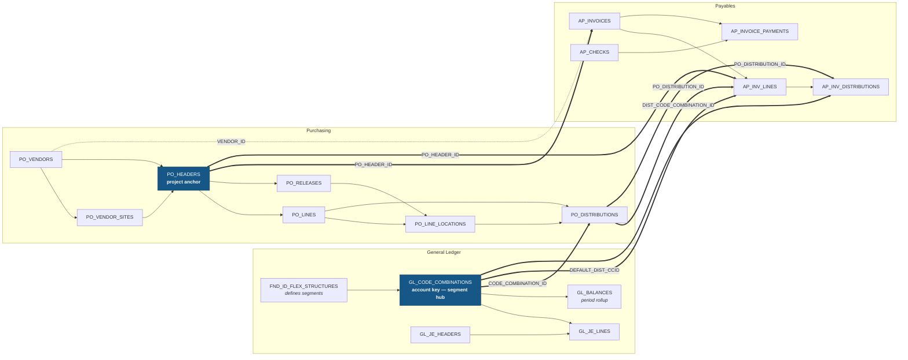
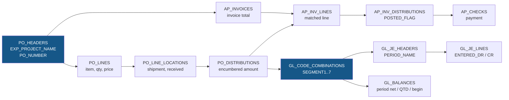

# Oracle Entities — Diagram & Reference

Source of truth for column lists: [`data/oracle/db-schema.md`](../../data/oracle/db-schema.md).
This document adds the **relationships** the schema file does not state, plus the join spine the
tracking app will actually walk.

> ### ⚠️ The names in this diagram are the retired `WCSEXP_*` vocabulary
>
> **The relationships drawn here are correct and still worth reading.** The node *names* are not:
> they are the extract's `WCSEXP_*` views, which are no longer used. The SQL and the app read the
> base tables directly.
>
> Rename each node with `WCSEXP_` **removed**, except where the base table has a different name:
>
> | Node here | Real table |
> |---|---|
> | `WCSEXP_GL_*`, `WCSEXP_FND_ID_FLEX_STRUCTURES` | same name without `WCSEXP_` |
> | `WCSEXP_PO_HEADERS` / `_LINES` / `_LINE_LOCATIONS` / `_DISTRIBUTIONS` / `_VENDOR_SITES` | `PO_HEADERS_ALL` / `PO_LINES_ALL` / `PO_LINE_LOCATIONS_ALL` / `PO_DISTRIBUTIONS_ALL` / `PO_VENDOR_SITES_ALL` |
> | `WCSEXP_PO_VENDORS` / `_LINE_TYPES` | `PO_VENDORS` / `PO_LINE_TYPES` |
> | `WCSEXP_AP_INVOICES` / `_INV_LINES` | `AP_INVOICES_ALL` / `AP_INV_LINES` |
> | `WCSEXP_AP_INV_DISTRIBUTIONS` | `AP_INVOICE_DISTRIBUTIONS_ALL` |
> | `WCSEXP_AP_INVOICE_PAYMENTS` / `WCSEXP_AP_CHECKS` | both are `AP_INVOICE_PAYMENTS_ALL` |
>
> **Two edges below do not exist on the base tables.** `WCSEXP_AP_INV_LINES` is shown with a
> `PO_DISTRIBUTION_ID` FK to `WCSEXP_PO_DISTRIBUTIONS`; that column was `NULL` in the view and is
> absent from `AP_INV_LINES`. The invoice-line → PO-distribution link lives on
> `AP_INVOICE_DISTRIBUTIONS_ALL.PO_DISTRIBUTION_ID`. The `DIST_CODE_COMBINATION_ID` edge is a
> real FK, but the column is `CODE_COMBINATION_ID` on the table.
>
> `EXP_PROJECT_NAME` and `EXP_PO_NUMBER` (§`WCSEXP_PO_HEADERS`) **are** columns of
> `PO_HEADERS_ALL`, so that part needs no rename.

**21 tables** in three modules plus two shared reference tables:

| Module | Tables | Root anchor |
|---|---|---|
| General Ledger (GL) | 6 | `WCSEXP_GL_CODE_COMBINATIONS` |
| Purchasing (PO) | 10 | `WCSEXP_PO_HEADERS` |
| Payables (AP) | 5 | `WCSEXP_AP_INVOICES` |
| Shared reference | 2 (`FND_ID_FLEX_STRUCTURES`, `GL_LOOKUPS`, `PO_LOOKUP_CODES`) | key flexfield / lookup types |

---

## 1. Structural ERD

Full entity relationship diagram. `PK` / `FK` markers are derived from the schema; every FK shown is
a relationship the app can traverse.

```mermaid
erDiagram
    %% ---------------------------------------------------------------
    %% GENERAL LEDGER
    %% ---------------------------------------------------------------
    WCSEXP_FND_ID_FLEX_STRUCTURES {
        NUMBER ID_FLEX_NUM PK
        VARCHAR ID_FLEX_STRUCTURE_CODE
        VARCHAR ID_FLEX_CODE
        VARCHAR DESCRIPTION
    }

    WCSEXP_GL_CODE_COMBINATIONS {
        NUMBER CODE_COMBINATION_ID PK
        NUMBER CHART_OF_ACCOUNTS_ID FK
        VARCHAR ACCOUNT_TYPE
        VARCHAR ENABLED_FLAG
        VARCHAR SUMMARY_FLAG
        VARCHAR SEGMENT1
        VARCHAR SEGMENT2
        VARCHAR SEGMENT3
        VARCHAR SEGMENT4
        VARCHAR SEGMENT5
        VARCHAR SEGMENT6
        VARCHAR SEGMENT7
        VARCHAR DESCRIPTION
    }

    WCSEXP_GL_JE_HEADERS {
        NUMBER JE_HEADER_ID PK
        NUMBER LEDGER_ID FK
        VARCHAR JE_CATEGORY
        VARCHAR JE_SOURCE
        VARCHAR PERIOD_NAME
        VARCHAR NAME
        VARCHAR STATUS
        DATE DATE_CREATED
        VARCHAR ACTUAL_FLAG
        DATE DEFAULT_EFFECTIVE_DATE
        NUMBER ENCUMBRANCE_TYPE_ID FK
        DATE POSTED_DATE
        VARCHAR DESCRIPTION
    }

    WCSEXP_GL_JE_LINES {
        NUMBER JE_HEADER_ID PK
        NUMBER JE_LINE_NUM PK
        NUMBER LEDGER_ID FK
        DATE EFFECTIVE_DATE
        NUMBER CODE_COMBINATION_ID FK
        VARCHAR STATUS
        NUMBER ENTERED_DR
        NUMBER ENTERED_CR
        VARCHAR DESCRIPTION
        VARCHAR LINE_TYPE_CODE
        VARCHAR INVOICE_IDENTIFIER
        NUMBER INVOICE_AMOUNT
    }

    WCSEXP_GL_BALANCES {
        NUMBER SET_OF_BOOKS_ID PK
        NUMBER CODE_COMBINATION_ID PK
        VARCHAR PERIOD_NAME PK
        VARCHAR ACTUAL_FLAG PK
        NUMBER BUDGET_VERSION_ID PK
        NUMBER ENCUMBRANCE_TYPE_ID PK
        VARCHAR PERIOD_TYPE
        NUMBER PERIOD_YEAR
        NUMBER PERIOD_NUM
        NUMBER PERIOD_NET_DR
        NUMBER PERIOD_NET_CR
        NUMBER QUARTER_TO_DATE_DR
        NUMBER QUARTER_TO_DATE_CR
        NUMBER BEGIN_BALANCE_DR
        NUMBER BEGIN_BALANCE_CR
    }

    WCSEXP_GL_LOOKUPS {
        VARCHAR LOOKUP_CODE PK
        VARCHAR LOOKUP_TYPE PK
        VARCHAR DESCRIPTION
    }

    %% ---------------------------------------------------------------
    %% PURCHASING
    %% ---------------------------------------------------------------
    WCSEXP_PO_VENDORS {
        NUMBER VENDOR_ID PK
        VARCHAR VENDOR_NAME
        VARCHAR VENDOR_TYPE_LOOKUP_CODE
        VARCHAR CUSTOMER_NUM
        NUMBER PARENT_VENDOR_ID FK
    }

    WCSEXP_PO_VENDOR_SITES {
        NUMBER VENDOR_SITE_ID PK
        NUMBER VENDOR_ID FK
        VARCHAR VENDOR_SITE_CODE
        VARCHAR ADDRESS_LINE1
        VARCHAR ADDRESS_LINE2
        VARCHAR ADDRESS_LINE3
        VARCHAR CITY
        VARCHAR STATE
        VARCHAR ZIP
        VARCHAR AREA_CODE
        VARCHAR PHONE
        VARCHAR CUSTOMER_NUM
    }

    WCSEXP_PO_VENDOR_CONTACTS {
        NUMBER VENDOR_CONTACT_ID PK
        NUMBER VENDOR_SITE_ID FK
        VARCHAR FIRST_NAME
        VARCHAR MIDDLE_NAME
        VARCHAR LAST_NAME
        VARCHAR AREA_CODE
        VARCHAR PHONE
        VARCHAR EMAIL_ADDRESS
    }

    WCSEXP_PO_LINE_TYPES {
        NUMBER LINE_TYPE_ID PK
        VARCHAR LINE_TYPE
        VARCHAR DESCRIPTION
        VARCHAR PURCHASE_BASIS
        VARCHAR MATCHING_BASIS
    }

    WCSEXP_PO_HEADERS {
        NUMBER PO_HEADER_ID PK
        VARCHAR TYPE_LOOKUP_CODE
        VARCHAR PO_NUMBER
        NUMBER VENDOR_ID FK
        NUMBER VENDOR_SITE_ID FK
        VARCHAR APPROVED_FLAG
        DATE APPROVED_DATE
        DATE START_DATE_ACTIVE
        VARCHAR EXP_PROJECT_NAME
        VARCHAR EXP_PO_NUMBER
    }

    WCSEXP_PO_LINES {
        NUMBER PO_LINE_ID PK
        NUMBER PO_HEADER_ID FK
        NUMBER LINE_TYPE_ID FK
        NUMBER LINE_NUM
        NUMBER ITEM_ID
        VARCHAR ITEM_DESCRIPTION
        VARCHAR UNIT_MEAS_LOOKUP_CODE
        NUMBER UNIT_PRICE
        NUMBER QUANTITY
        VARCHAR CLOSED_CODE
    }

    WCSEXP_PO_LINE_LOCATIONS {
        NUMBER LINE_LOCATION_ID PK
        NUMBER PO_HEADER_ID FK
        NUMBER PO_LINE_ID FK
        NUMBER SHIPMENT_NUM
        NUMBER SHIP_TO_LOCATION_ID FK
        NUMBER QUANTITY
        NUMBER QUANTITY_RECEIVED
        NUMBER AMOUNT_RECEIVED
        VARCHAR UNIT_MEAS_LOOKUP_CODE
        NUMBER PO_RELEASE_ID FK
        VARCHAR APPROVED_FLAG
        VARCHAR CLOSED_CODE
    }

    WCSEXP_PO_DISTRIBUTIONS {
        NUMBER PO_DISTRIBUTION_ID PK
        NUMBER PO_HEADER_ID FK
        NUMBER PO_LINE_ID FK
        NUMBER LINE_LOCATION_ID FK
        NUMBER CODE_COMBINATION_ID FK
        NUMBER QUANTITY_ORDERED
        NUMBER AMOUNT_BILLED
        VARCHAR ENCUMBERED_FLAG
        NUMBER ENCUMBERED_AMOUNT
        NUMBER DISTRIBUTION_NUM
    }

    WCSEXP_PO_RELEASES {
        NUMBER PO_RELEASE_ID PK
        NUMBER PO_HEADER_ID FK
        NUMBER RELEASE_NUM
    }

    WCSEXP_PO_LOOKUP_CODES {
        VARCHAR LOOKUP_CODE PK
        VARCHAR LOOKUP_TYPE PK
        VARCHAR DESCRIPTION
    }

    %% ---------------------------------------------------------------
    %% PAYABLES
    %% ---------------------------------------------------------------
    WCSEXP_AP_INVOICES {
        NUMBER INVOICE_ID PK
        VARCHAR INVOICE_NUM
        NUMBER VENDOR_ID FK
        NUMBER VENDOR_SITE_ID FK
        NUMBER INVOICE_AMOUNT
        NUMBER AMOUNT_PAID
        DATE INVOICE_DATE
        VARCHAR DESCRIPTION
        NUMBER TAX_AMOUNT
        VARCHAR PAYMENT_STATUS_FLAG
        NUMBER PO_HEADER_ID FK
    }

    WCSEXP_AP_INV_LINES {
        NUMBER INVOICE_ID PK
        NUMBER LINE_NUMBER PK
        VARCHAR LINE_TYPE_LOOKUP_CODE
        VARCHAR MATCH_TYPE
        NUMBER DEFAULT_DIST_CCID FK
        NUMBER AMOUNT
        NUMBER PO_HEADER_ID FK
        NUMBER PO_LINE_ID FK
        NUMBER PO_LINE_LOCATION_ID FK
        NUMBER PO_DISTRIBUTION_ID FK
    }

    WCSEXP_AP_INV_DISTRIBUTIONS {
        NUMBER INVOICE_ID PK
        NUMBER INVOICE_LINE_NUMBER PK
        NUMBER DISTRIBUTION_LINE_NUMBER PK
        NUMBER PO_DISTRIBUTION_ID FK
        VARCHAR LINE_TYPE_LOOKUP_CODE
        NUMBER DIST_CODE_COMBINATION_ID FK
        NUMBER AMOUNT
        VARCHAR POSTED_FLAG
    }

    WCSEXP_AP_INVOICE_PAYMENTS {
        NUMBER INVOICE_PAYMENT_ID PK
        NUMBER INVOICE_ID FK
        VARCHAR PAYMENT_NUM
        NUMBER CHECK_ID FK
    }

    WCSEXP_AP_CHECKS {
        NUMBER CHECK_ID PK
        VARCHAR CHECK_NUMBER
        DATE CHECK_DATE
        NUMBER AMOUNT
    }

    %% =========================== GL relationships ===========================
    WCSEXP_FND_ID_FLEX_STRUCTURES ||--o{ WCSEXP_GL_CODE_COMBINATIONS : "CHART_OF_ACCOUNTS_ID"
    WCSEXP_GL_JE_HEADERS        ||--|{ WCSEXP_GL_JE_LINES       : "JE_HEADER_ID"
    WCSEXP_GL_CODE_COMBINATIONS ||--o{ WCSEXP_GL_JE_LINES       : "CODE_COMBINATION_ID"
    WCSEXP_GL_CODE_COMBINATIONS ||--o{ WCSEXP_GL_BALANCES       : "CODE_COMBINATION_ID"

    %% =========================== PO relationships ===========================
    WCSEXP_PO_VENDORS           ||--o{ WCSEXP_PO_VENDOR_SITES    : "VENDOR_ID"
    WCSEXP_PO_VENDOR_SITES      ||--o{ WCSEXP_PO_VENDOR_CONTACTS : "VENDOR_SITE_ID"
    WCSEXP_PO_VENDORS           ||--o{ WCSEXP_PO_VENDORS         : "PARENT_VENDOR_ID"
    WCSEXP_PO_VENDORS           ||--o{ WCSEXP_PO_HEADERS         : "VENDOR_ID"
    WCSEXP_PO_VENDOR_SITES      ||--o{ WCSEXP_PO_HEADERS         : "VENDOR_SITE_ID"
    WCSEXP_PO_LINE_TYPES        ||--o{ WCSEXP_PO_LINES           : "LINE_TYPE_ID"

    WCSEXP_PO_HEADERS           ||--|{ WCSEXP_PO_LINES           : "PO_HEADER_ID"
    WCSEXP_PO_LINES             ||--o{ WCSEXP_PO_LINE_LOCATIONS  : "PO_LINE_ID"
    WCSEXP_PO_RELEASES          ||--o{ WCSEXP_PO_LINE_LOCATIONS  : "PO_RELEASE_ID"
    WCSEXP_PO_HEADERS           ||--o{ WCSEXP_PO_RELEASES        : "PO_HEADER_ID"

    WCSEXP_PO_LINES             ||--o{ WCSEXP_PO_DISTRIBUTIONS   : "PO_LINE_ID"
    WCSEXP_PO_LINE_LOCATIONS    ||--o{ WCSEXP_PO_DISTRIBUTIONS   : "LINE_LOCATION_ID"
    WCSEXP_GL_CODE_COMBINATIONS ||--o{ WCSEXP_PO_DISTRIBUTIONS   : "CODE_COMBINATION_ID"

    %% =========================== AP relationships ===========================
    WCSEXP_PO_HEADERS           ||--o{ WCSEXP_AP_INVOICES        : "PO_HEADER_ID"
    WCSEXP_PO_VENDORS           ||--o{ WCSEXP_AP_INVOICES        : "VENDOR_ID"
    WCSEXP_PO_VENDOR_SITES      ||--o{ WCSEXP_AP_INVOICES        : "VENDOR_SITE_ID"

    WCSEXP_AP_INVOICES          ||--|{ WCSEXP_AP_INV_LINES            : "INVOICE_ID"
    WCSEXP_PO_LINES             ||--o{ WCSEXP_AP_INV_LINES            : "PO_LINE_ID"
    WCSEXP_PO_LINE_LOCATIONS    ||--o{ WCSEXP_AP_INV_LINES            : "PO_LINE_LOCATION_ID"
    WCSEXP_PO_DISTRIBUTIONS     ||--o{ WCSEXP_AP_INV_LINES            : "PO_DISTRIBUTION_ID"
    WCSEXP_GL_CODE_COMBINATIONS ||--o{ WCSEXP_AP_INV_LINES            : "DEFAULT_DIST_CCID"

    WCSEXP_AP_INV_LINES         ||--o{ WCSEXP_AP_INV_DISTRIBUTIONS    : "INVOICE_ID"
    WCSEXP_PO_DISTRIBUTIONS     ||--o{ WCSEXP_AP_INV_DISTRIBUTIONS    : "PO_DISTRIBUTION_ID"
    WCSEXP_GL_CODE_COMBINATIONS ||--o{ WCSEXP_AP_INV_DISTRIBUTIONS    : "DIST_CODE_COMBINATION_ID"

    WCSEXP_AP_INVOICES          ||--o{ WCSEXP_AP_INVOICE_PAYMENTS     : "INVOICE_ID"
    WCSEXP_AP_CHECKS            ||--o{ WCSEXP_AP_INVOICE_PAYMENTS     : "CHECK_ID"
```

---

## 2. Domain coupling — where the modules actually meet

The three modules are not independent. This view answers "which tables does a Project need to span?"

> **Read this as:** `GL_CODE_COMBINATIONS` and `PO_HEADERS` are the only two tables that reach into
> every other module. Everything a Project groups is ultimately reached through one of those two.

---

## 3. The join spine

The single path that unifies procurement, payment and accounting for one procurement event.

| Hop | Join key | Direction |
|---|---|---|
| PO line → location | `PO_LINE_ID` | 1 : N |
| PO line → distribution | `PO_LINE_ID` + `LINE_LOCATION_ID` | 1 : N |
| PO → AP invoice | `PO_HEADER_ID` | 1 : N |
| AP invoice → line | `INVOICE_ID` | 1 : N |
| AP line → distribution | `INVOICE_ID` + `INVOICE_LINE_NUMBER` | 1 : N |
| PO distribution → AP line | `PO_DISTRIBUTION_ID` | 1 : N (3-way match) |
| anything → chart of accounts | `CODE_COMBINATION_ID` | N : 1 |
| code combination → JE | `CODE_COMBINATION_ID` | 1 : N |
| code combination → balances | `CODE_COMBINATION_ID` | 1 : N |

> **The account key is the last hop, and it is the one a Project hangs off.** Everything above it is
> reachable *only* through `CODE_COMBINATION_ID`, which is why the plan resolves every row to a
> canonical **seven-segment `combination_key`** during curation ([plan §3.3](./oracle-project-tracker-plan.md))
> rather than joining to `GL_CODE_COMBINATIONS` at query time. Two consequences worth knowing up front:
> the **money and the `CODE_COMBINATION_ID` are on `PO_DISTRIBUTIONS`**, not on `PO_LINES` (the line
> sample has no account column at all) — so a Project binds at the *distribution* grain; and a row that
> carries neither segments nor a CCID **inherits** the nearest ancestor's combination, which is what
> makes PO and AP headers groupable at all.

---

## 4. Temporal spine — which tables can be time-bucketed

This matters because the app charts and filters by period. **Most tables carry no date at all.**

| Table | Date columns | Usable for period bucketing? |
|---|---|---|
| `GL_JE_HEADERS` | `DATE_CREATED`, `POSTED_DATE`, `DEFAULT_EFFECTIVE_DATE`, `PERIOD_NAME` | ✅ yes — `PERIOD_NAME` is the accounting period |
| `GL_JE_LINES` | `EFFECTIVE_DATE` | ✅ yes |
| `GL_BALANCES` | `PERIOD_NAME`, `PERIOD_YEAR`, `PERIOD_NUM` | ✅ yes — **already aggregated** |
| `AP_INVOICES` | `INVOICE_DATE` | ✅ yes |
| `AP_CHECKS` | `CHECK_DATE` | ✅ yes |
| `PO_HEADERS` | `APPROVED_DATE`, `START_DATE_ACTIVE` | ⚠️ approval date only, often null |
| `PO_LINES` | *(none)* | ❌ inherit from header |
| `PO_LINE_LOCATIONS` | *(none)* | ❌ inherit from line → header |
| `PO_DISTRIBUTIONS` | *(none)* | ❌ inherit from line → header |
| `AP_INV_LINES` | *(none)* | ❌ inherit from invoice |
| `AP_INV_DISTRIBUTIONS` | *(none)* | ❌ inherit from invoice |
| `AP_INVOICE_PAYMENTS` | *(none)* | ❌ join to `AP_CHECKS.CHECK_DATE` |
| `GL_CODE_COMBINATIONS` | *(none in schema doc)* | ❌ dimension table |
| all vendor / lookup / line-type tables | *(none)* | ❌ dimensions |

> **Consequence:** only **5 tables** are natively time-bucketed. Every other transaction row must
> **inherit its date from its nearest dated ancestor** (`PO_DISTRIBUTION → PO_LINE → PO_HEADER`,
> `AP_INV_DISTRIBUTION → AP_INV_LINE → AP_INVOICE`). The app materializes this as a
> `resolved_date` column during curation so reporting never has to walk the chain at query time.

---

## 5. Gaps and dangling references

Relationships implied by the schema that the extract **cannot** currently resolve.

| # | Gap | Impact | Workaround |
|---|---|---|---|
| 1 | **No project table anywhere.** No `PA_PROJECTS`. The only project signal is `PO_HEADERS.EXP_PROJECT_NAME` (free text) + `EXP_PO_NUMBER`. | The app's "Project" is **app-native**, not an Oracle entity; Oracle's own project dimension is unavailable. | Bind by the **whole account combination** — the full seven-segment `CODE_COMBINATION` string that every distribution and journal line already carries. **Not "the one account segment":** in the sample extract four of the seven segments are constant (`FUND`=`04`, `PROGRAM`=`862`, `COST_CENTER`=`0840`, `FUTURE_USE`=`000`), so the segment *named* `COST_CENTER` cannot key anything — it is identical on every row. Match on all seven segments, or on `PO_DISTRIBUTIONS.CODE_COMBINATION_ID` where a table carries no segments of its own (the money and the CCID live on the **distribution**, not the line). Treat `EXP_PROJECT_NAME` as a *naming hint* only, never as the key of a Project. See [`oracle-project-tracker-plan.md` §3.2](./oracle-project-tracker-plan.md#32-the-cost-centre-is-the-whole-seven-segment-combination) and §3.3. |
| 2 | `GL_JE_HEADERS.LEDGER_ID` and `GL_JE_LINES.LEDGER_ID` | No `GL_LEDGERS` table in the extract | Resolve via a configurable ledger map; single-ledger assumption until proven otherwise |
| 3 | `GL_BALANCES.SET_OF_BOOKS_ID`, `BUDGET_VERSION_ID`, `ENCUMBRANCE_TYPE_ID` | No parent tables | Store the raw IDs; expose as filters with unknown labels |
| 4 | `PO_LINE_LOCATIONS.SHIP_TO_LOCATION_ID` | **Completely dangling** — no locations table exists | Display the ID; add a location table to the extract if the field is needed |
| 5 | `LEDGER_ID`, `ENCUMBRANCE_TYPE_ID` on JE headers | No parent tables | as #3 |
| 6 | **AP never references a JE.** No `JE_HEADER_ID` on any AP table. | AP → GL reconciliation is **indirect only**: by `CODE_COMBINATION_ID` + `PERIOD_NAME`, or via `AP_INV_DISTRIBUTIONS.POSTED_FLAG`. There is no document-level linkage. | Reconcile by code combination + period; flag unmatched as exceptions |
| 7 | `*_LOOKUP_CODE` columns are **loose strings, not FKs** — and there are **two separate lookup tables** (`GL_LOOKUPS`, `PO_LOOKUP_CODES`) with overlapping `LOOKUP_TYPE` values. | `APPROVED_FLAG`, `CLOSED_CODE`, `LINE_TYPE_CODE` etc. have no enforced meaning | Maintain an app-side `lookup_map`; join on `(LOOKUP_TYPE, LOOKUP_CODE)` with a fallback for unmapped codes |
| 8 | `CHART_OF_ACCOUNTS_ID` is only *partially* resolvable | `FND_ID_FLEX_STRUCTURES.ID_FLEX_NUM` is the presumed parent, but **nothing in the schema proves the values match** | Verify on first extract; if it fails, segments stay unnamed and must be mapped by hand |
| 9 | **`AP_INVOICES.PO_HEADER_ID` duplicates `AP_INV_LINES.PO_HEADER_ID`** | Denormalized — the two can disagree | Define precedence (recommend: line wins for line-level attribution, header for invoice-level) |
| 10 | **No audit columns in the schema doc** — no `LAST_UPDATE_DATE`, `CREATION_DATE`, `LAST_UPDATED_BY` on any listed table | Cannot do an incremental pull | **Treat the extract as a full snapshot** and compute deltas app-side. ⚠️ Verify: the `json-output.json` sample *does* carry `LAST_UPDATE_DATE` on `GL_CODE_COMBINATIONS`, so the real extract is wider than the doc. Confirm per table. |
| 11 | **`ORDER_NUMBER` is not `PO_HEADER_ID`.** The PO-line sample (`output.json`) ships the human *document* number (`218566…285812`); the AP samples ship the *surrogate* (`11349903…`). | **Verified: zero intersection.** A PO extract keyed on `ORDER_NUMBER` cannot be joined to an AP extract keyed on `PO_HEADER_ID`, so the **three-way match (PO → invoice → payment) cannot be built from the samples as they stand** — and that is a phase-5 exit criterion in the plan. | The real extract must include **both** columns on `PO_HEADERS`. If it does not, bridge at the distribution grain (`PO_DISTRIBUTIONS.PO_DISTRIBUTION_ID` → `AP_INV_LINES`) or fall back to vendor + amount + date, and label the match as inferred in the UI rather than presenting a join that is silently empty. |
| 12 | **`CODE_COMBINATION_ID` spaces do not overlap between samples.** `json-output.json` (company `04`) and `inv-distributions.json` (a third fund) share **no** combination id. | A per-fund assumption anywhere will silently produce empty joins in the other funds. | Treat every `CODE_COMBINATION_ID → segments` resolution as **per chart of accounts**; never assume a global surrogate space. Confirm the fund on each new extract. |

---

## 6. Column inventory

Complete attribute lists, grouped by module. Sourced verbatim from
[`db-schema.md`](../../data/oracle/db-schema.md); relationship columns are annotated.

### 6.1 General Ledger

**`WCSEXP_GL_CODE_COMBINATIONS`** — *the segment hub*
`CODE_COMBINATION_ID` **PK** · `CHART_OF_ACCOUNTS_ID` → `FND_ID_FLEX_STRUCTURES` · `ACCOUNT_TYPE` ·
`ENABLED_FLAG` · `SUMMARY_FLAG` · `SEGMENT1`…`SEGMENT7` · `DESCRIPTION`

**`WCSEXP_FND_ID_FLEX_STRUCTURES`** — *defines what each segment means*
`ID_FLEX_NUM` **PK** · `ID_FLEX_STRUCTURE_CODE` · `ID_FLEX_CODE` · `DESCRIPTION`

**`WCSEXP_GL_JE_HEADERS`** — *journal entry batch*
`JE_HEADER_ID` **PK** · `LEDGER_ID` · `JE_CATEGORY` · `JE_SOURCE` · `PERIOD_NAME` · `NAME` ·
`STATUS` · `DATE_CREATED` · `ACTUAL_FLAG` · `DEFAULT_EFFECTIVE_DATE` · `ENCUMBRANCE_TYPE_ID` ·
`POSTED_DATE` · `DESCRIPTION`

**`WCSEXP_GL_JE_LINES`** — *journal entry detail*
`JE_HEADER_ID` **PK/FK** · `JE_LINE_NUM` **PK** · `LEDGER_ID` · `EFFECTIVE_DATE` ·
`CODE_COMBINATION_ID` → `GL_CODE_COMBINATIONS` · `STATUS` · `ENTERED_DR` · `ENTERED_CR` ·
`DESCRIPTION` · `LINE_TYPE_CODE` · `INVOICE_IDENTIFIER` · `INVOICE_AMOUNT`

**`WCSEXP_GL_BALANCES`** — *period rollup, no document linkage*
`SET_OF_BOOKS_ID` **PK** · `CODE_COMBINATION_ID` **PK/FK** · `PERIOD_NAME` **PK** ·
`ACTUAL_FLAG` **PK** · `BUDGET_VERSION_ID` **PK** · `ENCUMBRANCE_TYPE_ID` **PK** · `PERIOD_TYPE` ·
`PERIOD_YEAR` · `PERIOD_NUM` · `PERIOD_NET_DR` · `PERIOD_NET_CR` · `QUARTER_TO_DATE_DR` ·
`QUARTER_TO_DATE_CR` · `BEGIN_BALANCE_DR` · `BEGIN_BALANCE_CR`

**`WCSEXP_GL_LOOKUPS`** — *reference*
`LOOKUP_CODE` **PK** · `LOOKUP_TYPE` **PK** · `DESCRIPTION`

### 6.2 Purchasing

**`WCSEXP_PO_HEADERS`** — *the procurement root, carries the only project hint*
`PO_HEADER_ID` **PK** · `TYPE_LOOKUP_CODE` · `PO_NUMBER` · `VENDOR_ID` **FK** · `VENDOR_SITE_ID` **FK** ·
`APPROVED_FLAG` · `APPROVED_DATE` · `START_DATE_ACTIVE` · **`EXP_PROJECT_NAME`** · **`EXP_PO_NUMBER`**

**`WCSEXP_PO_LINES`**
`PO_LINE_ID` **PK** · `PO_HEADER_ID` **FK** · `LINE_TYPE_ID` **FK** · `LINE_NUM` · `ITEM_ID` ·
`ITEM_DESCRIPTION` · `UNIT_MEAS_LOOKUP_CODE` · `UNIT_PRICE` · `QUANTITY` · `CLOSED_CODE`

**`WCSEXP_PO_LINE_LOCATIONS`**
`LINE_LOCATION_ID` **PK** · `PO_HEADER_ID` **FK** · `PO_LINE_ID` **FK** · `SHIPMENT_NUM` ·
`SHIP_TO_LOCATION_ID` *dangling* · `QUANTITY` · `QUANTITY_RECEIVED` · `AMOUNT_RECEIVED` ·
`UNIT_MEAS_LOOKUP_CODE` · `PO_RELEASE_ID` **FK** · `APPROVED_FLAG` · `CLOSED_CODE`

**`WCSEXP_PO_DISTRIBUTIONS`** — *where purchasing meets accounting*
`PO_DISTRIBUTION_ID` **PK** · `PO_HEADER_ID` **FK** · `PO_LINE_ID` **FK** · `LINE_LOCATION_ID` **FK** ·
`CODE_COMBINATION_ID` **FK** · `QUANTITY_ORDERED` · `AMOUNT_BILLED` · `ENCUMBERED_FLAG` ·
`ENCUMBERED_AMOUNT` · `DISTRIBUTION_NUM`

**`WCSEXP_PO_RELEASES`**
`PO_RELEASE_ID` **PK** · `PO_HEADER_ID` **FK** · `RELEASE_NUM`

**`WCSEXP_PO_VENDORS`** — *has a self-referencing hierarchy*
`VENDOR_ID` **PK** · `VENDOR_NAME` · `VENDOR_TYPE_LOOKUP_CODE` · `CUSTOMER_NUM` · `PARENT_VENDOR_ID` **FK → self**

**`WCSEXP_PO_VENDOR_SITES`**
`VENDOR_SITE_ID` **PK** · `VENDOR_ID` **FK** · `VENDOR_SITE_CODE` · `ADDRESS_LINE1`…`ADDRESS_LINE3` ·
`CITY` · `STATE` · `ZIP` · `AREA_CODE` · `PHONE` · `CUSTOMER_NUM`

**`WCSEXP_PO_VENDOR_CONTACTS`**
`VENDOR_CONTACT_ID` **PK** · `VENDOR_SITE_ID` **FK** · `FIRST_NAME` · `MIDDLE_NAME` · `LAST_NAME` ·
`AREA_CODE` · `PHONE` · `EMAIL_ADDRESS`

**`WCSEXP_PO_LINE_TYPES`**
`LINE_TYPE_ID` **PK** · `LINE_TYPE` · `DESCRIPTION` · `PURCHASE_BASIS` · `MATCHING_BASIS`

**`WCSEXP_PO_LOOKUP_CODES`** — *reference*
`LOOKUP_CODE` **PK** · `LOOKUP_TYPE` **PK** · `DESCRIPTION`

### 6.3 Payables

**`WCSEXP_AP_INVOICES`**
`INVOICE_ID` **PK** · `INVOICE_NUM` · `VENDOR_ID` **FK** · `VENDOR_SITE_ID` **FK** · `INVOICE_AMOUNT` ·
`AMOUNT_PAID` · `INVOICE_DATE` · `DESCRIPTION` · `TAX_AMOUNT` · `PAYMENT_STATUS_FLAG` · `PO_HEADER_ID` **FK**

**`WCSEXP_AP_INV_LINES`**
`INVOICE_ID` **PK/FK** · `LINE_NUMBER` **PK** · `LINE_TYPE_LOOKUP_CODE` · `MATCH_TYPE` ·
`DEFAULT_DIST_CCID` **FK** · `AMOUNT` · `PO_HEADER_ID` **FK** · `PO_LINE_ID` **FK** ·
`PO_LINE_LOCATION_ID` **FK** · `PO_DISTRIBUTION_ID` **FK**

**`WCSEXP_AP_INV_DISTRIBUTIONS`**
`INVOICE_ID` **PK/FK** · `INVOICE_LINE_NUMBER` **PK/FK** · `DISTRIBUTION_LINE_NUMBER` **PK** ·
`PO_DISTRIBUTION_ID` **FK** · `LINE_TYPE_LOOKUP_CODE` · `DIST_CODE_COMBINATION_ID` **FK** · `AMOUNT` ·
`POSTED_FLAG`

**`WCSEXP_AP_INVOICE_PAYMENTS`**
`INVOICE_PAYMENT_ID` **PK** · `INVOICE_ID` **FK** · `PAYMENT_NUM` · `CHECK_ID` **FK**

**`WCSEXP_AP_CHECKS`**
`CHECK_ID` **PK** · `CHECK_NUMBER` · `CHECK_DATE` · `AMOUNT`

---

## 7. What is *not* here (scope boundaries)

Confirmed absent from the extract, and therefore out of scope for any Project grouping:

| Missing | Consequence |
|---|---|
| **Any project/portfolio table** | Projects and Portfolios are 100% app-side concepts — see the [plan](./oracle-project-tracker-plan.md) §3 |
| **Geography / location master** | `SHIP_TO_LOCATION_ID`, and the `CITY`/`STATE`/`ZIP` on vendor sites are the only geographic data |
| **Employee / approver / buyer** | No `*_BY` columns, no HR table. Cannot answer "who approved this" |
| **Contract / Kahua linkage** | No contract number, no `CONTRACT_ID`. The PO is the only procurement document |
| **Budget definitions** | `BUDGET_VERSION_ID` is an unresolved integer |
| **Currencies** | All amounts are unqualified numbers — no currency code anywhere |
| **Receipts / receiving transactions** | Only `QUANTITY_RECEIVED` / `AMOUNT_RECEIVED` rollups on the location row |
| **Asset / capitalization** | No fixed-asset tables |
| **Change history** | No audit/history tables — one row per entity per extract only |
