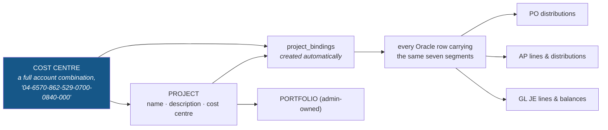
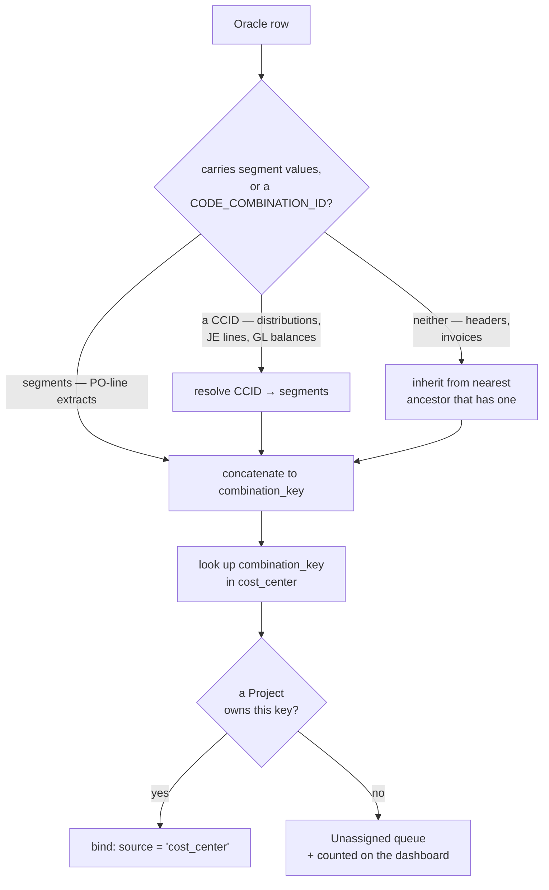
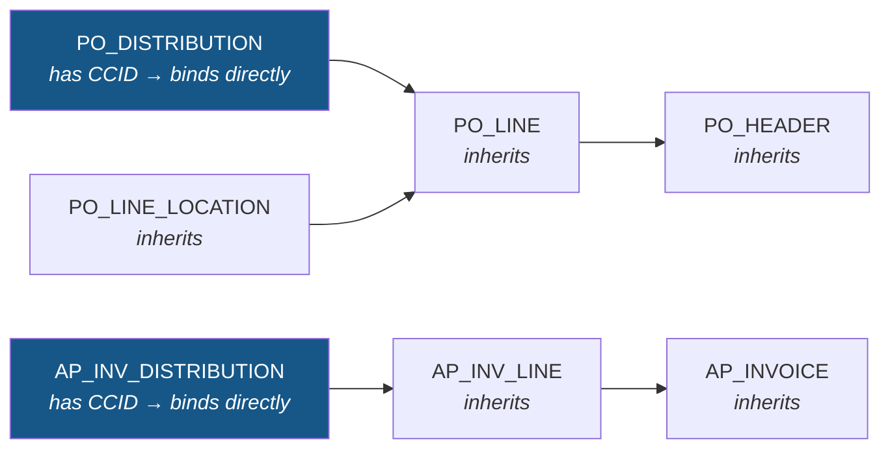
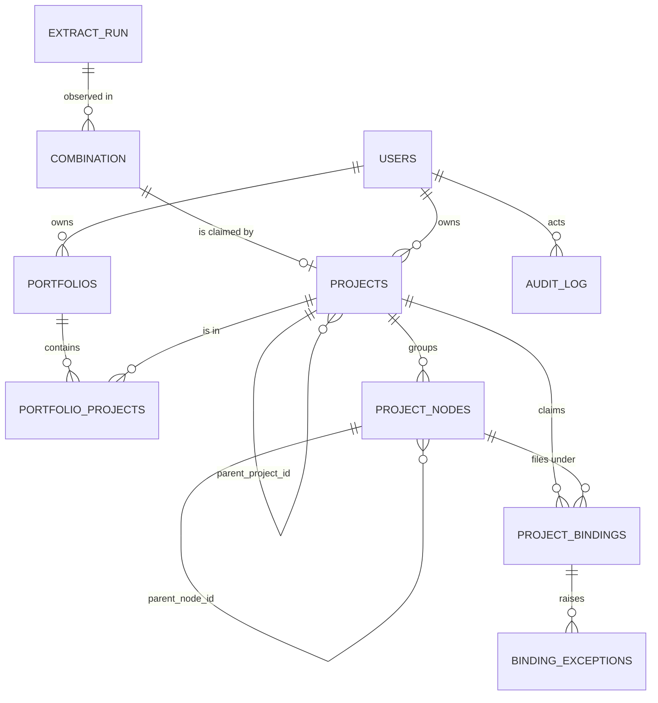
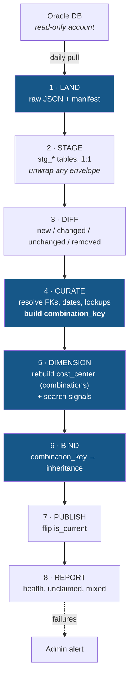

# Oracle Project Tracker — Implementation Plan

**Status:** Draft for review · **Created:** 2026-09-16 · **Revision:** 1

> **Status note (added retrospectively):** every `WCSEXP_*` object named in this plan is a retired
> compatibility view; the base tables are used instead. This matters most where the plan discusses
> `WCSEXP_PO_HEADERS.EXP_PROJECT_NAME` — that column **does** exist on the base table
> `PO_HEADERS_ALL`, so the plan's reasoning about free-text project names is unaffected. See
> [`../../data/oracle/db-schema.md`](../../data/oracle/db-schema.md) for the full map.

| | |
|---|---|
| **Purpose** | Track Oracle procurement and accounting activity as staff-named **Projects**, rolled up into administrator-owned **Portfolios** |
| **Stack** | Node 20 + Express + TypeScript (ESM) · React 18 + Vite + TypeScript · **Turso (libSQL)** |
| **Source** | Daily full extract of 21 Oracle tables (see [`db-schema.md`](../../data/oracle/db-schema.md)) |
| **Companions** | [Oracle Entities — Diagram & Reference](./oracle-entities-diagram.md) · [Design system](../css/site-style.md) |
| **Not started** | No code exists yet. This document is the specification. |

> **Naming note:** "Oracle Projects" is an existing Oracle *module* (`PA`). This application does not
> use it and the extract contains no `PA_*` tables. To avoid confusion in conversation and in the
> codebase, the app's own entities are called **Projects** and **Portfolios**, never "Oracle Projects".

---

## 1. Purpose and scope

### 1.1 The problem

Oracle holds procurement and accounting transactions — POs, invoices, payments, journal entries,
balances. It has **no project dimension**. The only project-shaped field in the entire extract is
`WCSEXP_PO_HEADERS.EXP_PROJECT_NAME`, a free-text string, plus `EXP_PO_NUMBER` — and free text is not
something a report can be trusted on.

What Oracle *does* maintain, consistently and with enforced meaning, is a **cost centre**: the
account combination that every PO distribution, invoice line, journal entry and GL balance already
carries. Staff recognise their cost centres. What the samples show is that the *usable* form of that
key is the **whole seven-segment account combination** — in this fund the segment literally named
`COST_CENTER` never varies, so it cannot key anything on its own (§3.2).

Staff also think in projects: *"the roof replacement"*, *"the HVAC retrofit at Lincoln"*,
*"the 2026 technology refresh"*. This application lets them **name a cost centre as a project** — and
keeps that grouping stable as the daily extract changes underneath it.

### 1.2 What the app does

1. **Ingests** the full Oracle extract daily, with lineage and change detection.
2. **Lets staff create and name Projects** by choosing an **account combination** from a
   **type-ahead picker** populated from the extract — three required fields, no rule authoring.
3. **Binds Oracle rows automatically** by matching the row's full **account combination**, which is
   exact, deterministic and reaches the ledger.
4. **Preserves Oracle's own parent/child structure** inside each Project, so a Project is browsable as
   *PO → line → shipment → distribution*, not as a flat table dump.
5. **Lets administrators group Projects into Portfolios** for roll-up reporting.
6. **Reports** what is claimed, what is **unclaimed** (the app's main source of new work), and totals.

### 1.3 Non-goals (v1)

| Not in scope | Why |
|---|---|
| Writing back to Oracle | Extract is read-only. The app is a read model plus its own metadata. |
| Kahua contract integration | A separate later workstream; the schema here has no contract linkage |
| General-ledger posting / accounting logic | The app reports balances; it never computes them |
| Budget entry or forecasting | No budget table is extractable — `BUDGET_VERSION_ID` is an unresolved integer |
| Multi-currency | The extract carries no currency code |
| Replacing Oracle's own reporting | This is a *grouping and tracking* layer, not a replacement GL |

---

## 2. Source data — what we are working with

### 2.1 Shape and volume

The extract arrives as a **full snapshot**, one JSON file per table-set, keyed by table name:

```json
{ "Table1": [ { "CODE_COMBINATION_ID": 9709011, "SEGMENT1": "04", … } ] }
```

- **21 tables** across General Ledger, Purchasing and Payables.
- **Five samples are on hand**, and the single most important discovery is that **`output.json` names
  its segment columns instead of numbering them** — which makes it the decoder ring for the rest:

  | File | Oracle table | Rows | Envelope | What it gives us |
  |---|---|---|---|---|
  | `json-output.json` | `GL_CODE_COMBINATIONS` | 320 | flat `{ Table1 }` | the account key, company `04` |
  | `output.json` | **PO lines ⋈ account** | **2,782** | `{ body: { ResultSets } }` | **the real transactional grain, with named segments** |
  | `cost-center.json` | `GL_CODE_COMBINATIONS` | 20 | `{ OutputParameters, ResultSets }` | company `01` — a *different fund*, 20 cost centres |
  | `inv-distributions.json` | `PO_DISTRIBUTIONS` | 20 | `{ OutputParameters, ResultSets }` | **`CODE_COMBINATION_ID` + the money** (`AMOUNT_ORDERED`, `AMOUNT_BILLED`, `ENCUMBERED_*`) |
  | `inv-lines.json` | `PO_LINES` | 20 | `{ OutputParameters, ResultSets }` | line detail — **no account column** |

  ⚠️ **Three different envelope shapes, none of them documented.** The ingest must unwrap
  generically (walk to the first array of objects) rather than by a hard-coded offset.
- **The money and the `CODE_COMBINATION_ID` live on the *distribution*, not on the line.**
  `inv-lines.json` has no account; `inv-distributions.json` has both the account and the amounts.
  This confirms the join spine and it is why §3.3 binds at the distribution level.
- The transactional tables are already **far larger than the GL samples** (2,782 PO lines vs. 320
  accounts), and the real extract will be larger again. Sizing is an **open question** (see §13, Q1) —
  the ingest design must not assume anything fits in memory.
- All amounts are unqualified numbers. All keys are Oracle integers.
- **`output.json` carries no `CODE_COMBINATION_ID`**, only the seven segment columns. On the PO-line
  grain the segments *are* the key (§3.2).
- **Only `cost-center.json` lacks a segment name.** Because `output.json` names its columns, the
  business meaning of segments 1–7 for chart `101` is now readable from the extract itself rather
  than needing a person (see §3.2) — the opposite of what the earlier draft assumed.
- ⚠️ **`ORDER_NUMBER` ≠ `PO_HEADER_ID`.** `output.json` ships the *document* number (`218566`); the
  two invoice samples ship the *surrogate* (`11349903`). They will not join without `PO_HEADERS`
  carrying both, so the real extract must include both columns.

### 2.2 The four facts that drive the design

**① There is no project table.**
The app's Project is a first-class *app* entity, not a mirror of anything in Oracle. Binding Oracle
rows to a Project is the application's core value and its core complexity.

**② Only two tables are true roots.**
`GL_CODE_COMBINATIONS` (account key) and `PO_HEADERS` (procurement document) are the only tables that
reach every other module. Everything else is reachable only *through* them
(see [diagram §2](./oracle-entities-diagram.md#2-domain-coupling--where-the-modules-actually-meet)).

**③ Most tables carry no date and no change-tracking column.**
Only **5 of 21** tables have a usable date (see [diagram §4](./oracle-entities-diagram.md#4-temporal-spine--which-tables-can-be-time-bucketed)),
and the schema doc lists **no `LAST_UPDATE_DATE` on any table**. Therefore:

- Delivery is a **full snapshot**, and deltas are computed **app-side** by diffing snapshots.
- Every undated transactional row must **inherit its date** from its nearest dated ancestor. The
  ingest materializes this as a `resolved_date` so reporting never walks the chain at query time.

> ⚠️ **Verify on first extract:** the sample `json-output.json` *does* contain `LAST_UPDATE_DATE` on
> `GL_CODE_COMBINATIONS`, which the schema doc omits — but `cost-center.json` **does not**. The real
> extract is wider than the doc, and its width may vary by query. Confirm per table before relying on
> snapshot-only diffing.

**④ The cost centre is the project key — and the cost centre is the whole seven-segment string.**
Oracle has no project, but it does have a **cost centre** — a dimension staff already use and already
know. That is the join between the two worlds, and it is the design's single most important choice.
The extract proves that in company `04` four of the seven segments never vary, so the usable key is
the **complete account combination**, not any single segment. See §3.2.

---

## 3. The Project model — the cost-centre approach

A Project is a **named account combination**. Staff take a cost centre that already exists in Oracle,
give it a human name and a description, and the app binds every Oracle row carrying **that same
seven-segment string** to it.



**Why this is the right call.** The alternative — matching on `PO_HEADERS.EXP_PROJECT_NAME`, a free-text
field — is probabilistic, needs alias tables, confidence scores and a human confirming every match. The
account combination is a **key**: exact, already maintained in Oracle, already understood by staff, and
reachable from every module. It turns attribution from a fuzzy inference into a **deterministic join**,
which is a much smaller amount of software and a much larger amount of trust.

> **Naming, deliberately.** Staff call this thing a *cost centre*, and so does this plan — the form
> field is still "Cost centre". But what is stored and matched is the **full seven-segment string**,
> because in the real extract the segment named `COST_CENTER` is a constant and cannot key anything
> (§3.2). Anywhere below that says "cost centre" as a *pickable unit*, read "account combination".

### 3.1 The three required fields

The Project creation form has exactly three required inputs:

| # | Field | Type | Notes |
|---|---|---|---|
| 1 | **Project Name** | text, 3–120 chars | Free text. Warn on near-duplicate names (§12 rule 12) |
| 2 | **Project Description** | text, 10–2000 chars | **Required, not optional** — it is the only record of *why* this grouping exists |
| 3 | **Cost Centre** | **type-ahead single-select** | Populated from the extract (§3.4) — it lists account **combinations**, and nothing can be typed that is not selected. This is the binding key |

Everything else is system-managed or optional:

| Field | How it is set |
|---|---|
| `code` | **Auto-derived** from the account combination — staff never type it (§3.4.5). Not a fourth form field. |
| `owner_user_id` | The creating staff member |
| `status` | Defaults to `active` |
| `parent_project_id` | Optional — for sub-projects (§3.8), not part of the create form |
| `fiscal_year` | Optional |

> **Design note:** the request says *three* required fields, so the form has three inputs. `code` is
> derived, not asked for. If a human-readable identifier is wanted, the account combination *is* that
> identifier — the whole point of choosing it. The type-ahead (§3.4) is a *filter over* that one
> field, not a fourth field: it narrows the list, and only a selected row can be submitted.

### 3.2 The cost centre **is** the whole seven-segment combination

**This was open question Q2. The extract answers it.**

`data/oracle/output.json` is a real PO-line extract that ships the segments under their **business
names** instead of `SEGMENTn`. Comparing it to `json-output.json` (which uses `SEGMENTn`) settles the
mapping and proves the two files are the **same fund**:

| Position | `output.json` column | ≡ | `json-output.json` value-set | Relationship |
|---|---|---|---|---|
| 1 | `FUND` | `SEGMENT1` | `04` | **identical** |
| 2 | `PURPOSE` | `SEGMENT2` | `6560` `6570` `9000` | subset |
| 3 | `PROGRAM` | `SEGMENT3` | `861` `862` | subset |
| 4 | `OBJECT_` | `SEGMENT4` | 9 of 11 values | subset |
| 5 | `LEVEL_` | `SEGMENT5` | 139 of 146 values | subset |
| 6 | **`COST_CENTER`** | **`SEGMENT6`** | `0840` | **identical** |
| 7 | `FUTURE_USE` | `SEGMENT7` | `000` | **identical** |

Every named value-set is identical to, or a strict **subset** of, its `SEGMENTn` counterpart. A subset is
exactly what one fund's slice of a shared chart of accounts looks like, so this is **agreement, not
conflict**. `COST_CENTER` is segment 6, and for chart `101` the pointer is settled.

> **Correction to an earlier draft.** It read `cost-center.json` as evidence of a second, *conflicting*
> chart of accounts. It is not. That file is **company `01`** — a different fund with **zero** value
> overlap on segments 1–6 — and, as its filename says, it is a **master list of that fund's 20 cost
> centres**. Different population, not contradiction.

**But segment 6 is not usable as a key.** In the 2,782 PO lines of `output.json`, four of the seven
segments never vary at all:

| Segment | Distinct values | Verdict |
|---|---|---|
| `FUND` (1) | `04` | **constant — unusable as a key** |
| `PURPOSE` (2) | **3** | varies — carries the capital/operating split |
| `PROGRAM` (3) | `862` | **constant** |
| `OBJECT_` (4) | **9** | varies — the natural account |
| `LEVEL_` (5) | **139** | varies — the project-ish code |
| `COST_CENTER` (6) | `0840` | **constant — unusable as a key** |
| `FUTURE_USE` (7) | `000` | **constant** |

A project keyed on segment 6 alone would produce **exactly one project**. The same is true of segment 1,
3 or 7. **The cost centre is the whole combination**, as hypothesised:

```
FUND - PURPOSE - PROGRAM - OBJECT_ - LEVEL_ - COST_CENTER - FUTURE_USE
 04  -  6570   -   862   -   529   -  0700  -    0840    -    000
                     ↓
        '04-6570-862-529-0700-0840-000'
```

**How many are there?** 2,782 PO lines collapse to **328 distinct combinations**, and the repetition is
the *point* rather than a defect — **one combination covers 320 separate lines**. The per-row key of
this extract is `(ORDER_NUMBER, LINE_NUMBER)` (2,782 of 2,782 unique, verified as a control); the
combination is a **grouping**, which is exactly what a project is.

**The 328 split on meaning, not arbitrarily:**

| `PURPOSE` | Population | Rows | Amount | Combinations |
|---|---|---|---|---|
| `6570` | **capital** — construction, renovation, HVAC, roofing | 861 | **$418.9 M** (97.3 %) | **303** |
| `9000` | **operating** — stocking, freight, network renewals | 1,906 | $11.0 M | **13** |
| `6560` | | 15 | $0.65 M | 12 |

**68 % of the rows are operating but they collapse into 13 accounts**, while **97 % of the money sits in
303 capital combinations**. That is why the picker defaults to capital (§3.4): a staff member creating a
project is almost never creating one for `SHIPPING / FREIGHT CHARGE`.

> **Sanity control.** The three `PURPOSE` amounts sum to `430,569,027` — exactly the file total of
> `430,569,026.92`. The partition is exhaustive, so no combination is left unclassified.

**A useful confirmation from the schema.** This extract ships **no `CODE_COMBINATION_ID`**; in Oracle the
surrogate lives on `PO_DISTRIBUTIONS`, which is the table `inv-distributions.json` samples and which
*does* carry it. So on the PO-line grain **the seven segments are the semantic key**, and the app stores
the string as primary with the surrogate as an alternate where available.

The `segment_def` pointer stays — configuration beats hard-coding — but for chart `101` it can be
**seeded** rather than left blank:

```sql
-- segment 6 is the cost centre (verified against output.json)
UPDATE segment_def SET is_cost_centre = 1 WHERE chart_of_accounts_id = 101 AND segment_num = 6;
-- and the purpose segment earns its own flag, because it carries the capital/operating split
UPDATE segment_def SET is_purpose = 1     WHERE chart_of_accounts_id = 101 AND segment_num = 2;

INSERT INTO segment_value_flag VALUES
  (101, 2, '6570', 'capital',   'Capital projects'),
  (101, 2, '9000', 'operating', 'Operating / inventory'),
  (101, 2, '6560', 'operating', NULL);
```

**When more than one segment varies, the *combination* is still the unit.** A future fund may vary on
segments 2, 4 and 5 rather than 4 and 5 alone — the picker lists combinations either way, because the
combination is what the row actually carries and therefore what the join actually matches.

### 3.3 How the account combination becomes a binding

Binding is deterministic and requires no rule engine.



- **Match key:** the canonical `combination_key` string — the seven segment values joined by `-` in
  position order, zero-padded as Oracle stores them. It is **normalised once, at ingest**, never
  re-derived at query time.
- **Two resolution paths, both required.** Rows that carry segment columns (the PO-line extracts) are
  concatenated directly; rows that carry only a `CODE_COMBINATION_ID` (all distributions, JE lines, GL
  balances) are resolved through `GL_CODE_COMBINATIONS`. Either way the row ends up with one
  `oracle_entity.cc_key`.
- **Where the columns are named rather than numbered**, the ingest maps them via `segment_column_map`
  (§7.4) — resolved for the samples in §3.2 and seeded from there.
- **Coverage:** `GL_CODE_COMBINATIONS` → PO distributions, AP lines, AP distributions, JE lines and GL
  balances. This is the **only** mechanism that reaches GL, and the only one that reaches *everything*,
  because every distribution and every journal line carries an account.
- **Timing:** rebuilt on every ingest run, in one pass, after curation. No rules to evaluate.

> **The cost of the fuller key.** Keying on seven segments instead of one makes the match exact but
> narrower: an Oracle row binds only if its **entire** combination is claimed. A `LEVEL_` that staff
> think of as "one project" still splits into several combinations where `OBJECT_` differs — capital
> rows legitimately carry `522`/`523`/`527` for different work types. That is a real consequence, and
> §3.8 is where it is handled: with an explicit, auditable override, never a fuzzy match.

### 3.4 The picker — 328 combinations, selected as you type

The picker is **not** free text and **not** a hard-coded list — it is read from the extract. What changed
from the earlier draft is the *unit*: it lists **account combinations**, not single segment values.

```sql
CREATE TABLE cost_center (
  id                   TEXT PRIMARY KEY,
  chart_of_accounts_id INTEGER NOT NULL,
  combination_key      TEXT NOT NULL,          -- ★ '04-6570-862-529-0700-0840-000'
  combination_hash     TEXT NOT NULL,          -- short stable id, for URLs and claim links
  segments_json        TEXT NOT NULL,          -- ["04","6570","862","529","0700","0840","000"]
  purpose_code         TEXT NOT NULL,          -- segment 2 — capital / operating
  object_code          TEXT NOT NULL,          -- segment 4
  level_code           TEXT NOT NULL,          -- segment 5 — the project-ish code
  display_name         TEXT,                   -- admin-editable label; the extract supplies none
  search_text          TEXT NOT NULL,          -- ★ denormalised type-ahead index (§3.4.2)
  is_active            INTEGER NOT NULL DEFAULT 1,
  first_seen_run       TEXT NOT NULL REFERENCES extract_run (id),
  last_seen_run        TEXT NOT NULL REFERENCES extract_run (id),
  row_count            INTEGER NOT NULL DEFAULT 0,
  amount_total         REAL NOT NULL DEFAULT 0,
  order_count          INTEGER NOT NULL DEFAULT 0,
  vendor_count         INTEGER NOT NULL DEFAULT 0,
  UNIQUE (chart_of_accounts_id, combination_key)
);
CREATE INDEX ix_cc_pick  ON cost_center (is_active, purpose_code, amount_total DESC);
CREATE INDEX ix_cc_level ON cost_center (level_code);
```

Rebuilt each run from the staged transaction rows — the combination is **observed, never invented**:

```sql
INSERT INTO cost_center (id, chart_of_accounts_id, combination_key, segments_json,
                         purpose_code, object_code, level_code, search_text, …)
SELECT …,
       COUNT(*), SUM(amount), COUNT(DISTINCT order_number), COUNT(DISTINCT vendor_name)
  FROM stg_po_line
 GROUP BY combination_key;
```

#### 3.4.1 Why 328 is fine, and what actually makes it usable

328 options is a large dropdown but a **small search index**. The failure mode is not the count — it is
that **a code string is not searchable**. Nobody types `04-6570-862-529-0700-0840-000`. They type
*"aiphone"*, *"lockhart"*, or *"0700"*.

So the field is a **type-ahead over evidence**, which drives the whole design:

| Requirement | Why |
|---|---|
| Search runs **server-side and debounced** | The real extract will hold far more than 328 combinations; never ship the full list to the browser |
| Every result is **labelled with evidence**, not just the code | `19 rows · $5.97 M · 4 POs` is how a person recognises the right one |
| Search matches **things a human knows** — labels, codes, vendors, description tokens — not only the string | Otherwise the picker is no faster than scrolling 328 rows |
| Default filter is **capital**, with a visible toggle | 303 of 328 are capital; the 13 operating accounts are 68 % of *rows* but almost never what a project means |
| Claimed combinations are **shown, disabled, with the claiming project** | One project per combination (§3.5); a disabled row with a reason prevents a guaranteed `409` |
| **Selection is mandatory** — the typed string can never be submitted | The typed text is a filter. Only a chosen row yields a `cost_center_id`, so no typo can become a project |

#### 3.4.2 The search index

`cost_center_signal` holds the harvestable, human-recognisable evidence per combination, so
`GET /cost-centers?q=…` is an indexed lookup rather than a scan over joined fact tables.

```sql
CREATE TABLE cost_center_signal (
  cost_center_id TEXT NOT NULL REFERENCES cost_center (id) ON DELETE CASCADE,
  kind           TEXT NOT NULL CHECK (kind IN ('vendor','description','buyer','alias')),
  value          TEXT NOT NULL,        -- original text, for display
  normalized     TEXT NOT NULL,        -- lowercased, punctuation stripped, for matching
  row_count      INTEGER NOT NULL DEFAULT 0,
  amount_total   REAL NOT NULL DEFAULT 0,
  PRIMARY KEY (cost_center_id, kind, normalized)
);
CREATE INDEX ix_cc_signal_match ON cost_center_signal (normalized);
```

Populated per run by harvesting the description, vendor and buyer text of every row in each combination,
with stop-words dropped and each description reduced to its leading phrase. The
`04-6570-862-529-0700-0840-000` group is the proof this works: its 19 lines all begin
*"AIPHONE UPGRADE & ACCESS CONTROL…"*, which is precisely the token a staff member would type.

`cost_center.search_text` is the flat fallback for the ranking tiers that don't need per-signal detail —
`combination_key` plus its punctuation-stripped form plus `level_code` plus `display_name`, lowercased
and space-delimited.

> ⚠️ **This is not a return to fuzzy matching.** The earlier draft rejected `EXP_PROJECT_NAME` matching
> because it made *attribution* probabilistic. Here the search only decides **which rows are shown**;
> attribution remains the exact, stored `combination_key` a human then selects. It is a **filter, not a
> classifier** — a wrong search result is visible and ignored, whereas a wrong automatic match is
> invisible and corrupts the books. §12 rule 14 encodes the distinction.

#### 3.4.3 Ranking

First tier that matches wins; ties broken by `amount_total DESC`, then `row_count DESC`:

| # | Tier | Example query → match |
|---|---|---|
| 1 | `display_name` prefix | `roof` → a combination an admin labelled *Roofing* |
| 2 | `level_code` exact, then prefix | `0700` → `04-6570-862-529-0700-0840-000` |
| 3 | signal `normalized` **exact** | `aiphone` → `…-0700-…` |
| 4 | signal `normalized` **prefix** | `lockh` → the `LOCKHART ES-RENO…` combination |
| 5 | `combination_key` with punctuation ignored | `046570862529` → `04-6570-862-529-0700-0840-000` |
| 6 | signal `normalized` **substring** — last resort, capped | `reno` → the reno combinations |

Exact → prefix → substring is what keeps the result list short enough to read at a glance.

#### 3.4.4 Interaction spec

| Behaviour | Detail |
|---|---|
| Debounce | 150 ms; minimum 1 character; server `limit=20` |
| Empty query | Ranked default list — capital first, by `amount_total DESC` — plus the counter *"328 combinations · 315 unclaimed"* |
| Each row renders | `04-6570-862-529-0700-0840-000` · `L0700` · **19 rows** · **$5.97 M** · 4 POs · a muted `capital` chip |
| Match reason | When the hit came from a signal, say so: *matched "**AIPHONE UPGRADE…**" ×19* |
| Highlighting | The matched substring is bolded in the code, the label and the reason |
| Stale results | Keep the previous result set visible while refetching — never blank the list mid-type |
| Keyboard | `↑` `↓` move, `Enter` selects, `Esc` closes, `Tab` confirms. Fully operable without a mouse |
| Zero-activity combinations | Still selectable — a project may legitimately have no rows this period — but **badged** *"no activity since 2025-11"* |
| Claimed combinations | Rendered **disabled** with *"used by Bond 2026 — Roof Replacement"* and an `[Open it →]` link |
| A `409` at submit | Rendered inline on the field as *"Already used by …"*, never as a generic toast |
| Accessibility | `role="combobox"` + `aria-expanded` + `aria-activedescendant`; the result count is announced politely as it changes |

#### 3.4.5 The derived `code`

`projects.code` stays **auto-derived and never typed** (§3.1). It is now built from the combination's own
segments — `CC-<LEVEL>-<OBJECT>` with leading zeros trimmed (e.g. `CC-700-529`) — suffixed on collision.
The full `combination_key` remains the *displayed* identifier, because it is the one staff can reconcile
against Oracle.

**Sizing caveat.** The theoretical space is larger than the observed set: one `FUND` × 3 `PURPOSE` ×
one `PROGRAM` × 9 `OBJECT_` × 139 `LEVEL_` × one `COST_CENTER` × one `FUTURE_USE` ≈ **1,251** possible
combinations, of which **328** actually occur. **The picker is fed from observed data only** — an
unobserved combination is not something anyone can claim, and offering it would invite typo-shaped
projects. The cardinality check still applies at config time: warn if a configured segment produces more
distinct values than `0.5 × row count`.

### 3.5 One project per combination

**An account combination may back at most one active project.** Enforced by index, not by convention:

```sql
CREATE UNIQUE INDEX ux_project_cost_center
  ON projects (cost_center_id) WHERE status = 'active';
```

The index is unchanged from the earlier draft; what changed is what `cost_center_id` points at — a row
of `cost_center`, which is now one **combination** (§3.4). Without it, two projects claim the same
combination and the deterministic join stops being deterministic: every bound row belongs to both, and
portfolio totals double-count.

Three consequences to handle:

| Situation | Behaviour |
|---|---|
| Staff pick a claimed combination | **Blocked in the picker** (§3.4.4) and rejected by the API with `409` |
| Staff want to split one combination across two projects | They cannot — the combination is the boundary. Use `project_nodes` (§3.9 ③) to split *presentation* inside one project, or an admin reassigns the combination |
| A project is archived | Its combination frees up; the picker includes it again. Bindings are closed, not deleted (§3.10) |

> **⚠️ The practical consequence of keying on seven segments.** A `LEVEL_` that a staff member thinks of
> as one project may be split across several combinations, because `OBJECT_` and `PURPOSE` differ
> underneath it. The capital `LEVEL_` `0700` is one combination and therefore one project; but a busy
> level such as `0521` (90 rows) spreads over several. Two responses, both sanctioned:
> **①** claim each combination and let a **parent project** (§3.9 ②) present them as one programme — the
> normal, preferred case; **②** if the split is genuinely an artefact rather than real accounting, the
> fix belongs in Oracle. What must **never** happen is a code-level fudge that silently widens the match.

### 3.6 Rows with no combination of their own — inheritance

Most transactional tables carry no account combination, so they inherit from the nearest ancestor that
does. With the key being seven segments rather than one, this matters **more**, not less: a document
header has nothing to inherit a combination *from* unless a distribution below it resolved one.



| Entity | How it gets a combination |
|---|---|
| `PO_DISTRIBUTION` | **Own** `CODE_COMBINATION_ID` — and it also carries the money (`AMOUNT_ORDERED`, `AMOUNT_BILLED`, `ENCUMBERED_*`) |
| `PO_LINE_LOCATION` | Via `PO_LINE` → `PO_DISTRIBUTION` |
| `PO_LINE`, `PO_HEADER`, `PO_RELEASE` | Via their distributions — **or**, in a PO-line extract like `output.json`, from their own seven segment columns |
| `AP_INV_DISTRIBUTION` | **Own** `DIST_CODE_COMBINATION_ID` |
| `AP_INV_LINE` | Own `DEFAULT_DIST_CCID`, else via `AP_INVOICE` |
| `AP_INVOICE` | Via its lines' distributions |
| `AP_INVOICE_PAYMENT` | Via `AP_INVOICE` |
| `GL_JE_LINE`, `GL_BALANCES` | **Own** `CODE_COMBINATION_ID` |
| `AP_CHECK`, `PO_VENDORS`, lookups, line types | **Never bound** — dimensions, not transactions |

> **Two routes to the same key, and the samples show both.** `inv-distributions.json` proves the
> distribution route (`CODE_COMBINATION_ID`); `output.json` proves the inline route (seven segment
> columns, no CCID). The ingest must accept either and normalise both to one `combination_key` (§3.3).
> A row that carries a CCID can additionally resolve it to segments through `GL_CODE_COMBINATIONS`, so
> the two routes converge rather than compete.

**A document can straddle two combinations.** A PO whose lines are charged to
`04-6570-862-529-0700-0840-000` and `04-6570-862-527-0454-0840-000` is split across two Projects at the
*distribution* level. That is correct accounting and the app should show it as such — the PO appears in
both projects, with its lines allocated. The PO *header* is then owned by neither, and the UI must not
imply it is.

**Rule of thumb encoded in the schema:** bind at the **lowest level that carries a combination** (the
distribution, or the inline-segment line), and let the header follow only when all its children agree.
`PO_HEADER` gets a binding only if every distribution under it resolves to the same `combination_key`;
otherwise it is `mixed` and shows as split.

### 3.7 Combinations nobody has claimed

Because the account combination is populated by Oracle and not by the app, **a combination with real
traffic will often belong to no project.** This is the normal state, not an error, and it is the
app's main source of new work. In the sample extract, **all 328 are unclaimed** — the queue is not an
edge case, it is the starting condition.

The dashboard shows three numbers, and they should be read together:

| Number | Meaning | What it prompts |
|---|---|---|
| **Unclaimed combinations** | Have rows this period, no project owns them | *"You are not tracking this yet"* |
| **Unclaimed rows** | Row count and amount behind those combinations | *"…and this is how much"* |
| **Claimed but empty** | Projects whose combination has no rows this period | *"…and this project may be finished"* |

The **Unassigned queue** (§9.4) lists unclaimed combinations ranked by amount (not row count — that
is what §3.2's partition tells us: the operating side has most of the *rows* and almost none of the
*money*). One click creates a Project pre-filled with that combination and pre-suggested from its own
signals — which turns "assign 328 combinations" into a sequence of confident choices rather than a
research project.

> **Default the queue to capital.** Ranking unfiltered would put the 13 operating accounts at the top of
> a list a staff member reads as "work to track". Filter by `segment_value_flag = 'capital'` on by
> default, with a toggle — the same default as the picker (§3.4.1).

### 3.8 Overrides, for the cases the combination match does not cover

The combination match (§3.3) is the default and should account for the overwhelming majority of
bindings. Four situations still need an answer:

| Case | Handling |
|---|---|
| **A row must belong to a project other than its combination's** | A **locked manual binding** (`source = 'manual'`, `locked = 1`). Highest precedence, never overwritten by a re-ingest, and recorded in the audit log with an actor |
| **A combination is split across two projects over time** | Not an override — a **new project claiming the combination after the old one is archived** (§3.5). Temporal bindings (§3.10) make history read correctly |
| **Several combinations are really one project** (the `LEVEL_`-spanning case, §3.5) | **Not** an override — claim each combination and group them under a **parent project** (§3.9 ②). Roll-ups sum the subtree, so the programme total is a first-class figure rather than a special case |
| **One combination must be shared by two live projects** | **Unsupported by design.** A locked blanket rule that maps a combination to a second project would break the one-project-per-combination guarantee and double-count in every roll-up. If this is genuinely needed, the split is financial and belongs in Oracle |

Precedence, highest first:

| Rank | `source` | `locked` | Written by | Overwritable? |
|---|---|---|---|---|
| 1 | `manual` | `1` | Staff pin on a single row | **Never** |
| 2 | `cost_center` | `0` | The deterministic match (§3.3) | Recomputed each run |
| 3 | `inherited` | `0` | Ancestor traversal (§3.6) | Recomputed each run |

> **What is gone.** The earlier draft of this plan carried `grouping_rules`, a rule engine, an
> `EXP_PROJECT_NAME` alias table, a confidence score and a proposed/approved workflow. The combination
> match makes all of it unnecessary. A single `grouping_rules` table survives only to express the rare
> override, and `project_alias` is retained **only** to seed a suggested name when a combination is
> claimed — never to drive attribution.

> **The one override that is explicitly rejected.** *"Treat every variation of `04-6570-862-*-0700-0840-000`
> as this project"* is tempting when a `LEVEL_` spans several `OBJECT_` codes, and it must not be built.
> A wildcard match makes attribution a guess, and the whole point of the seven-segment key is that it is
> **exact and checkable**. The supported alternatives are the §3.9 ② parent project (many combinations,
> many projects, one programme) and the §3.8 rank-1 manual pin (one row at a time, audited).

### 3.9 Parent/child, three distinct senses

The request mentions parent/children, which can mean three different things. All three are supported,
and keeping them separate matters.

| Sense | Where it lives | Example |
|---|---|---|
| **① Oracle's own hierarchy** | Derived from FKs on every read | PO `4501` → line `2` → shipment `1` → distribution `1` |
| **② Project hierarchy** | `projects.parent_project_id` (self-FK) | *"2026 Bond Program"* → *"Roof Replacement — Phase 1"* |
| **③ Internal grouping nodes** | `project_nodes` (free-form tree inside one Project) | *"Design"*, *"Procurement"*, *"Closeout"* |

- **① is never editable.** It is Oracle's structure; the app only renders it.
- **② is real structure.** A sub-project is its own Project with its own bindings, owner and
  reporting line. Roll-ups sum the subtree. Depth is capped at **3** (portfolio → project →
  sub-project) to keep breadcrumbs and roll-ups tractable.
- **③ is presentation only.** A node never changes attribution; it is a folder. Deleting one moves
  children to the parent, never orphans data.

> **Interaction with account combinations:** a sub-project must claim a **different** combination from its
> parent, since one combination backs one active project (§3.5). This is exactly how a real sub-project
> works — *"Roof Replacement — Phase 1"* and *"Phase 2"* are separate combinations under one programme.
> If staff want to split a **single** combination, that is `project_nodes` (§3③), not sub-projects,
> because it is presentation rather than accounting structure.
>
> **This is also the answer to §3.5's spanning problem.** Where `OBJECT_` splits a `LEVEL_` across several
> combinations, staff claim each one and parent them under the programme project. The sub-project tree
> is therefore load-bearing rather than decorative, and the dashboard should surface "unclaimed
> combinations under a claimed `LEVEL_`" as a distinct prompt — it is the cheapest way to finish a
> programme that was started and abandoned halfway.

### 3.10 Bindings are temporal

A combination can change hands — a project is archived, another claims the key, and history must
survive that.

`project_bindings` carries `effective_from` / `effective_to`. A change writes a new row and closes the
old one — **no UPDATE, no data loss**. Reports default to "as of today" but can be run
"as of 2026-03-31", which is only possible if the prior binding still exists.

This matters more under the combination model than it did under a rule engine, because account
combinations are **reused**. `04-9000-862-541-0523-0840-000` in FY26 and the same key in FY29 may be
entirely different work — and the operating side is where reuse is most aggressive, since those 13
accounts are recycled continuously. The app must be able to answer both "what was this key in FY26?" and
"what is it now?" without the second answer overwriting the first.

---

## 4. Portfolio model (administrator-owned)



> `COMBINATION ||--o| PROJECTS` is **optional-one**, enforced by a partial unique index on
> `projects (cost_center_id) WHERE status = 'active'` (§3.5). The table is still called `cost_center`
> (§3.4) — the *table name* is legacy wording, the *key* is the combination.

### 4.1 Cardinality

| Relationship | Cardinality | Notes |
|---|---|---|
| **Account combination → Project** | **1 : 0..1** | One active project per combination (§3.5). Archived projects free the combination |
| Portfolio → Project | **N : N** | A project may sit in several portfolios (e.g. *Capital*, *FY26*) |
| Project → Project | 1 : N | Sub-projects; max depth 3 |
| Project → Binding | 1 : N | One Oracle entity binds to exactly one project **at a time** |
| Portfolio → Binding | **none** | Deliberate — see below |

### 4.2 The separation-of-concerns rule

> **Portfolio membership NEVER affects attribution.**

A portfolio is a **pure roll-up lens**. Adding a project to a portfolio must not change which Oracle
rows belong to that project, must not cascade to sub-projects, and must not be usable as an implicit
grouping rule. This is enforced in the schema (no FK path from a binding to a portfolio) and asserted
by a test.

If portfolios *could* drive attribution, then removing a project from a portfolio would silently
un-attribute its data — a destruction of staff work via an admin action. Keeping the two orthogonal
means portfolio edits are always cheap and safe.

### 4.3 Portfolio properties

- `code` — short, unique, admin-defined (e.g. `CAP-26`)
- `name`, `description`
- `owner_user_id` — the admin accountable
- `fiscal_year` — optional scoping
- `status` — `draft` | `active` | `closed`
- `include_subprojects` — whether roll-ups descend into the sub-project tree (default `true`)
- `sort_order` per project via `portfolio_projects`, so the admin controls presentation

---

## 5. Roles and permissions

| Capability | Viewer | Staff | Admin |
|---|:--:|:--:|:--:|
| View projects, portfolios, Oracle data, account combinations | ✔ | ✔ | ✔ |
| View audit log | — | own actions | ✔ |
| **Create a Project — `{name, description, cost_center_id}`** | — | ✔ | ✔ |
| **Search account combinations (`GET /cost-centers?q=`)** | ✔ | ✔ | ✔ |
| Select a combination that is **already claimed** | — | **blocked (`409`)** — the row renders disabled with the claimant's name | **blocked (`409`)** |
| Rename / re-describe / archive a Project | — | own projects | ✔ |
| **Change a Project's account combination** | — | — | ✔ — re-attributes every bound row |
| Rebind a project from its combination | — | own projects | ✔ |
| Pin a single row to a project, overriding its combination | — | own projects | ✔ |
| **Set `segment_def.is_cost_centre` / `is_purpose` / `is_company`** | — | — | ✔ — **and it must be set before anything can bind** |
| **Maintain `segment_column_map` / `segment_value_flag` / `segment_def.position`** | — | — | ✔ — the segment map must cover all seven positions before binding runs (§12 rule 3) |
| Edit a combination's `display_name` | — | — | ✔ |
| Manage override rules | — | — | ✔ |
| **Create / edit / delete a Portfolio** | — | — | ✔ |
| Add or remove projects in a portfolio | — | — | ✔ |
| Assign project to a sub-project parent | — | own projects | ✔ |
| Manage users, roles, lookup maps | — | — | ✔ |
| Trigger / retry a daily extract run | — | — | ✔ |
| Backfill or re-publish a historical extract run | — | — | ✔ |

**Enforcement:** role is a claim in the JWT, but every write endpoint re-checks ownership against the
database — a token is never trusted for authorisation on its own.

---

## 6. Daily extract pipeline



| Step | What happens | Failure behaviour |
|---|---|---|
| **1 Land** | Write raw payload to `data/incoming/<run-id>/`; record a manifest (tables, row counts, extract tool version, checksum, watermark) | Abort the run; the previous published run stays live |
| **2 Stage** | Unwrap the payload (**three envelope shapes across five samples — walk to the first array of objects, never a fixed offset**), then load `stg_<table>` mirroring Oracle 1:1, adding `_run_id` and `_row_hash` | Abort; nothing published |
| **3 Diff** | Join to the previous run on the natural key, compare `_row_hash`, classify each row | Abort |
| **4 Curate** | Build `oracle_entity`; resolve `resolved_date` by ancestor walk; resolve lookups; type-cast and null-normalize. **★ Build `combination_key`** from the row's own segments, or by resolving a `CODE_COMBINATION_ID` through `GL_CODE_COMBINATIONS` (§3.3) | **Non-fatal** — unresolved rows are flagged and carried forward, never dropped |
| **5 Dimension** | Rebuild `cost_center` from the staged rows grouped by `combination_key`, then harvest `cost_center_signal` from description/vendor/buyer text (§3.4.2); refresh `observed_distinct` on `segment_def` | **Fatal if `is_cost_centre` is unset or the `segment→column` map is incomplete** — the run lands and publishes its facts but binds nothing, and the dashboard says why |
| **6 Bind** | Read each row's `cc_key`, compare to the claimed `cost_center.combination_key`, then inherit up the FK chain for rows without one (§3.6) | Non-fatal; unobserved keys land in the unclaimed queue |
| **7 Publish** | Set `is_current = 1` on the new run in a single transaction; demote the old run | Atomic — a half-published run is impossible |
| **8 Report** | Row counts, orphan counts, **unclaimed combinations**, mixed documents | Alerts only |

### 6.1 Design rules

1. **Never mutate a published run.** Corrections are a new run or an admin backfill.
2. **The site is never down during a run.** Reads always resolve against `is_current`, which flips
   atomically at the end.
3. **Partial extracts are detectable.** A run whose row counts fall outside a tolerance band versus
   the previous run is flagged `suspect` and does **not** auto-publish. A truncated Oracle export must
   never present as "all the data was deleted".
4. **Everything is idempotent.** Re-running the same extract produces the same result; ingest is keyed
   on the natural key, not on insertion order.
5. **The run is a job, not a request.** Ingest runs in a worker off a `jobs` table. No HTTP request
   ever waits on Oracle.
6. **★ The combination is normalised once, at ingest.** Padding, case, whitespace and null-segment
   handling are settled in step 4 and stored as `oracle_entity.cc_key`. No later query re-derives it —
   otherwise a formatting change in Oracle silently breaks every binding while producing no error.
7. **★ The dimension is rebuilt from *observed* rows only.** A combination nobody has transacted
   against is not offered in the picker (§3.4.5), so a stale `cost_center` row must not linger: step 5
   reconciles, marking disappeared combinations `is_active = 0` rather than deleting them, since a
   project may still reference one.

> **Snapshot safety:** because a full snapshot either lands completely or not at all, the risk is not
> a torn read but a *plausibility* failure — an extract that succeeds technically while carrying
> 5 % of the rows. The tolerance band in rule 3 is the guard, and it must be checked **before**
> publish, not after.

---

## 7. Data model (Turso / libSQL)

SQLite dialect. All timestamps are ISO-8601 UTC text. All IDs are UUID text unless the column name
says otherwise.

### 7.1 Extract lineage

```sql
CREATE TABLE extract_run (
  id             TEXT PRIMARY KEY,
  source         TEXT NOT NULL DEFAULT 'oracle',
  started_at     TEXT NOT NULL,
  finished_at    TEXT,
  status         TEXT NOT NULL CHECK (status IN
                   ('running','staged','curated','bound','published','failed','suspect')),
  watermark      TEXT,                       -- max LAST_UPDATE_DATE seen, when available
  manifest_json  TEXT,                       -- tables, row counts, tool version, checksums
  is_current     INTEGER NOT NULL DEFAULT 0,
  error          TEXT
);
-- at most one published run
CREATE UNIQUE INDEX ux_extract_run_current ON extract_run (is_current) WHERE is_current = 1;

CREATE TABLE extract_table_stat (
  extract_run_id TEXT NOT NULL REFERENCES extract_run (id) ON DELETE CASCADE,
  table_name     TEXT NOT NULL,
  rows_in        INTEGER NOT NULL,
  rows_new       INTEGER NOT NULL DEFAULT 0,
  rows_changed   INTEGER NOT NULL DEFAULT 0,
  rows_removed   INTEGER NOT NULL DEFAULT 0,
  content_hash   TEXT,
  PRIMARY KEY (extract_run_id, table_name)
);

-- one row per changed/new/removed entity, per run. This is the change feed.
CREATE TABLE oracle_row_delta (
  extract_run_id TEXT NOT NULL REFERENCES extract_run (id) ON DELETE CASCADE,
  table_name     TEXT NOT NULL,
  natural_key    TEXT NOT NULL,              -- canonical 'K1=v|K2=v'
  change_kind    TEXT NOT NULL CHECK (change_kind IN ('new','changed','removed','unchanged')),
  row_hash       TEXT NOT NULL,
  payload_json   TEXT,
  PRIMARY KEY (extract_run_id, table_name, natural_key)
);
CREATE INDEX ix_row_delta_lookup ON oracle_row_delta (table_name, natural_key, change_kind);
```

### 7.2 Identity map — the spine of all binding

```sql
CREATE TABLE oracle_entity (
  id             TEXT PRIMARY KEY,
  entity_type    TEXT NOT NULL,              -- 'PO_HEADER' | 'GL_CODE_COMBINATION' | …
  natural_key    TEXT NOT NULL,              -- canonical, stable across runs
  display_key    TEXT,                       -- human label, e.g. PO_NUMBER or the combination string
  first_seen_run TEXT NOT NULL REFERENCES extract_run (id),
  last_seen_run  TEXT NOT NULL REFERENCES extract_run (id),
  is_active      INTEGER NOT NULL DEFAULT 1, -- 0 once absent from a published run
  resolved_date  TEXT,                       -- inherited from nearest dated ancestor
  -- ★ the join key: the full account combination this row resolves to, plus where it came from
  cc_key         TEXT,                       -- ★ '04-6570-862-529-0700-0840-000' (§3.2)
  cc_id          TEXT REFERENCES cost_center (id),  -- resolved FK; null while unobserved
  cc_source      TEXT CHECK (cc_source IN ('own_segments','own_ccid','inherited')),
  cc_via_entity  TEXT REFERENCES oracle_entity (id),  -- set when cc_source = 'inherited'
  cc_mixed       INTEGER NOT NULL DEFAULT 0, -- 1 when a header's children disagree (§3.6)
  attributes_json TEXT,                      -- denormalized hot columns for list views
  UNIQUE (entity_type, natural_key)
);
CREATE INDEX ix_entity_type_active ON oracle_entity (entity_type, is_active);
CREATE INDEX ix_entity_display ON oracle_entity (entity_type, display_key);
CREATE INDEX ix_entity_date ON oracle_entity (resolved_date);
-- ★ the binding recompute walks this index; without it every run is a full scan
CREATE INDEX ix_entity_cc ON oracle_entity (cc_key, entity_type);
CREATE INDEX ix_entity_cc_id ON oracle_entity (cc_id, entity_type);
```

> **Why a generic identity table?** Bindings must reference 21 different entity types with wildly
> different composite keys. A single `oracle_entity` table gives bindings **one** FK target, one
> `display_key` to search, one `resolved_date` to sort by, one `cc_key` to match on, and one place to
> answer "is this row still in the extract?". Typed `stg_*` tables keep the real columns for reporting.
>
> **Why `cc_key` lives here rather than in each `stg_*` table:** resolving it once during curation means
> the binding step is a single indexed `UPDATE … WHERE cc_key = ?` instead of 21 different joins. It
> also records *provenance* (`cc_source`, `cc_via_entity`), which is what lets the UI say
> *"inherited from Dist 1"* rather than just showing a code.
>
> **Why `cc_key` is TEXT and not an FK.** Resolution and observation are different events. A row can
> carry a perfectly valid combination that no extract has ever *seen* (a GL balance for a combination
> with no PO activity yet), and dropping it for want of a `cost_center` row would be data loss — which
> §12 rule 6 forbids. So `cc_key` is stored raw, and `cc_id` is filled when the combination is known,
> left null when it is not. The unobserved set is itself a useful dashboard number.

### 7.3 Staging mirrors (one per Oracle table, 21 total)

Pattern — `stg_*` columns match Oracle 1:1 plus bookkeeping:

```sql
CREATE TABLE stg_gl_code_combinations (
  _run_id             TEXT NOT NULL REFERENCES extract_run (id) ON DELETE CASCADE,
  _row_hash           TEXT NOT NULL,
  code_combination_id INTEGER NOT NULL,
  chart_of_accounts_id INTEGER,
  account_type        TEXT,
  enabled_flag        TEXT,
  summary_flag        TEXT,
  segment1            TEXT, segment2 TEXT, segment3 TEXT, segment4 TEXT,
  segment5            TEXT, segment6 TEXT, segment7 TEXT,
  description         TEXT,
  PRIMARY KEY (_run_id, code_combination_id)
);

CREATE TABLE stg_po_headers (
  _run_id           TEXT NOT NULL REFERENCES extract_run (id) ON DELETE CASCADE,
  _row_hash         TEXT NOT NULL,
  po_header_id      INTEGER NOT NULL,
  type_lookup_code  TEXT,
  po_number         TEXT,
  vendor_id         INTEGER,
  vendor_site_id    INTEGER,
  approved_flag     TEXT,
  approved_date     TEXT,
  start_date_active TEXT,
  exp_project_name  TEXT,
  exp_po_number     TEXT,
  PRIMARY KEY (_run_id, po_header_id)
);
-- … and 19 more, generated from a single table manifest
```

### 7.4 Application domain

```sql
-- ---------------- Users & roles ----------------
CREATE TABLE users (
  id            TEXT PRIMARY KEY,
  email         TEXT NOT NULL UNIQUE COLLATE NOCASE,
  display_name  TEXT NOT NULL,
  role          TEXT NOT NULL CHECK (role IN ('viewer','staff','admin')),
  password_hash TEXT,                     -- null when SSO-only
  is_active     INTEGER NOT NULL DEFAULT 1,
  created_at    TEXT NOT NULL,
  last_login_at TEXT
);

-- ---------------- Portfolios (admin-owned) ----------------
CREATE TABLE portfolios (
  id                 TEXT PRIMARY KEY,
  code               TEXT NOT NULL UNIQUE,
  name               TEXT NOT NULL,
  description        TEXT,
  owner_user_id      TEXT NOT NULL REFERENCES users (id),
  fiscal_year        INTEGER,
  status             TEXT NOT NULL DEFAULT 'active'
                       CHECK (status IN ('draft','active','closed')),
  include_subprojects INTEGER NOT NULL DEFAULT 1,
  created_by         TEXT NOT NULL REFERENCES users (id),
  created_at         TEXT NOT NULL,
  updated_at         TEXT NOT NULL
);

-- ---------------- Cost centre dimension — populated FROM the extract (§3.4) ----------------
-- ★ One row per OBSERVED ACCOUNT COMBINATION. Full DDL, column rationale and the
--   type-ahead contract live in §3.4 — that is the single source of truth.
--   Summary of the shape:
--     combination_key  '04-6570-862-529-0700-0840-000'   ← the binding key
--     purpose_code / object_code / level_code            ← denormalised for filter + sort
--     search_text + cost_center_signal                   ← the type-ahead index (§3.4.2)
--     row_count / amount_total / order_count / vendor_count  ← the evidence shown per option
CREATE TABLE cost_center ( … );   -- see §3.4

-- ★ Type-ahead evidence harvested per combination (§3.4.2)
CREATE TABLE cost_center_signal ( … );   -- see §3.4.2

-- ---------------- Projects (staff-owned, hierarchical, combination-keyed) ----------------
CREATE TABLE projects (
  id                TEXT PRIMARY KEY,
  code              TEXT NOT NULL UNIQUE,      -- AUTO-DERIVED CC-<LEVEL>-<OBJECT>; never typed (§3.4.5)
  name              TEXT NOT NULL,             -- FORM FIELD 1
  description       TEXT NOT NULL,             -- FORM FIELD 2 - required, not optional
  cost_center_id    TEXT NOT NULL REFERENCES cost_center (id),  -- FORM FIELD 3 (type-ahead, §3.4)
  status            TEXT NOT NULL DEFAULT 'active'
                      CHECK (status IN ('draft','active','on_hold','closed','archived')),
  owner_user_id     TEXT NOT NULL REFERENCES users (id),
  parent_project_id TEXT REFERENCES projects (id) ON DELETE RESTRICT,
  path              TEXT NOT NULL,    -- materialized path: '/<root>/<child>/'
  depth             INTEGER NOT NULL DEFAULT 0,   -- 0..2  (cap = 3 levels)
  fiscal_year       INTEGER,
  created_by        TEXT NOT NULL REFERENCES users (id),
  created_at        TEXT NOT NULL,
  updated_at        TEXT NOT NULL,
  CHECK (parent_project_id IS NULL OR parent_project_id <> id),
  CHECK (depth BETWEEN 0 AND 2),
  CHECK (length(trim(name)) >= 3),
  CHECK (length(trim(description)) >= 10)
);
-- ONE ACTIVE PROJECT PER ACCOUNT COMBINATION (§3.5). Integrity backbone of the design.
CREATE UNIQUE INDEX ux_project_cost_center
  ON projects (cost_center_id) WHERE status = 'active';
CREATE INDEX ix_projects_parent ON projects (parent_project_id);
CREATE INDEX ix_projects_path   ON projects (path);
CREATE INDEX ix_projects_owner  ON projects (owner_user_id, status);

CREATE TABLE portfolio_projects (
  portfolio_id TEXT NOT NULL REFERENCES portfolios (id) ON DELETE CASCADE,
  project_id   TEXT NOT NULL REFERENCES projects (id)   ON DELETE CASCADE,
  added_by     TEXT NOT NULL REFERENCES users (id),
  added_at     TEXT NOT NULL,
  sort_order   INTEGER NOT NULL DEFAULT 0,
  PRIMARY KEY (portfolio_id, project_id)
);

-- optional free-form folder tree INSIDE one project (presentation only)
CREATE TABLE project_nodes (
  id              TEXT PRIMARY KEY,
  project_id      TEXT NOT NULL REFERENCES projects (id) ON DELETE CASCADE,
  parent_node_id  TEXT REFERENCES project_nodes (id) ON DELETE CASCADE,
  name            TEXT NOT NULL,
  sort_order      INTEGER NOT NULL DEFAULT 0,
  CHECK (parent_node_id IS NULL OR parent_node_id <> id)
);

-- ---------------- Optional naming aid (NOT an attribution mechanism) ----------------
-- Seeds a suggested Project name when a combination is claimed, from whatever
-- EXP_PROJECT_NAME already says about that combination's rows.
CREATE TABLE project_alias (
  id                TEXT PRIMARY KEY,
  project_id        TEXT NOT NULL REFERENCES projects (id) ON DELETE CASCADE,
  source            TEXT NOT NULL DEFAULT 'exp_project_name',
  raw_value         TEXT NOT NULL,
  normalized_value  TEXT NOT NULL,
  created_by        TEXT NOT NULL REFERENCES users (id),
  created_at        TEXT NOT NULL,
  UNIQUE (source, normalized_value)
);

-- ---------------- Overrides only (see §3.8) ----------------
-- The combination match is the default and needs no row here. This table exists
-- solely for the rare case where a specific row must belong to a different project.
CREATE TABLE grouping_rules (
  id                TEXT PRIMARY KEY,
  name              TEXT NOT NULL,
  description       TEXT,
  priority          INTEGER NOT NULL,          -- lower runs first
  enabled           INTEGER NOT NULL DEFAULT 1,
  match_type        TEXT NOT NULL CHECK (match_type IN
                      ('exp_project_name','exp_po_number','po_number_prefix','vendor')),
  field             TEXT,
  operator          TEXT NOT NULL CHECK (operator IN
                      ('equals','in','prefix','suffix','contains','regex')),
  values_json       TEXT NOT NULL DEFAULT '[]',
  target_project_id TEXT NOT NULL REFERENCES projects (id) ON DELETE CASCADE,
  stop_on_match     INTEGER NOT NULL DEFAULT 1,
  status            TEXT NOT NULL DEFAULT 'active'
                      CHECK (status IN ('proposed','active','disabled')),
  created_by        TEXT NOT NULL REFERENCES users (id),
  approved_by       TEXT REFERENCES users (id),
  created_at        TEXT NOT NULL,
  updated_at        TEXT NOT NULL
);
CREATE INDEX ix_rules_order ON grouping_rules (enabled, priority);

-- ---------------- The bindings ----------------
CREATE TABLE project_bindings (
  id                 TEXT PRIMARY KEY,
  project_id         TEXT NOT NULL REFERENCES projects (id) ON DELETE CASCADE,
  project_node_id    TEXT REFERENCES project_nodes (id) ON DELETE SET NULL,
  entity_id          TEXT NOT NULL REFERENCES oracle_entity (id),
  source             TEXT NOT NULL CHECK (source IN
                       ('cost_center','inherited','manual')),
  rule_id            TEXT REFERENCES grouping_rules (id) ON DELETE SET NULL,
  matched_key        TEXT,                     -- ★ the combination_key that produced the match (audit)
  locked             INTEGER NOT NULL DEFAULT 0,
  binding_run_id     TEXT REFERENCES extract_run (id),
  effective_from     TEXT NOT NULL,
  effective_to       TEXT,                     -- null = currently in force
  created_by         TEXT REFERENCES users (id),
  created_at         TEXT NOT NULL,
  CHECK (effective_to IS NULL OR effective_to > effective_from)
);
-- one live binding per entity
CREATE UNIQUE INDEX ux_binding_live
  ON project_bindings (entity_id) WHERE effective_to IS NULL;
CREATE INDEX ix_binding_project ON project_bindings (project_id, effective_to);
CREATE INDEX ix_binding_locked  ON project_bindings (locked, entity_id);

-- ---------------- Divergence & review (§3.6, §3.7) ----------------
CREATE TABLE binding_exceptions (
  id                 TEXT PRIMARY KEY,
  entity_id          TEXT NOT NULL REFERENCES oracle_entity (id) ON DELETE CASCADE,
  binding_run_id     TEXT NOT NULL REFERENCES extract_run (id),
  reason             TEXT NOT NULL CHECK (reason IN
                       ('mixed_combination','missing_parent','no_combination',
                        'combination_unobserved','segment_not_configured','date_unresolvable')),
  candidate_json     TEXT NOT NULL,            -- [{project_id, combination_key, source, detail}, …]
  resolution         TEXT CHECK (resolution IN ('accepted','overridden','ignored')),
  resolved_by        TEXT REFERENCES users (id),
  resolved_at        TEXT,
  created_at         TEXT NOT NULL
);
CREATE INDEX ix_exceptions_open ON binding_exceptions (resolution, reason);

-- ---------------- Reference data we must maintain ourselves ----------------
-- ⚠️  is_cost_centre MUST be set on exactly one segment before binding can run (§3.2).
-- The app refuses to bind while no segment is marked. For chart 101 it is SEGMENT6 ('0840').
CREATE TABLE segment_def (
  chart_of_accounts_id INTEGER NOT NULL,
  segment_num          INTEGER NOT NULL,       -- 1..7
  name                 TEXT NOT NULL,          -- 'Fund', 'Purpose', 'Program', … (§3.2)
  meaning              TEXT,
  column_alias         TEXT,                   -- ★ the name the extract may use instead of SEGMENTn,
                                               --   e.g. 'COST_CENTER' for segment 6 (§3.2)
  position             INTEGER NOT NULL,       -- ★ order in the concatenated combination_key
  is_cost_centre       INTEGER NOT NULL DEFAULT 0,
  is_company           INTEGER NOT NULL DEFAULT 0,   -- which segment identifies the fund
  is_purpose           INTEGER NOT NULL DEFAULT 0,   -- ★ which segment carries capital/operating
  is_padded            INTEGER NOT NULL DEFAULT 1,   -- ★ zero-pad to a fixed width when concatenating
  pad_width            INTEGER NOT NULL DEFAULT 4,
  observed_distinct    INTEGER,                -- cardinality seen last run, for the sanity check (§3.4)
  PRIMARY KEY (chart_of_accounts_id, segment_num)
);
-- exactly one cost-centre segment per chart of accounts
CREATE UNIQUE INDEX ux_segment_cost_centre
  ON segment_def (chart_of_accounts_id) WHERE is_cost_centre = 1;
-- exactly one purpose segment per chart of accounts
CREATE UNIQUE INDEX ux_segment_purpose
  ON segment_def (chart_of_accounts_id) WHERE is_purpose = 1;

-- ★ Marks which VALUES of a segment mean what. Carries the capital/operating split (§3.2).
-- Seeded for chart 101 from the extract; admin-editable thereafter.
CREATE TABLE segment_value_flag (
  chart_of_accounts_id INTEGER NOT NULL,
  segment_num          INTEGER NOT NULL,
  segment_value        TEXT NOT NULL,
  flag                 TEXT NOT NULL CHECK (flag IN ('capital','operating','inactive')),
  meaning              TEXT,
  PRIMARY KEY (chart_of_accounts_id, segment_num, segment_value)
);
CREATE INDEX ix_svf_purpose ON segment_value_flag (chart_of_accounts_id, segment_num, flag);

-- ★ Maps an extract's BUSINESS-NAMED columns onto segment numbers, for sources that do not
--   emit SEGMENTn. output.json uses FUND/PURPOSE/PROGRAM/OBJECT_/LEVEL_/COST_CENTER/FUTURE_USE.
--   Seeded from the verified mapping in §3.2; extend per source query as extracts are added.
CREATE TABLE segment_column_map (
  source_query   TEXT NOT NULL,                -- 'po_lines', 'gl_code_combinations', …
  column_name    TEXT NOT NULL,                -- 'OBJECT_'
  segment_num    INTEGER NOT NULL,             -- 4
  PRIMARY KEY (source_query, column_name)
);

CREATE TABLE lookup_map (
  domain       TEXT NOT NULL,                  -- 'GL' | 'PO' | 'AP'
  lookup_type  TEXT NOT NULL,
  lookup_code  TEXT NOT NULL,
  meaning      TEXT NOT NULL,
  PRIMARY KEY (domain, lookup_type, lookup_code)
);

-- ---------------- Audit & jobs ----------------
CREATE TABLE audit_log (
  id            TEXT PRIMARY KEY,
  actor_user_id TEXT REFERENCES users (id),
  action        TEXT NOT NULL,                 -- 'project.create', 'binding.lock', …
  entity_type   TEXT NOT NULL,
  entity_id     TEXT,
  before_json   TEXT,
  after_json    TEXT,
  at            TEXT NOT NULL
);
CREATE INDEX ix_audit_entity ON audit_log (entity_type, entity_id, at DESC);
CREATE INDEX ix_audit_actor  ON audit_log (actor_user_id, at DESC);

CREATE TABLE jobs (
  id          TEXT PRIMARY KEY,
  kind        TEXT NOT NULL,                   -- 'extract.ingest', 'binding.rebuild'
  payload_json TEXT,
  status      TEXT NOT NULL DEFAULT 'queued'
                CHECK (status IN ('queued','running','succeeded','failed','cancelled')),
  attempts    INTEGER NOT NULL DEFAULT 0,
  max_attempts INTEGER NOT NULL DEFAULT 3,
  run_after   TEXT NOT NULL,
  started_at  TEXT,
  finished_at TEXT,
  error       TEXT
);
CREATE INDEX ix_jobs_ready ON jobs (status, run_after);
```

### 7.5 Materialized roll-ups

Kept as tables (not views) so the dashboard never scans transaction tables.

```sql
CREATE TABLE project_rollup (
  extract_run_id  TEXT NOT NULL REFERENCES extract_run (id) ON DELETE CASCADE,
  project_id      TEXT NOT NULL REFERENCES projects (id) ON DELETE CASCADE,
  period_name     TEXT,                        -- null = all-time row
  po_count        INTEGER NOT NULL DEFAULT 0,
  po_committed    REAL    NOT NULL DEFAULT 0,
  invoice_count   INTEGER NOT NULL DEFAULT 0,
  invoiced_amount REAL    NOT NULL DEFAULT 0,
  paid_amount     REAL    NOT NULL DEFAULT 0,
  je_line_count   INTEGER NOT NULL DEFAULT 0,
  net_debit       REAL    NOT NULL DEFAULT 0,
  net_credit      REAL    NOT NULL DEFAULT 0,
  unbound_count   INTEGER NOT NULL DEFAULT 0,  -- rows in this cost centre not bound here (straddles)
  PRIMARY KEY (extract_run_id, project_id, period_name)
);

CREATE TABLE portfolio_rollup (
  extract_run_id TEXT NOT NULL REFERENCES extract_run (id) ON DELETE CASCADE,
  portfolio_id   TEXT NOT NULL REFERENCES portfolios (id) ON DELETE CASCADE,
  period_name    TEXT,
  project_count  INTEGER NOT NULL DEFAULT 0,
  po_count       INTEGER NOT NULL DEFAULT 0,
  invoiced_amount REAL   NOT NULL DEFAULT 0,
  net_debit      REAL    NOT NULL DEFAULT 0,
  PRIMARY KEY (extract_run_id, portfolio_id, period_name)
);
```

---

## 8. API surface

REST, `/api/v1`, JSON. Zod schemas on every body, JWT bearer, role + ownership checked server-side.

### 8.1 Account combinations & the project picker

| Method | Path | Role | Notes |
|---|---|---|---|
| `GET` | `/cost-centers` | staff+ | **Populates the type-ahead (§3.4).** Query: `?q=&purpose=&level=&object=&available=1&include_claimed=0&limit=20&sort=relevance\|amount\|rows\|recent` |
| `GET` | `/cost-centers/:id` | staff+ | One combination with its full evidence: signals, top vendors, monthly activity |
| `GET` | `/cost-centers/unclaimed` | staff+ | Ranked by **amount** — backs the Unassigned queue (§3.7). `?purpose=capital` is the default |
| `GET` | `/cost-centers/suggest` | staff+ | **Recent** (this user's last picks) + **Suggested** (top capital combinations by amount, unclaimed) |
| `GET` | `/cost-centers/:id/preview-bind` | staff+ | *"Claiming this binds **19 rows · $5,972,326 · 4 orders**"* — the pre-commit evidence shown before Create |

`GET /cost-centers` is **the hot path** — it runs on every keystroke (debounced, §3.4.4). It is a
server-side ranked search over `cost_center` + `cost_center_signal`, never a full-list download:

```json
{
  "items": [
    { "id": "cc_9f2a…",
      "combination_key": "04-6570-862-529-0700-0840-000",
      "segments": { "fund": "04", "purpose": "6570", "program": "862",
                    "object": "529", "level": "0700", "cost_center": "0840",
                    "future_use": "000" },
      "display_name": "Aiphone Upgrade & Access Control",
      "purpose_code": "6570", "purpose_label": "Capital",
      "level_code": "0700", "level_name": "MISCELLANEOUS CONTRACTS AND OTHER CHARGES",
      "object_code": "529",
      "row_count": 19, "order_count": 19, "vendor_count": 4,
      "amount_total": 5972326.0, "last_seen": "2026-07-27",
      "match": { "tier": "signal_exact", "field": "description",
                 "value": "AIPHONE UPGRADE & ACCESS CONTROL", "hits": 19 },
      "claimed_by": null, "has_current_year_activity": true },
    { "id": "cc_1b77…",
      "combination_key": "04-9000-862-541-0523-0840-000",
      "purpose_code": "9000", "purpose_label": "Operating",
      "row_count": 412, "order_count": 96, "vendor_count": 51,
      "amount_total": 1180440.5, "last_seen": "2026-08-06",
      "match": { "tier": "key_prefix", "field": "combination_key", "value": "04-9000" },
      "claimed_by": { "project_id": "prj_…", "name": "Network Renewals FY26" },
      "has_current_year_activity": true }
  ],
  "total": 328,
  "returned": 2,
  "truncated": true,
  "unclaimed": 328,
  "claimed": 0,
  "by_purpose": { "capital": 303, "operating": 13, "other": 12 },
  "filters_applied": { "q": "aiphone", "purpose": "capital", "available": true }
}
```

Contract rules the client depends on:

| Field | Guarantee |
|---|---|
| `combination_key` | **Immutable.** Always present, always the full seven segments. The client never constructs one |
| `match` | Present only when `q` was supplied. Drives the *matched "…"* line and the highlighting (§3.4.4) |
| `claimed_by` | Non-null means **render disabled**, with the project name and an `[Open it →]` link. Never omit a claimed row silently |
| `truncated` | `true` when `total > returned`; the client shows *"328 combinations — refine your search"* |
| `by_purpose` | Counts **after** the other filters, so the chips always read truthfully |
| Ordering | Server-side only. The client never re-sorts — relevance depends on `match`, which only the server knows |

> **Why the search is not client-side.** At 328 rows a browser *could* filter locally — and that is
exactly the trap. The real daily extract will hold thousands of combinations, and a design that ships
the whole list would have to be rewritten. Server-side search from day one means the picker scales
without a second implementation, and it keeps the `claimed_by` decision in one place instead of two.

### 8.2 Projects

| Method | Path | Role | Notes |
|---|---|---|---|
| `GET` | `/projects` | viewer+ | Filter: `status`, `owner`, `fiscal_year`, `portfolio_id`, `cost_center_id`, `q`; cursor-paginated |
| `POST` | `/projects` | staff+ | **`{name, description, cost_center_id}`** — the three required fields (§3.1). `code` is derived server-side. `cost_center_id` is **one observed account combination** |
| `GET` | `/projects/:id` | viewer+ | Includes subtree summary, binding counts and the claimed combination |
| `PATCH` | `/projects/:id` | owner/admin | Rename, re-describe, reparent, change status. **Changing `cost_center_id` is admin-only** — it re-attributes every bound row |
| `DELETE` | `/projects/:id` | owner/admin | Soft — archives; frees the combination; refuses if it has sub-projects |
| `GET` | `/projects/:id/tree` | viewer+ | Sub-project tree + internal nodes. **This is how a programme spanning several combinations is presented** (§3.5) |
| `GET` | `/projects/:id/entities` | viewer+ | **Bound Oracle data**, filter by `entity_type`, `period` |
| `GET` | `/projects/:id/rollup` | viewer+ | Precomputed aggregates by period |
| `GET` | `/projects/:id/coverage` | viewer+ | Bound vs. unbound, uncovered periods, **and unclaimed sibling combinations under the same `level_code`** |

`POST /projects` — the whole create contract:

```json
{ "name": "Bond 2026 — Roof Replacement",
  "description": "Roof and membrane replacement across four campuses, funded by the 2026 bond.",
  "cost_center_id": "cc_9f2a…" }
```

Validation, in order:

| Check | Failure |
|---|---|
| Zod shape: all three present, name ≥ 3 chars, description ≥ 10 chars | `400` |
| `cost_center_id` exists, `is_active`, and the user was **allowed to see it** (role + `purpose` filter) | `404` / `400` |
| No active project already claims that combination (§3.5) | **`409 CONFLICT`** with the claiming project's id and name, so the UI can offer *"Open it instead?"* |
| Name is not a near-duplicate of an existing project | `409` with a warning payload — overridable |

> **The `409` is a backstop, not the primary guard.** The picker already returns claimed
> combinations as disabled rows with the claimant's name (§3.4.4 and §8.1), so a well-behaved client
> cannot produce this error. It is kept because the picker result is a snapshot and two staff can race.

### 8.3 Bindings

| Method | Path | Role | Notes |
|---|---|---|---|
| `POST` | `/projects/:id/rebind` | staff+ | Recompute this project's bindings from its claimed combination |
| `POST` | `/bindings/:id/pin` | staff+ | Lock a single row to this project, overriding its combination (§3.8) |
| `DELETE` | `/bindings/:id` | owner/admin | Closes `effective_to` (temporal close, not delete) |
| `GET` | `/projects/:id/bindings` | viewer+ | Every bound entity with its `matched_key` for auditability |

> **No bulk-import endpoint.** Under the combination model there is nothing to import — a project
> claims an account combination and the bindings follow. This is a direct simplification of the earlier
draft.

### 8.4 Segments, overrides & lookups

| Method | Path | Role |
|---|---|---|
| `GET/PUT` | `/segment-defs` | admin — **`is_cost_centre`, `is_company` and `is_purpose` must be consistent before binding can run**. For chart 101 the cost centre is segment 6 (§3.2) |
| `GET` | `/segment-defs/validate` | admin — cardinality sanity check (§3.4.5), reports which segment looks like a cost centre and whether `combination_key` builds cleanly |
| `GET/PUT` | `/segment-column-map` | admin — the business-name → segment map for sources that do not emit `SEGMENTn` (§3.2) |
| `GET/PUT` | `/segment-value-flags` | admin — which values are `capital` / `operating`; drives the picker default (§3.2, §3.4.1) |
| `GET/PUT` | `/cost-centers/:id` | admin — set `display_name` (the friendly label shown in the picker) |
| `GET/POST/PATCH/DELETE` | `/rules` | admin — **overrides only** (§3.8) |
| `POST` | `/rules/evaluate` | admin — dry run over the current run, returns match counts only |
| `GET/PUT` | `/lookups` | admin |

### 8.5 Portfolios

| Method | Path | Role |
|---|---|---|
| `GET` | `/portfolios` | viewer+ |
| `POST` | `/portfolios` | **admin** |
| `PATCH`/`DELETE` | `/portfolios/:id` | **admin** |
| `POST` | `/portfolios/:id/projects` | **admin** — add one or many |
| `DELETE` | `/portfolios/:id/projects/:projectId` | **admin** |
| `PATCH` | `/portfolios/:id/projects/order` | **admin** |
| `GET` | `/portfolios/:id/rollup` | viewer+ |

### 8.6 Oracle data, extract and admin

| Method | Path | Role |
|---|---|---|
| `GET` | `/oracle/:entityType/:key` | viewer+ — the full FK-graph detail for one entity |
| `GET` | `/oracle/:entityType/:key/children` | viewer+ — Oracle's own parent/child chain |
| `GET` | `/oracle/search` | viewer+ — cross-entity search |
| `GET` | `/unclaimed` | staff+ — unclaimed **combinations** ranked by amount, defaulted to capital (§3.7) |
| `POST` | `/unclaimed/:ccId/claim` | staff+ — creates a project pre-filled from that combination's `display_name` and `level_name` |
| `GET` | `/assignments/inbox` | staff+ — rows that could not be bound, and mixed documents |
| `POST` | `/assignments/inbox/:id/resolve` | staff+ |
| `GET` | `/extract/runs` | admin |
| `POST` | `/extract/runs` | admin — trigger a manual run |
| `POST` | `/extract/runs/:id/republish` | admin — roll back to a prior run |
| `GET` | `/extract/runs/:id/changes` | admin — the `oracle_row_delta` feed |
| `GET` | `/health` | public — `{ ok, dbReady, lastPublishedRunAt }` |

---

## 9. Screens

| # | Screen | Role | Purpose |
|---|---|---|---|
| 9.1 | **Dashboard** | all | Extract health, **unclaimed combinations**, top projects by spend |
| 9.2 | **Projects list** | all | Filter, search, tree/flat toggle; **3-field create form** for staff |
| 9.3 | **Project detail** | all | The workhorse — leads with the account combination; tabs: Overview · Oracle Data · Hierarchy · Bindings · Coverage · Audit |
| 9.4 | **Unclaimed queue** | staff+ | **Unclaimed combinations** ranked by amount, defaulted to capital, one click to claim (§3.7) |
| 9.5 | **Portfolios list / detail** | all (write: admin) | Roll-up across member projects |
| 9.6 | **Oracle explorer** | all | The raw FK graph — PO → line → shipment → distribution → account |
| 9.7 | **Segment admin** | admin | **Name the segments, set `is_cost_centre`/`is_purpose`, and maintain the segment→column map; the app cannot bind until this is done** |
| 9.8 | **Combination admin** | admin | Editable `display_name` per account combination, plus the `PURPOSE`/`OBJECT_`/`LEVEL_` filters and the `capital`/`operating` value flags; the extract supplies no names |
| 9.9 | **Overrides** | admin | The rare manual-pin rules (§3.8) |
| 9.10 | **Extract runs** | admin | Run history, row-count deltas, republish, **combination count moved in/out**, change feed |
| 9.11 | **Users & roles** | admin | |

### 9.1 Dashboard

- **Extract status strip** — last run time, status badge, row-count delta vs. previous run,
  `resolved_date` freshness, **the number of observed combinations and how it moved since the last run**,
  **and a red banner if `segment_def.is_cost_centre` is unset or the segment map is incomplete**
  (nothing can bind until an admin answers §3.2 / §3.4.5)
- **KPI row** — Projects (active), Portfolios, **Unclaimed combinations** (split capital / operating),
  **Unclaimed rows / amount**, total committed / invoiced
- **Trend** — committed vs. invoiced by period (reuse the existing
  [`dashboard-monthly-trend.html`](../screenshots/dashboard-monthly-trend.html) chart component and
  its monotone-cubic SVG renderer, with month click-through and the right-side detail drawer already
  built and proven)
- **Attention list** — projects with no activity this period, **combinations claimed but empty**, and
  unclaimed combinations with the largest traffic (§3.7, defaulted to capital)

### 9.2 Projects list — the create form

The create form is still exactly three inputs, in this order. What changed is the third one: it is a
**type-ahead**, not a dropdown, because what it selects is a full account combination.

```
┌─ New Project ───────────────────────────────────────────────────────────┐
│ Name *                                                                   │
│ [ Bond 2026 — Roof Replacement                                        ]  │
│                                                                          │
│ Description *                                                            │
│ [ Roof and membrane replacement across four campuses,                 ]   │
│ [ funded by the 2026 bond.                                            ]   │
│                                                                          │
│ Cost centre *   (type to filter — only a chosen row can be submitted)     │
│ [ ⌕ aiphone                                                           ]   │
│   Capital ▾   Level ▾   Object ▾             123 of 328 · 328 unclaimed   │
│ ┌──────────────────────────────────────────────────────────────────────┐ │
│ │ ● 04-6570-862-529-0700-0840-000                        19 rows · $5.97M│ │
│ │   L0700 · Aiphone Upgrade & Access Control · ● Capital               │ │
│ │   matched "AIPHONE UPGRADE…" ×19                                      │ │
│ ├──────────────────────────────────────────────────────────────────────┤ │
│ │   04-6570-862-529-0704-0840-000                          2 rows · $64K│ │
│ │   L0704 · Aiphone — Phase 2 access control                           │ │
│ ├──────────────────────────────────────────────────────────────────────┤ │
│ │ ✖ 04-9000-862-541-0523-0840-000                     412 rows · $1.18M│ │
│ │   used by Network Renewals FY26            [Open it →]                │ │
│ └──────────────────────────────────────────────────────────────────────┘ │
│                                                                          │
│                                            [Cancel]  [Create]            │
└──────────────────────────────────────────────────────────────────────────┘
```

- The field is a **type-ahead combobox** fed by `GET /cost-centers?q=…` (§8.1) — the full interaction
  rules are §3.4.4. **Typing filters; only picking a row sets a value.** The field cannot be submitted
  with unselected text in it.
- Each option carries its **own evidence** — the full code, the `LEVEL_` shortcut, a friendly name, the
  purpose chip, and `rows · amount` — so staff recognise the right combination without leaving the form.
- The `Capital | All | Operating` chips default to **Capital**, with **Level** and **Object** as the
  narrowing filters (§3.4.1). A `287` row-count difference against the 328 total is the operating side,
  which is why the default is not "All".
- A combination that is **already claimed** renders **disabled inline**, naming the project and offering
  `[Open it →]`. The client should not have to wait for a `409` to learn that.
- **Recent** and **Suggested** chips (a staff member's own last picks; the highest-amount unclaimed
  capital combinations) appear when the field is focused and empty — the fastest route for the common case.
- **No `code` field.** It is derived server-side from the combination (§3.4.5).

> **Field label vs. stored key.** The label stays *"Cost centre"* because that is the word staff use
> (§3 intro). The value submitted is `cost_center_id`, and it points at a full combination. The client
> never sees or constructs a `combination_key` — it only ever echoes back an opaque `id`.

### 9.3 Project detail — the parent/child presentation

The key screen: it must make Oracle's hierarchy legible without flattening it, and it must **lead with
the account combination** because that is what defines the project.

```
Roof Replacement — Phase 1                          [Staff owner]  ● active
Cost centre  04-6570-862-529-0700-0840-000  ·  19 rows  ·  $5.97M  ·  4 POs  ⓘ
2026 Bond Program / Roof Replacement — Phase 1                     depth 1
──────────────────────────────────────────────────────────────────────────────
Overview   Oracle Data   Hierarchy   Bindings   Coverage   Audit
──────────────────────────────────────────────────────────────────────────────
▸ Purchase Orders (7)                                    committed  1,284,300
   ▾ PO 4501-NC  ·  Tri-State Roofing  ·  approved 2026-03-14        428,900
       Line 1   Membrane replacement, 12,400 sq ft      qty 1    412,000
         Ship 1  received 2026-05-02                    recv 1    412,000
           Dist 1  04-6570-862-541-0507-0840-000        encumbered  412,000
       Line 2   Freight                                   qty 1     16,900
   ▸ PO 4512-NC  ·  Carolina Sheet Metal  ·  approved 2026-04-02     355,400
▸ Invoices (9)                                             invoiced   962,110
▸ Payments (6)                                               paid     540,000
▸ Journal Entries (14)                                net debit   1,102,450
▸ GL Balances (3 periods)
──────────────────────────────────────────────────────────────────────────────
⚠ 1 combination under this project's POs is not this project's
   — Dist 2 on PO 4512-NC reads 04-6570-862-529-0507-0840-000        [Review →]
⚠ 14 rows share this project's LEVEL_ 0700 under 2 unclaimed combinations  [Review →]
```

- Every node exposes its **Oracle key** and its **binding provenance**
  (`combination 04-6570-862-529-0700-0840-000` / `inherited from Dist 1` / `manual pin`).
- Clicking any leaf opens the existing **right-side detail drawer** pattern.
- The first `⚠` strip is where a **mixed** document surfaces (§3.6) — visible, counted, one click from
  review. The second is the **`LEVEL_`-spanning prompt** (§3.9): rows carrying this project's `LEVEL_`
  under a *different* `OBJECT_`, which is exactly the case a seven-segment key cannot match.
- **Either `⚠` is a prompt to claim a sibling combination and group it under this project (§3.9 ②),
  never a per-row exception list.** The counts measure how incomplete the project's coverage is, so
  they must stay visible rather than be hidden behind a clean-looking total.

---

## 10. Technology choices

| Layer | Choice | Rationale |
|---|---|---|
| Runtime | Node 20 LTS | Matches the union of available libs; no transpile surprises |
| Backend | **Express 5 + TypeScript (ESM/NodeNext)** | Plain, well-understood, no framework lock-in. `dotenv` must resolve the repo-root `.env` |
| Validation | **Zod** | One schema per endpoint, shared with the frontend for types |
| DB client | `@libsql/client` | Native Turso driver; supports embedded replicas for fast local reads |
| Auth | JWT access (15 min) + refresh cookie (7 d, httpOnly) | Standard; role claim + server-side ownership recheck |
| Jobs | `jobs` table + in-process worker | Avoids a second deployable in v1; the table makes a separate worker a drop-in later |
| Frontend | **React 18 + Vite 5 + TS**, React Router 6 | Consistent with the existing stack |
| Server state | **TanStack Query** | Real caching/invalidations — hand-rolled `useEffect` fetching will not hold up against 21 entity types |
| Tables | TanStack Table (headless) | Sorting/filtering/virtualization without a heavyweight grid |
| Charts | Hand-written inline SVG (existing `monotonePath`) | Already built, proven, dependency-free, and matches the mockup |
| Styling | Ported `site-style.md` tokens, **3px radius** | Existing design system; §11 semantics mapped to reporting status |
| Testing | Vitest + Supertest, Playwright for e2e | |
| Ingest runner | Scheduled job (cron/Windows Task Scheduler) hitting the admin endpoint | Keeps the scheduler outside the app |

### 10.1 Design-system application

From [`site-style.md` §11](../css/site-style.md):

- Page titles in `#262626`, **not** the source's orange — orange is reserved for accents and key metrics
- Status semantics: `--status-ok` `#BED600` (synced), `--status-info` `#00add0` (pending),
  `--status-warning` `#fed100` (needs review), `--status-error` `#c90062` (failed/over budget),
  `--status-neutral` `#455560` (archived)
- ⚠️ Dark text on the lime and yellow status fills — white fails contrast on both
- `--tertiary-color #00add0` is **2.66:1** — never use it for a data line
- 3px radius on every rectangular surface; `:focus-visible` and `prefers-reduced-motion` from day one

---

## 11. Build phases

| Phase | Deliverable | Exit criteria |
|---|---|---|
| **0 · Foundation** | Repo, DB, migrations, auth, health endpoint, seeded users, **`segment_def` + `segment_column_map` + `segment_value_flag` admin** | `/api/health` green; a staff and an admin can log in; **the chart-101 pointers are seeded from §3.2 (`segment_num = 6` cost centre, `2` purpose)** |
| **1 · Ingest** | Land → stage → **generic envelope unwrap** → diff → curate (**build `combination_key`**) → publish for **the PO-line grain only**; **`cost_center` + `cost_center_signal` rebuilt per run** | Two consecutive runs produce a correct change feed; **`output.json` yields exactly 328 combinations, 303 of them capital**, matching the §3.2 figures |
| **2 · The type-ahead picker & Projects** | Projects CRUD (3 fields), **the type-ahead combobox (§3.4.4) over real combinations**, **deterministic bind by `combination_key`**, Project detail showing the Oracle hierarchy | A staff user types *"aiphone"* and picks `04-6570-862-529-0700-0840-000`; **all 19 of its rows appear bound with no rule authored**; typing alone never submits |
| **3 · Inheritance & the unclaimed queue** | Ancestor traversal for PO/AP headers and lines, unclaimed-combination queue (**defaulted to capital**), **mixed-document surfacing**, **unclaimed-sibling prompt under a claimed `LEVEL_`** | Every row carrying a combination is bound; unclaimed combinations are listed by amount with one-click claim (§3.7) |
| **4 · Portfolios** | Admin portfolio CRUD, membership, roll-ups | An admin groups projects and sees summed totals; removing one changes no binding |
| **5 · Remaining tables** | All 21 extract tables: AP chain, JE lines, GL balances, vendors, lookups. **Adds the CCID resolution path for tables that carry no segment columns** (§3.3) | Full three-way match PO → invoice → payment visible on one screen; **GL JE lines bind, proving the combination reaches the ledger** |
| **6 · Reporting & export** | Dashboard, trends, CSV/Excel export, scheduled runs, alerting | A daily run completes unattended for two weeks |

> **What changed from the earlier draft.** The old phase 3 was *"rule engine, propagation, assignment
> inbox"* — a large, uncertain build. Choosing a deterministic key deleted it; phase 2 **is** the binding
> engine and phase 3 shrinks to inheritance plus the unclaimed queue. **The type-ahead picker is the one
> thing the combination model adds back**, and it is a bounded, testable UI component rather than an
> inference engine — which is the whole trade: *more UI, far less database*.

Phases 1–2 are the load-bearing work. Phases 3–6 are additive.

---

## 12. Cross-cutting rules

1. **An account combination backs at most one active project.** Enforced by a partial unique index
   (`ux_project_cost_center`), not by application logic, and surfaced as `409` (§3.5).
2. **A project's key is an account combination, never a single segment.** The picker offers
   **observed** combinations only, and `combination_key` is normalised once at ingest (§6.1 rule 6).
3. **The segment pointer *and* the segment→column map must be configured before any binding runs.** If
   `segment_def.is_cost_centre` is unset, or a source's columns are unmapped, the app refuses to bind
   and says so on the dashboard.
4. **Never allow an Oracle entity to have two live bindings.** Enforced by a partial unique index,
   not by application logic.
5. **Combination binding is authoritative; only a `locked` manual pin outranks it.** Asserted by test.
6. **Never delete a binding — close it.** `effective_to` is the only retirement mechanism, because
   combinations are reused across years.
7. **Never drop an unresolvable row.** It is flagged and carried; data loss is never a fallback. This
   includes a row whose combination no extract has observed — `cc_key` is stored even when `cc_id` is null.
8. **Never auto-publish a run that fails the row-count tolerance band.**
9. **Never let a portfolio edit change attribution.** No FK path exists from bindings to portfolios.
10. **Every write is audited** with before/after JSON and actor.
11. **Every list query is index-backed.** No dashboard query scans a transactional table — including
    the type-ahead search, which is why `cost_center_signal` exists (§3.4.2).
12. **Ownership is checked against the database**, never inferred from a token claim alone.
13. **Unauthenticated endpoints are limited to `/health` and login.**
14. **★ Search may suggest; only a human selection may attribute.** The type-ahead's evidence matching
    decides which rows are *shown* — never which project a row *belongs to*. Attribution is always the
    exact, stored `combination_key`. A client must never be able to submit a `cost_center_id` it did not
    receive from the API.
15. **Warn on near-duplicate project names at create time** (§8.2) — fragmentation is the most likely
    way this app degrades over years, and it is cheapest to catch at the moment of creation.

---

## 13. Open questions

| # | Question | Why it blocks | Proposed default |
|---|---|---|---|
| **Q2 ✅ ANSWERED** | **Which segment is the cost centre — `SEGMENT4` or `SEGMENT6`?** | **Resolved by `output.json`.** `COST_CENTER` ≡ `SEGMENT6`; and **no single segment can be the key** — four of the seven are constant. The cost centre is the **whole combination** (§3.2) | Implemented: `segment_num = 6` for chart 101, and the picker lists combinations |
| **Q2b** | **Which other funds and charts of accounts exist, and what are their segment maps?** | Decides whether the pointer is per-chart-of-accounts (it is) and whether `segment_column_map` needs more rows | Confirmed: at least **three** populations — company `04` (`json-output.json` **and** `output.json`), company `01` (`cost-center.json`), and a third fund behind `inv-distributions.json` (7-digit `CODE_COMBINATION_ID`s, **zero** overlap with the other two) |
| **Q2c** | **What do the other six segments *mean*, and are the names stable across charts?** | Needed to label picker filters and populate `is_company` / `is_purpose` | **Largely answered for chart 101** by `output.json` (`FUND`, `PURPOSE`, `PROGRAM`, `OBJECT_`, `LEVEL_`, `COST_CENTER`, `FUTURE_USE`); confirm the names hold for the other charts |
| **Q2d** | **Does the third fund's `PO_HEADERS` carry the document number *and* the surrogate?** | **Blocks joining invoices to POs.** `output.json` ships `ORDER_NUMBER` (`218566…`); the invoice samples ship `PO_HEADER_ID` (`11349903…`); **the intersections are zero**. Without a bridging column the invoice side is an island | Confirm `PO_HEADERS` carries both; if it does not, bridge through `PO_LINE_LOCATION`/`PO_DISTRIBUTIONS` or match on vendor + amount + date |
| **Q1** | Row counts for the 15 transactional tables? | Sizing the ingest, indexes and pagination | Assume ≤ 5 M rows/table; re-evaluate after the first real extract |
| **Q3** | Is `EXP_PROJECT_NAME` populated, and how consistently? | **No longer critical** — it seeds a suggested project name when a combination is claimed, nothing more. It is a *naming hint*, never a key | Sample it once; if it is junk, skip the suggestion entirely |
| **Q4** | Does `CHART_OF_ACCOUNTS_ID` join to `FND_ID_FLEX_STRUCTURES.ID_FLEX_NUM`? | Segment *names* are otherwise unavailable | Verify on the first extract; degrade to unnamed segments |
| **Q5** | Is one Oracle ledger / set of books involved, or many? | Multi-ledger changes every default key | **The samples suggest more than one fund**, but a fund is a segment, not a ledger — still assume a single ledger until proven otherwise |
| **Q6** | Extract cadence and overlap — full nightly, or incremental where possible? | Diffing two full snapshots is simplest but costs storage | Full snapshot nightly; add `LAST_UPDATE_DATE` filtering per table only where the column is confirmed |
| **Q7** | Auth source — local accounts or SSO (Entra ID)? | Blocks phase 0 | Local accounts first, with an SSO-shaped `users` table |
| **Q8** | Retention for `stg_*` runs? | Unbounded growth | Keep the current run plus 13 prior; archive older to object storage |
| **Q9 ✅ ANSWERED (sample)** | **How many combinations will the real extract have?** | Originally decided whether a picker needed search-first UX | **328 observed in the sample** (303 capital, 13 operating, 12 other) from 2,782 rows. **The picker is search-first by design regardless** (§3.4), so a larger real number changes no architecture — only the ranking's importance. Confirm the real figure on the first extract and set `limit` from it |
| **Q10** | Who owns each project when staff leave? | Orphaned projects are unmaintainable | Admin reassignment UI + a dashboard warning for projects with inactive owners |

---

## 14. Risk register

| Risk | Likelihood | Impact | Mitigation |
|---|---|---|---|
| **The wrong segment is configured as the cost centre** | **Low** for chart 101 (verified §3.2); Medium for other charts | **High** — every binding is wrong, silently and consistently | Seeded for chart 101 (`segment_num = 6`); a **cardinality sanity check warns at config time** (§3.4.5); a wrong answer stays a one-row fix, not a migration |
| **A wrong `segment_column_map`** | **Medium** | **High** and silent — a mis-mapped column builds a plausible-looking `combination_key` that matches nothing, so every project shows zero rows and nothing errors | Seed from the verified §3.2 mapping; assert the map covers **every** segment position 1–7 before binding; refuse to bind when a position is unmapped (rule 3) |
| **A project claims one combination but the work spans several `OBJECT_` codes** | **High** — observed in the sample (`LEVEL_` 0521 carries 90 rows across several `OBJECT_`s) | **Medium** — spend under one `LEVEL_` splits across projects, so a programme total is only correct if the sub-tree is claimed fully | **①** the picker warns when the chosen combination's `level_code` has unclaimed siblings, and offers *"claim all N under this level"*; **②** `projects.parent_project_id` groups them into one programme with a summed roll-up (§3.9); **③** `GET /projects/:id/coverage` lists the unclaimed siblings. **A wildcard match rule is explicitly refused** (§3.8) |
| **The combination key drifts because padding or case changes in Oracle** | Medium | Silent — bindings stop matching and every project looks empty | Normalise once at ingest (§6.1 rule 6) and store it; assert a stable `combination_key` for a known row across two consecutive runs as a test |
| **The type-ahead is slow on the real extract** | Medium | The picker is on the create path, so latency is felt on every project | Server-side ranked search with `limit` (§8.1), `cost_center_signal` indexed, debounced 150 ms, results capped. **Never ship the full list to the browser** |
| **A combination is legitimately used for two business purposes** | Low | One active project per combination blocks a real need | Use `project_nodes` (§3.9 ③) to split *presentation* inside one project; if the split is financial, the fix belongs in Oracle (a new combination), not in the app |
| **A combination has traffic but no project** | **High — this is the normal state** (all 328 are unclaimed in the sample) | Untracked spend | By design: the **unclaimed-combination queue** with amounts and one-click claim (§3.7), defaulted to capital, not an error |
| Extract omits `LAST_UPDATE_DATE` on most tables | **High** | Cannot do incremental pulls | Full-snapshot diffing; cost is storage, not correctness |
| **A third- and fourth-fund extract arrives** | **High** — the samples already show three populations | The chart-101 assumptions do not transfer, and a new fund's `segment_column_map` is unknown | Never hard-code segment positions; `segment_column_map` is per source and per chart; the ingest refuses to bind a chart whose pointers are unset. This is the same mitigation that made §3.2 a config row, not code |
| **Invoices cannot be joined to POs** (`ORDER_NUMBER` ≠ `PO_HEADER_ID`) | **Confirmed in the samples** | The three-way match (PO → invoice → payment) is impossible, which is a phase-5 exit criterion | Q2d: confirm `PO_HEADERS` carries both columns. If not, bridge at the distribution grain and match on vendor + amount + date, and say so in the UI rather than showing a wrong join |
| Full snapshot size grows past storage limits | Medium | Run times and cost | Retention policy (Q8); archive non-current runs; store deltas not payloads |
| A truncated extract looks like mass deletion | Medium | Catastrophic-looking false alarm, or worse, silent data loss | Row-count tolerance band gates publish; old run stays live |
| Staff create near-duplicate projects | **High** | Fragmented reporting | Name similarity warning on create (§8.2); admin merge tool. **Sharper under this model** — at 328 combinations, several will be near-synonyms of one another, so the `LEVEL_` and `display_name` shown in the picker matter |
| A project is archived and its combination is reclaimed by someone else | Medium | History reads wrong | Temporal bindings (§3.10) — archiving **closes** bindings, never deletes them |
| Portfolio aggregation gets slow | Low | Dashboard latency | `portfolio_rollup` materialized per run, never computed live |
| Oracle read account is throttled | Low | Missed runs | Off-peak schedule, retry with backoff, alert on two consecutive failures |

---

## 15. Appendix — entity reference

The Oracle side of this plan is specified in
[`oracle-entities-diagram.md`](./oracle-entities-diagram.md):

| Section | Contents |
|---|---|
| §1 | Full structural ERD — all 21 tables with PK/FK and cardinality |
| §2 | Domain coupling diagram — how GL, PO and AP meet |
| §3 | The join spine — the path that unifies one procurement event end to end |
| §4 | Temporal spine — which tables can be time-bucketed (answer: 5 of 21) |
| §5 | Gaps and dangling references — 10 findings, each with a workaround |
| §6 | Complete column inventory by module |
| §7 | Scope boundaries — what is provably absent from the extract |

### AI summary of the Oracle side

- **21 tables** in three modules plus shared reference data.
- **Two roots** reach everything: `GL_CODE_COMBINATIONS` and `PO_HEADERS`.
- **No project table exists.** The app's Project is app-native — and it is bound not by a free-text
  name but by a **cost centre**, an account segment Oracle already maintains. **The seven-segment
  `CODE_COMBINATION` string *is* that key** (§3.2): the segment *named* `COST_CENTER` is a constant in
  the sample and cannot key anything, so the whole combination is matched.
- **Only 5 tables carry a date.** Every other transaction row inherits one from its nearest dated
  ancestor.
- **★ The question has been answered for chart 101 — and the answer changed the design.**
  `output.json` (2,782 PO lines) names its columns, which decodes the unnamed segments:
  `COST_CENTER` ≡ `SEGMENT6`, `FUND` ≡ `SEGMENT1` (constant `04`). It also shows that **four of the
  seven segments are constant** in this population, so **no single segment can be the project key**.
  `json-output.json` and `output.json` are the *same* fund and chart; `cost-center.json` is fund `01`
  and shares **no** value with them. The plan therefore keys on the **full combination** (328 observed,
  303 capital) with a type-ahead picker (§3.2, §3.4, §13 Q2). A fund whose geometry differs is handled
  by the same configured pointers, not by new code.
- **`ORDER_NUMBER` is not `PO_HEADER_ID`.** `output.json` ships the document number; the invoice
  samples ship the surrogate, and the two sets do not intersect (Q2d).
- **AP never references a JE.** Payables-to-ledger reconciliation is by account + period only.
- **Vendor is the one self-referencing hierarchy** (`PARENT_VENDOR_ID`) besides the project tree.
