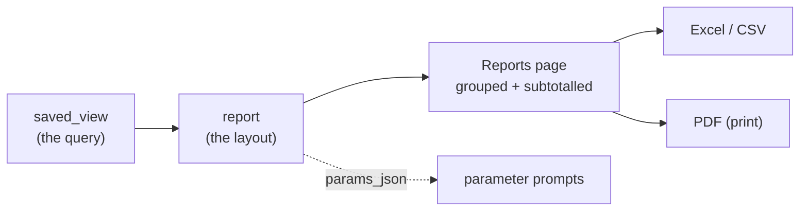

# Report Builder — Implementation Plan

**Status:** DRAFT — for review · **Created:** 2026-09-22 · **Revision:** 1

| | |
|---|---|
| **Purpose** | Define what a report is, how it is authored, how its rows are grouped and subtotalled, where it is stored, and how a reader opens and exports one |
| **Scope** | `Administration › Report builder` (`/admin/reports`), the reader-facing `Reports` screen, the `/api/reports` surface, and the export path (Excel/CSV + PDF). **Not** the scheduled delivery transport — that stays with the View Builder's webhook story |
| **Grounded in** | [`docs/plans/view-builder.md`](./view-builder.md) (the sibling feature, whose guard/storage/API patterns this reuses), the WCS General Ledger report in the request, `server/src/db/query-guard.ts`, `server/src/routes/views.ts`, `app/src/components/ViewResultGrid.tsx`, `app/src/lib/printPanel.ts`, and the measured column sets in §3 |
| **Depends on** | The View Builder's `saved_view` machinery (§6) and the `/api` Vite proxy — both already shipped |
| **Supersedes** | — |

---

## 1. The answer in one line

**A report is a saved view plus a *layout*: an ordered grouping, per-group subtotals, a header block
of parameters, and a banded body — rendered on a page and exportable to Excel and PDF.**

The View Builder already answers *"what rows does this question return?"*. A report answers the next
question, *"how is that answer presented to somebody who did not write it?"* — and the report in the
request is the proof that those are different questions, because **its most important rows are not
data rows at all**. `Program Total :`, `Project Total :` and `861 Program Total :` are computed bands,
and no column-and-row picker produces them.



**A report is therefore a *view* with a layout attached, not a second kind of query.** That is the
single most important design decision here, and §6 explains what it buys: the guard, the parameters,
the run history, the fingerprint, the subscriptions and the drift rule are all inherited rather than
reimplemented.

---

## 2. What the request's own report tells us

The screenshot is a **WCS General Ledger — County Bond (Parameters)** report. Reading its structure
is the specification, because it is a real report this app must be able to express.

### 2.1 Its anatomy, band by band

| Band | Content | Is it a data row? |
|---|---|---|
| **Header block** | `Account From: 04.0000.000.300.0000.0840.000` · `Account To: 04.9999.999.999.9999.0840.000` · `Date From: 01-JUL-2025` · `Date To: 30-JUN-2026` · `Run Date: 21-SEP-2026 14:35:28` · `Database: CFAIDB` | **No** — parameters + run metadata |
| **Group header 1** | `Program: 861` | **No** — a group key |
| **Group header 2** | `Project: 0504` then the combination `04.6570.861.393.0504.0840.000` and its description | **No** — a group key + its account |
| **Detail rows** | `Date · Period Name · Source · Invoice# · PO Number · Vendor Name · Check# · Check Date · Description · Accounted Balance` | **Yes** |
| **Project subtotal** | `0504 Project Total :` with a summed `Accounted Balance` | **No** — computed |
| **Program subtotal** | `861 Program Total :` | **No** — computed |

**Five of the eight bands are not data.** A grid that renders only the detail rows is missing the
report. This is the finding that shapes §5.

### 2.2 The columns, and where each one actually comes from

The report's ten columns do **not** all come from one table, and two of them are not columns at all.
This is the second finding: a report's row is a **join**, and the builder must be honest about which
side each column belongs to.

| Report column | Source | Note |
|---|---|---|
| `Date` | `GL_JE_LINES.EFFECTIVE_DATE` | ★ **Not** `GL_BALANCES`, and not the header either — the **line** carries its own date. See §3.1.2 and §3.2 |
| `Period Name` | `GL_BALANCES.PERIOD_NAME` | `JUN-26-FY-26` — the period, not the date |
| `Source` | `GL_JE_HEADERS.JE_SOURCE` | `Receivables`, `Payables` |
| `Invoice#` | `GL_JE_LINES.INVOICE_IDENTIFIER` *(candidate)* or `AP_INVOICES_ALL.INVOICE_NUM` | ★ The line carries one — see §3.1.2. Measure before choosing |
| `PO Number` | `PO_HEADERS_ALL.PO_NUMBER` | |
| `Vendor Name` | `PO_VENDORS.VENDOR_NAME` | |
| `Check#` | `AP_INVOICE_PAYMENTS_ALL.CHECK_NUMBER` | Not registered on this deployment — §12 |
| `Check Date` | `AP_INVOICE_PAYMENTS_ALL.PAYMENT_DATE` | Same |
| `Description` | `GL_JE_LINES.DESCRIPTION` or `GL_JE_HEADERS.DESCRIPTION` | Both exist; the line's reads `Journal Import Created` |
| `Accounted Balance` | `GL_BALANCES.PERIOD_NET_DR - PERIOD_NET_CR` | ★ **Accounted**, not the line's `ENTERED_DR`/`ENTERED_CR` — §3.1.2 point 3, §3.3 |

### 2.3 What the report's own numbers say about the data

Two things are visible in the screenshot and both are load-bearing:

- **A negative balance is normal.** `-2,930,412.00` on the `861` row. A report must not treat a
  negative as an error, and the CSV must not strip the sign.
- **The subtotals are exact sums of what is shown.** `861 Program Total : -2,930,412.00` equals the one
  detail row above it; `0504 Project Total : -2,930,412.00` likewise. So the subtotal is a `SUM` over
  the *rendered* rows, not a second query — which matters for §5.4, because a second query could
  disagree with the rows on screen and the reader would have no way to tell which was right.

---

## 3. The data traps, measured

Each of these is a place where a plausible implementation produces a **wrong number that looks
right**. They are the reason this plan is longer than "add a group-by".

### 3.1 Trap 1 — `GL_BALANCES` has no vendor, no invoice, no check, and no PO

`GL_BALANCES` is the ledger: `CODE_COMBINATION_ID`, `PERIOD_NAME`, `PERIOD_YEAR`, `PERIOD_NUM`,
`ACTUAL_FLAG`, `PERIOD_NET_DR`, `PERIOD_NET_CR`, `BEGIN_BALANCE_*`, `QUARTER_TO_DATE_*` — **and no
document columns at all**. Measured against the live column list in
[`routes/coa.ts`](../../server/src/routes/coa.ts) (`BALANCE_COLUMNS`, 17 names).

So seven of the report's ten columns are **not in the ledger table**. They arrive by joining through
`GL_JE_LINES` → `GL_JE_HEADERS` → the AP/PO documents.

**★ MEASURED — AND AN EARLIER DRAFT OF THIS SECTION WAS WRONG.** The first version of this plan
predicted that `GL_JE_LINES` was ungranted and that seven of the ten columns were therefore
unreachable. That was an assumption, not a measurement, and it is false:

| Table the report needs | In the app registry? | Evidence |
|---|---|---|
| `GL_BALANCES` | ✅ | Counted by `/api/meta/ledger-summary` |
| `GL_JE_HEADERS` | ✅ | `funding.ts:483` — a registered resource, columns declared at `:113` |
| `GL_JE_LINES` | ✅ | `funding.ts:516` — registered; **33,155,055 rows** measured |
| `PO_HEADERS_ALL` | ✅ | `procurement.ts` |
| `PO_LINES_ALL` | ✅ | `procurement.ts` |
| `PO_VENDORS` | ✅ | `routes/vendors.ts` |
| `GL_CODE_COMBINATIONS` | ✅ | `coa.ts` |
| `AP_INVOICES_ALL` | ❌ **not registered** | The AP extract is **0 rows by design**; the spend screens read JSON |
| `AP_INVOICE_PAYMENTS_ALL` | ❌ **not registered** | Same |
| `AP_INVOICE_DISTRIBUTIONS_ALL` | ❌ **not registered** | Same |

So the split is **7 reachable / 3 not**, and the three that are missing are the *payables* side — which
this deployment has no data for at all. `funding.ts`'s own header records why: *"there is no payables
journal in the slice"*, and `JE_CATEGORY` is only ever `'Budget'`.

**★ MEASURED, ONE PASS, `uncounted: 0` — every registered table the report needs counts:**

| Table | Rows | `scopeMode` | Does the account scope narrow it? |
|---|---|---|---|
| `GL_BALANCES` | 157,150,828 | `lookup` | ✅ yes, through `GL_CODE_COMBINATIONS` |
| `GL_JE_LINES` | 33,155,055 | `lookup` | ✅ yes |
| `GL_CODE_COMBINATIONS` | 1,300,594 | `segments` | ✅ yes, on `SEGMENT1`/`SEGMENT3` |
| `PO_LINES_ALL` | 1,141,913 | `null` | ❌ **no account at all** |
| `GL_JE_HEADERS` | 1,011,459 | `null` | ❌ **no account at all** |
| `PO_HEADERS_ALL` | 288,054 | `null` | ❌ **no account at all** |
| `PO_VENDORS` | 79,685 | `null` | ❌ **no account at all** |

### 3.1.1 ★ Trap 1b — four of the report's tables are NOT narrowed by the account scope
That table is the second finding, and it is a **correctness** problem rather than a performance one.

`GL_BALANCES` and `GL_JE_LINES` are narrowed by `FUND_CODE`/`PROGRAM_CODE` through the combination
table. `GL_JE_HEADERS`, `PO_HEADERS_ALL`, `PO_LINES_ALL` and `PO_VENDORS` carry **no account column**,
so `scopeMode: null` — the endpoint counts them whole and excludes them from `scopedRecords`, which is
the behaviour `/api/meta/ledger-summary` already reports as `unscopedObjects`.

**A report that joins a scoped table to an unscoped one therefore mixes two populations**, and the
result is a figure that looks scoped and is not. This is the same class of error `derived.ts` names in
its own header:

> *"An unscoped Oracle budget total sitting on the same screen as a scoped committed total would be
> **two different denominators presented as comparable**, which is a wrong answer rather than a slow
> one."*

**What the report must do about it**, and this is a requirement rather than a note:

- **The join direction decides the population.** Driving the report from `GL_BALANCES` (scoped) and
  joining *out* to `GL_JE_HEADERS` gives scoped rows with their headers. Driving it from
  `GL_JE_HEADERS` (unscoped) and joining *in* gives every header in the ledger, most of which the
  scope excludes. **The view's `FROM` clause is therefore the scope decision**, and the builder cannot
  make it for the author.
- **The report must state which of its columns are scoped and which are not**, in the same way the
  ledger summary separates `scopedRecords` from `unscopedObjects`. A reader looking at
  `Vendor Name` needs to know that column is not fund-restricted.
- **A subtotal over a mixed set is the worst case**, because §5.4 sums the rendered rows and the
  rendered rows may include unscoped ones. So the layout should mark which columns are scope-bearing,
  and §5.6's honest-states table gains a row for it.

**This is the trap that would have shipped.** It is invisible in the sample (31 `GL_BALANCES` rows, 0
AP rows) and invisible in a screenshot, and it produces a plausible total rather than an error.

### 3.1.2 ★ THE JOURNAL JOIN WORKS, AND IT IS ALREADY BUILT — measured live

**Asked directly: "is there a way to JOIN `GL_JE_LINES` and `GL_JE_HEADERS`?" Yes, on one key, and the
route already exists.**

```
GL_JE_HEADERS.JE_HEADER_ID  (1)  ──<  GL_JE_LINES.JE_HEADER_ID  (many)
```

`GL_JE_LINES` is keyed `(JE_HEADER_ID, JE_LINE_NUM)` — the composite key `funding.ts` already
documents as the reason that resource is list-only with no detail route.

**Measured live, header `12893675` (a Payroll journal, `Aug-26-FY-27`):**

| | Result |
|---|---|
| Joined rows | **2,248 lines** |
| Debits / credits | `3,512,526.36` / `3,512,526.36` — **difference exactly `0`** |
| Response time | **1,481 ms** |
| Header columns carried | `JE_SOURCE`, `PERIOD_NAME`, `DEFAULT_EFFECTIVE_DATE`, `DESCRIPTION`, `STATUS`, `NAME`, `POSTED_DATE` |
| Line columns carried | `JE_LINE_NUM`, **`EFFECTIVE_DATE`**, `CODE_COMBINATION_ID`, `ENTERED_DR`, `ENTERED_CR`, `DESCRIPTION`, **`INVOICE_IDENTIFIER`**, **`INVOICE_AMOUNT`** |

**Two routes already do this join**, so the report's spine needs no new query machinery:

- `GET /api/funding/journals/{id}/detail` — the header, its lines, and the debit/credit totals.
- `GET /api/funding/journals/{id}/lines` — the same rows paged, with the same sort allowlist.

**Three consequences that change this plan:**

1. **The report's `Date` column has a better source than §2.2 recorded.** `GL_JE_LINES` carries its
   **own `EFFECTIVE_DATE`**, so the line-level date is available directly rather than reached through
   the header. That is also the more correct grain: lines of one journal can carry different effective
   dates from the header's `DEFAULT_EFFECTIVE_DATE`.
2. **`Invoice#` may be reachable after all.** `GL_JE_LINES` carries **`INVOICE_IDENTIFIER`** and
   **`INVOICE_AMOUNT`**, so the invoice number may come from the journal line without touching
   `AP_INVOICES_ALL`. Both are `null` on the Payroll line above, so this is a **hypothesis to measure**
   rather than a fact — but it would take §12's "three unreachable columns" down to one or two.
3. **★ `ENTERED_DR`/`ENTERED_CR` ARE NOT `PERIOD_NET_DR`/`PERIOD_NET_CR`, AND THE REPORT MUST NOT
   CONFLATE THEM.** The journal line carries the **entered** (transaction-currency) amount; the ledger
   balance carries the **accounted** amount. The report's column is named `Accounted Balance`, so
   `GL_BALANCES` is the right source for it — but a report built on journal lines would naturally show
   entered amounts under a similar name, and on a non-USD transaction the two differ by the exchange
   rate. **Two columns that read alike and differ by currency translation is exactly the class of
   wrong number §3 exists to catch.**

**So the report's spine is a three-way join, and all three legs are proven:**

```
GL_BALANCES ──(CODE_COMBINATION_ID)──> GL_CODE_COMBINATIONS ──(account scope)
     │
     └──< GL_JE_LINES ──(JE_HEADER_ID)──> GL_JE_HEADERS
```

The `GL_BALANCES` → `GL_JE_LINES` leg is the one that is **not** a foreign key: the ledger is a
per-period rollup and the journal is the transaction, so they relate through the **combination and the
period**, not through a shared id. That is the leg a view author has to write by hand, and it is where
a wrong join produces a plausible total — see §3.1.1 on the scope, and §3.3 on the sign.


**What this means for the report, concretely.** Three of the report's ten columns —
`Invoice#`, `Check#`, `Check Date` — come from the payables tables that hold **no rows here**. The
other seven are reachable today. So the report is **buildable in phase 1 against live data** for its
ledger, journal and PO columns, and the three payables columns are the ones that need either the AP
extract or a grant.

**The generalisable lesson, recorded because it cost a draft:** *an assumption about what a ledger
cannot reach is not a measurement.* The registry and the resource descriptors answer this question
directly, and one `grep` for the table name would have settled it before the plan was written. The
DBA ask in §12 is therefore **smaller than the first draft claimed** — it is the payables surface, not
the journal.


### 3.2 Trap 2 — `Date` and `Period Name` are different questions with different answers

The report shows `Date` `11-Jun-26` beside `Period Name` `Jun-26-FY-26`, and on the `0450` rows
`Date 23-Apr-26` beside `Period Name Apr-26-FY-26`. They agree here, which is exactly why the trap is
easy to miss.

`view-builder.md` §3.2 already records the rule:

> `DEFAULT_EFFECTIVE_DATE` — *"The action date … the authoritative answer to 'when was this funded?',
> and it is the one date `GL_BALANCES` does not keep."*

`GL_BALANCES` gives the period a row lands in; the journal header gives the date the action happened.
**A report that labels a `PERIOD_NAME` column "Date" is wrong**, and the builder must let the author
name the column they actually selected. §5.5 makes the label the author's, not the column's.

### 3.3 Trap 3 — `Accounted Balance` is derived, and the sign convention is a choice

`Accounted Balance` is `PERIOD_NET_DR - PERIOD_NET_CR` — the same expression
[`db/derived.ts`](../../server/src/db/derived.ts) uses for `NET_AMOUNT` and for the position view's
budget/encumbrance/expenditure sums. Oracle stores debits and credits in **two columns**, so a single
"balance" is always a subtraction and the author has to choose the direction.

| Expression | Reads as | Used by |
|---|---|---|
| `DR - CR` | positive = net debit | `derived.ts` `NET_AMOUNT`, the position view |
| `CR - DR` | positive = net credit | — |

**A report must declare which one it means, and the column label must say so.** `Accounted Balance`
with an undeclared sign is the kind of figure two readers will disagree about while both are right.

### 3.4 Trap 4 — the fiscal-year floor is a *period* test, not a date test

The report's `Date From: 01-JUL-2025` / `Date To: 30-JUN-2026` is **FY2026**, and this repo already
records the convention: `PERIOD_YEAR` is the fiscal year a period **ends** in, so FY2026 =
`2025-07-01 .. 2026-06-30`. `view-builder.md` and the repo memory both carry this, and the memory
records that getting it wrong published a wrong histogram once.

**A report parameter of "fiscal year" must not be implemented as a calendar-year filter.** The
existing `fiscalFloor(startFy) = \`${startFy - 1}-07-01\`` is the correct helper and the report should
reuse it rather than re-deriving the boundary.

### 3.5 Trap 5 — the sample cannot answer the report's question

The bundled sample's `GL_BALANCES` holds **31 rows** (29 transcribed + 2 synthetic) over 6 accounts,
4 versions and 10 periods, and the AP surface is **empty by design**. So a report built on this
sample proves the **plumbing** — grouping, subtotals, export, parameters — and not one business
figure. The preview must say so, the same way `view-builder.md` §3.4 requires for first-fundings and
`Pending.tsx` names its reason.

---

## 4. The product decision: report = view + layout

### 4.1 Why not a second query language

A report could have been its own entity with its own SQL. It should not be, and the reason is
concrete: every hard problem in the View Builder is *already solved* and would have to be solved
again, differently, and then kept in step.

| Problem | View Builder's answer | Reimplementing it for reports costs |
|---|---|---|
| Running typed SQL safely | `query-guard.ts` — one statement, `SELECT`/`WITH` only, no `ATTACH`/`PRAGMA`/writes, dialect lint, row cap, timeout | A second guard, and the second one is the one that gets the fix |
| Parameters | `params_json`, compiled to binds server-side | A second binder |
| Run history | `saved_view_run` with duration, row count, truncation, fingerprint | A second history table |
| Change detection | `fingerprint` over a declared key column | A second definition of "changed" |
| Subscriptions | `saved_view_subscription` + the change comparison | A second subscriber list |
| Display drift | §7.3 — a named notice, the view still renders | A second drift rule |
| Export | `printPanel.ts` (PDF) + the per-screen CSV writers | A second print path |

**So a report references a view and adds a layout.** Concretely: `report.view_id` is a foreign key,
and the report's own table carries only what a view does not have — the grouping, the subtotals, the
column labels, the header fields and the export defaults.

### 4.2 What a report adds that a view has no concept of

| Addition | Why it cannot live on the view |
|---|---|
| **`group_by`** — an ordered list of columns | A view returns rows; a report *orders* them into bands. The same view can back two reports with different groupings |
| **`subtotals`** — which numeric columns sum, at which group level | A view has no notion of a level |
| **`labels`** — the printed name of each column | The report's `Date` column may be `PERIOD_NAME`; the *label* is the author's claim and must be editable per report |
| **`header_fields`** — which parameters are printed in the header block | The header is a document convention, not a query fact |
| **`export`** — orientation, which columns are excluded from the CSV, sheet name | An export choice, not a query choice |
| **`title` / `subtitle` / `footer`** | The report's own masthead |

### 4.3 What this deliberately does **not** add

- **No second SQL editor.** The report's query is edited in the View Builder, and the report screen
  links to it. Two editors for one statement is two places for the dialect lint to be missing.
- **No visual group-by designer.** `group_by` is a multi-select over the view's own returned columns
  (§5.2), which is a picker over a known list rather than a query planner.
- **No computed columns.** A report shows what its view returns, plus sums. A report that could
  compute would need an expression language, and that is the drag-and-drop query generator
  `view-builder.md` §16 puts out of scope.

---

## 5. The layout model

### 5.1 The shape, as JSON

```jsonc
{
  "view_id": 8,
  "slug": "county-bond-ledger",
  "title": "WCS General Ledger — County Bond",
  "subtitle": "Parameters",
  // ★ ORDERED, AND THE ORDER IS THE BAND ORDER. Level 1 is the outermost band.
  "group_by": [
    { "key": "program", "label": "Program" },
    { "key": "project", "label": "Project" }
  ],
  // ★ WHICH COLUMNS SUM, AND AT WHICH LEVEL. `level` is 1-based into `group_by`.
  "subtotals": [
    { "key": "accounted_balance", "level": 2, "label": "Project Total" },
    { "key": "accounted_balance", "level": 1, "label": "Program Total" }
  ],
  // ★ THE PRINTED NAME OF EACH COLUMN — the author's claim, not the column's name.
  "labels": {
    "effective_date": "Date",
    "period_name": "Period Name",
    "je_source": "Source",
    "invoice_num": "Invoice#",
    "po_number": "PO Number",
    "vendor_name": "Vendor Name",
    "check_number": "Check#",
    "payment_date": "Check Date",
    "description": "Description",
    "accounted_balance": "Accounted Balance"
  },
  // ★ WHICH PARAMETERS PRINT IN THE HEADER BLOCK, in order, with their own labels.
  "header_fields": [
    { "param": "account_from", "label": "Account From" },
    { "param": "account_to",   "label": "Account To" },
    { "param": "date_from",    "label": "Date From" },
    { "param": "date_to",      "label": "Date To" }
  ],
  // ★ RUN METADATA IS PRINTED, NOT STORED — see §5.5.
  "show_run_metadata": true,
  "export": {
    "orientation": "landscape",
    "sheet_name": "County Bond",
    "filename": "wcs-general-ledger-county-bond"
  }
}
```

### 5.2 `group_by` is a picker over the view's own columns, not free text

The view's result already declares its columns — `ViewResult.columns` in
[`ViewResultGrid.tsx`](../../app/src/components/ViewResultGrid.tsx) carries `key`, `label`, `format`
and `hidden`. So the grouping picker is a multi-select over **that** list, and the server can validate
a `group_by` key against the view's live result before saving.

**Three validation rules, each producing an error rather than a guess:**

- A `group_by` key the view does not return → **400**, naming the key. (Not a silent skip: a report
  whose grouping vanished renders as one flat band, which looks like a report with no grouping rather
  than a broken one.)
- A `subtotals[].key` that is not a numeric format → **400**. Summing a text column is meaningless and
  a `SUM` over a date would produce a number nobody can interpret.
- A `subtotals[].level` outside `1..group_by.length` → **400**. An off-by-one here silently sums at
  the wrong band.

### 5.3 Grouping is done **client-side, over the rows already fetched**

This is a deliberate choice and it has a cost, so both sides are stated.

**Why client-side:**

- The view's result is already capped and already fetched. Grouping it in the browser costs no second
  query, which is the cost `view-builder.md` §5.3 exists to bound.
- The subtotal is then a `SUM` over **the rows on screen**, which is what §2.3 shows the report's own
  totals to be. A server-side subtotal could disagree with the visible rows and the reader would have
  no way to know which was right.
- The same grouping code then serves the screen, the CSV and the print sheet — one implementation, so
  the three cannot disagree. This is the `ViewResultGrid` lesson applied again: a second
  implementation gets the fix the first one had.

**What it costs, stated plainly:** grouping operates on the **capped** result. A report whose view
returns more rows than the cap will subtotal a *prefix*, and the subtotal will be wrong in a way that
looks authoritative. **So a truncated result must not render subtotals at all** — it must say the cap
was hit and refuse the totals, because a wrong total is worse than no total. §5.6 makes that a named
state.

**The alternative, and why it is not the default:** a server-side `GROUP BY … WITH ROLLUP` would
subtotal the whole set, but it needs a second query shape, it cannot be composed from a view whose SQL
the author already wrote, and it would subtotal rows the reader cannot see. If a report ever needs
totals over an uncapped set, that is a new decision with its own plan — not a flag on this one.

### 5.4 Subtotals sum the **rendered** rows, and the sign is the view's

A subtotal is `SUM` over the rows in that band, using the **same values the cells show**. Two
consequences:

- A `null` contributes nothing to the sum and renders `—`. It is **not** coerced to `0`, because
  `format.ts`'s helpers all end in `Number(n) || 0` and a null amount means "no row", not "zero
  dollars" — the distinction `ViewResultGrid` rule 1 already protects.
- The sum is taken on the raw number, not on the formatted string, so a `money0` column subtotals
  exactly and only the *display* rounds. A subtotal of rounded values is a different number.

### 5.5 The header block: parameters are printed, run metadata is generated

The report's header has two kinds of field and they must not be conflated:

| Field | Kind | Where it comes from |
|---|---|---|
| `Account From` / `Account To` | **Parameter** | The view's `params_json`, supplied by the reader |
| `Date From` / `Date To` | **Parameter** | Same |
| `Run Date: 21-SEP-2026 14:35:28` | **Generated** | The moment the report was rendered |
| `Database: CFAIDB` | **Generated** | `config.db.label`, already served by `/api/meta/config` |

**The generated pair is never stored**, because a stored run date is a date that will be wrong the
moment somebody reopens the report — the same failure as a cached figure presented as measured, which
this project has now hit three times. It is rendered at print time from the render's own clock and
from the server's own configuration, both of which are facts about *this* rendering.

### 5.6 The honest states, and the one that matters most

| State | What the report says |
|---|---|
| No view chosen | "Pick the view this report lays out" + a link to the View Builder |
| View has not been run | "Not run yet" — never `0 rows` |
| **Result truncated** | **"The totals are not shown"** + why. §5.3 |
| A grouping column drifted | Named notice, the report still renders (§7.3's rule) |
| A subtotal column is non-numeric | 400 at save; if it drifts, a named notice and no total for it |
| **A column the account scope does not narrow** | Named on the report — §3.1.1. `Vendor Name` is not fund-restricted and the reader must be able to see that |
| Ledger unreachable | The existing `DB_UNAVAILABLE` states, with the retry the Vendor Sites page established |
| Sample data | "These figures come from the bundled sample" (§3.5) |

**The truncated case is the one to get right.** A report is the artefact people quote, so a subtotal
computed over a prefix is the most damaging wrong number this feature could produce. Refusing the
totals is the only honest answer, and it must be said in the report's own voice rather than as a
console warning.

---

## 6. Where a report lives

### 6.1 A real table, additive to `01-app.sql`

Following `view-builder.md` §6.2's precedent: a new table in `data/sql/turso/01-app.sql`, added
additively, never by editing `00-schema.sql`.

```sql
CREATE TABLE IF NOT EXISTS saved_report (
  id            INTEGER PRIMARY KEY AUTOINCREMENT,
  slug          TEXT NOT NULL UNIQUE,
  title         TEXT NOT NULL,
  subtitle      TEXT,
  description   TEXT,
  view_id       INTEGER NOT NULL REFERENCES saved_view(id) ON DELETE CASCADE,
  layout_json   TEXT NOT NULL,          -- §5.1
  created_by    TEXT,
  status        TEXT NOT NULL DEFAULT 'active',
  created_at    TEXT NOT NULL DEFAULT (datetime('now')),
  updated_at    TEXT NOT NULL DEFAULT (datetime('now'))
);
```

### 6.2 ★ A report must be added to all three app-table registries

This is not a formality — it is the defect this project has already shipped twice, and the reason the
plan calls it out before the DDL.

The repo holds **three hand-copied lists** of app-owned tables, in three languages, and a table
missing from any one of them fails in a different way:

| # | List | File | Failure if missed |
|---|---|---|---|
| 1 | `APP_TABLES` | `server/src/db/store.ts` | Gated against the DDL and `tablesOfClass('APP')` |
| 2 | `ROUTING_APP_TABLES` (the routing list) | `server/src/db/store.ts` | ★ **The dangerous one** — the statement routes to the **ledger** and dies `ORA-00942` on a table the app itself creates |
| 3 | `APP_OWNED_TABLES` | `scripts/verify-turso-sample.mjs` | G13 reports the table as `undocumented` |

The memory records that `vendor_site_route` was added to the DDL and to `APP_TABLES` and **missed in
the routing copy**, so a routed `SELECT … FROM vendor_site_route` fell through to Oracle and failed
with a message saying the table does not exist — about a table the app creates and stores. A comment
saying "keep these in step" did nothing; a gate that reads the source of truth and asserts set
equality in **both directions** is what fixed it.

**So: `saved_report` goes into all three, in the same commit, and the existing gates are what prove
it.** If the gates do not already cover a *third* copy by name, that is the first thing to check
before the table is created.

### 6.3 `ON DELETE CASCADE` on `view_id`, and why

A report without its view is not a degraded report, it is **nothing** — the layout names columns that
no longer have a source. Cascading the delete is the honest behaviour, and the alternative (orphaned
reports rendering an empty shell) is worse than the deletion.

**But the API must say so before it happens:** deleting a view that backs reports must answer a
conflict naming them, or require `?cascade=1`. A silent cascade that removes three reports because
somebody tidied a view is a data loss a reader cannot undo.

---

## 7. API surface

Following the repo convention: a descriptor-shaped resource where the shape fits, plus a router for
the render path.

| Method | Path | `operationId` | Notes |
|---|---|---|---|
| `GET` | `/api/reports` | `reports_list` | Standard envelope; `?q=`, `?status=` |
| `GET` | `/api/reports/{id}` | `reports_detail` | Includes the layout and the view it references |
| `POST` | `/api/reports` | `reports_create` | Validates `layout_json` against the view's **live result** (§5.2) |
| `PATCH` | `/api/reports/{id}` | `reports_update` | Same validation |
| `DELETE` | `/api/reports/{id}` | `reports_delete` | Refuses if it is the last reference — see below |
| **`POST`** | `/api/reports/{id}/run` | `reports_run` | Runs the backing view with supplied params; returns rows + the layout |
| `GET` | `/api/reports/{id}/export.csv` | `reports_export_csv` | Server-side CSV — see §8.2 |

**Three deliberate choices:**

- **`run` is a `POST` with a body**, for the same reason `views_run` is: parameters in a query string
  end up in access logs and browser history.
- **Validation happens on write.** A layout naming a column the view does not return is refused at
  save, not at render — otherwise every later failure looks like a rendering bug.
- **`export.csv` is server-side and separate from the screen's own CSV.** See §8.2; the two exist for
  different reasons and must not be conflated.

### 7.1 Reuse the View Builder's run path, do not duplicate it

`POST /api/reports/{id}/run` resolves the backing view and calls the **same** function
`POST /api/views/{id}/run` calls. It adds the layout to the response and nothing else. A second
implementation of "run a saved view" would be a second place for the row cap, the timeout, the
fingerprint and the run-history write to be missing — and the run history is what subscriptions
depend on, so a report that ran without recording would silently break change detection.

---

## 7.5 ★★★ THE JOIN IS SAVABLE, BUT A SAVED VIEW CANNOT READ LIVE ORACLE

**Asked directly: "is a JOIN savable somewhere, for use by the application?" Yes — and this section is
the caveat, which is the most important open question in this plan.**

### 7.5.1 A JOIN *is* a `SELECT`, so a saved view holds one

`saved_view.sql` is one `SELECT`/`WITH` statement, and a join is a `SELECT`. So this is savable today:

```sql
SELECT l.EFFECTIVE_DATE, l.DESCRIPTION, h.JE_SOURCE, h.PERIOD_NAME,
       b.PERIOD_NET_DR - b.PERIOD_NET_CR AS accounted_balance
  FROM GL_JE_LINES l
  JOIN GL_JE_HEADERS h ON h.JE_HEADER_ID = l.JE_HEADER_ID
  JOIN GL_BALANCES b ON b.CODE_COMBINATION_ID = l.CODE_COMBINATION_ID
 WHERE …
```

**The join is the view; the layout is the report.** That is exactly the split §4 proposes, so the
answer to the question is yes and it needs no new mechanism.

### 7.5.2 ★ But the View Builder reads the **app store**, by name, on purpose

From [`routes/views.ts`](../../server/src/routes/views.ts):

> *"THE VIEW BUILDER RUNS AGAINST THE APP STORE, NAMED RATHER THAN ROUTED. … Routing it by the tables
> the text mentions would make the dialect — and with it the `query_only` layer, the `LIMIT` wrapper
> and the Oracle-only refusal — a function of whatever the author happened to type. A query mentioning
> `GL_BALANCES` would be compiled as Oracle and then executed against whatever store `GL_BALANCES`
> lives in, which is the ledger — so a preview would read the production ledger directly and return
> rows through a path that was audited as reading the sample."*

So a saved view reads **the app store** — `data/sql/turso/sample.db` on this deployment. That is a
**sandbox**, and it is what makes the guard's refusals meaningful.

**Measured: the app store holds 54 objects, and includes every table the report needs** —
`GL_BALANCES`, `GL_JE_LINES`, `GL_JE_HEADERS`, `PO_HEADERS_ALL`, `PO_VENDORS`, `GL_CODE_COMBINATIONS`,
and even the three `AP_*` tables Oracle does not expose. So the join above **runs** — against 31
`GL_BALANCES` rows, not 157 million.

### 7.5.3 The two places a JOIN can live, and what each reads

| | Where the JOIN lives | What it reads | Rows |
|---|---|---|---|
| **Saved view** (View Builder) | `saved_view.sql` | The **app store** | The sample — 31 `GL_BALANCES` rows |
| **Server route** (the `funding.ts` pattern) | TypeScript in `server/src/routes/` | The **ledger** | Oracle — 157,150,828 rows |

**So the JOIN is savable, but a saved view cannot read live Oracle.** Both facts are by design, and
together they are the decision this plan has to make:

- **If the report is for the sample / a demo** → save the join as a view. Works today, no new code.
- **If the report must read live Oracle** → the join must be a **server route**, because the View
  Builder will not route a statement to the ledger, and `query-guard.ts` compiles for SQLite.

### 7.5.4 ★★ DECIDED: OPTION C — A REGISTRY OF NAMED, PARAMETERISED JOIN FRAGMENTS

**The user's decision (2026-09-22): "I'm going to need C since live features are required."**

So reports read **live Oracle**, and an admin authors them without a deploy. This subsection is the
design; §7.5.5 lists what it changes.

#### The mechanism already exists — C is a generalisation of `DIVERGENCES`

`server/src/db/ledger-shape.ts` already holds exactly this pattern. A `Divergence` is a vetted `from`
clause with joins plus per-column expressions:

```ts
PO_HEADERS_ALL: {
  object: 'PO_HEADERS_ALL',
  alias: 'h',
  from:
    `${q('WCSEXP_PO_HEADERS')} v\n` +
    `  JOIN ${q('PO_HEADERS_ALL')} h ON h.${q('PO_HEADER_ID')} = v.${q('PO_HEADER_ID')}`,
  at: { PO_NUMBER: `v.${q('PO_NUMBER')}`, EXP_PROJECT_NAME: `v.${q('EXP_PROJECT_NAME')}` },
}
```

That is a **named, vetted join** — two objects, an explicit key, and a per-column mapping — and
`ledgerPlan()` already resolves it per dialect, probes it against the live ledger, and reports which
columns have no readable source (`unavailable`, served as `NULL` under their own name).

**So C does not invent a mechanism. It promotes `DIVERGENCES` from a private constant to a registry
with declared parameters, and lets a saved view name one.** That is a much smaller change than it
sounds, and it inherits the probing, the caching, the transient-failure eviction and the
`unavailable` reporting that module already got right.

#### The fragment shape

```ts
interface JoinFragment {
  /** The name an author writes in their SQL, e.g. `ledger_journal`. */
  readonly name: string;
  /** One line of prose for the picker. */
  readonly label: string;
  /** ★ THE FIXED `FROM` CLAUSE. Not authorable — see the rule below. */
  readonly from: string;
  /** ★ THE DECLARED PARAMETERS. `:name` tokens the fragment's own WHERE may use. */
  readonly params: readonly FragmentParam[];
  /** Which columns the fragment exposes, so a picker can offer them. */
  readonly columns: readonly string[];
  /** Which of those the account scope narrows — §3.1.1. */
  readonly scopedColumns: readonly string[];
}
```

**The three fragments the request's report needs:**

| Fragment | `from` (vetted, fixed) | Params | Scoped? |
|---|---|---|---|
| `ledger_journal` | `GL_BALANCES b JOIN GL_JE_LINES l ON l.CODE_COMBINATION_ID = b.CODE_COMBINATION_ID AND l.EFFECTIVE_DATE BETWEEN …` | `from`, `to` | ✅ both sides |
| `journal_document` | `GL_JE_LINES l JOIN GL_JE_HEADERS h ON h.JE_HEADER_ID = l.JE_HEADER_ID` | — | ❌ header side |
| `ledger_account` | `GL_BALANCES b JOIN GL_CODE_COMBINATIONS c ON c.CODE_COMBINATION_ID = b.CODE_COMBINATION_ID` | `fund`, `programs` | ✅ |

#### ★ THE THREE RULES THAT KEEP THE SANDBOX CLOSED

This is the part that matters, because C re-opens a question `views.ts` settled deliberately.

**Rule 1 — a fragment is named, never written.** The author's SQL contains `FROM ledger_journal(…)`,
not a join. The server substitutes the vetted `from` text. **An author cannot introduce a join the
registry does not hold**, which is what keeps the reachable object set a decision rather than a
typing exercise.

**Rule 2 — a fragment takes declared parameters, never interpolated text.** The `(…)` argument list is
validated against `params` and compiled to **binds**, exactly as `params_json` already works. So a
value cannot become SQL, and the fragment's own `WHERE` is the only predicate it carries.

**Rule 3 — ★ A FRAGMENT MAY NOT BE COMBINED WITH ARBITRARY AUTHOR SQL AROUND IT.** This is the rule
that is easy to get wrong and the one that decides whether C is safe. If an author could write
`FROM ledger_journal(…) j JOIN PO_HEADERS_ALL p ON …`, the sandbox is reopened by the back door: they
have reached an object the registry did not offer. So:

- **A view whose SQL names a fragment is *restricted* to that fragment's columns** — the select list,
  the `WHERE`, the `ORDER BY` and any aggregate are all validated against `fragment.columns`.
- **A fragment is the whole `FROM` clause**, not a table that can be joined to. One fragment per view.
- **The guard for this is a parse, not a regex.** `query-guard.ts` already masks literals and comments
  and scans for denied keywords; C adds a check that the statement's `FROM` is *exactly* one fragment
  call and that every identifier used resolves to `fragment.columns`. A view that fails is 400 with
  the offending identifier named.

**The alternative I rejected:** letting a fragment be a *table* that composes with author SQL. It is
more flexible and it is exactly `views.ts`'s sandbox with extra steps — the author would then be able
to name any object the fragment's `from` happens to expose, and the registry's allowlist would be
decorative.

#### What C inherits rather than reimplements

| Concern | Already solved by | C's cost |
|---|---|---|
| Which columns an object really has | `ledgerPlan`'s probe (`SELECT * … WHERE ROWNUM <= 1`) | None |
| A column with no readable source | `unavailable`, served as `NULL` under its own name | None |
| Transient failure not cached as a grant fact | `probeCache`/`planCache` eviction | None |
| Dialect differences | `ledgerPlan` branches on `config.db.mode` | None |
| The `FROM` substitution | `DIVERGENCES`' own shape | A registry keyed by name |
| Parameter binding | `params_json` compile path | Reuse it |
| The scope | `derived.ts`'s fragments | Declare `scopedColumns` |

**So C's genuinely new code is: a registry constant, a name-resolution step in the guard, and the
`FROM`-is-exactly-one-fragment check.** The rest is composition over what exists.

#### What C does NOT give you, stated plainly

- **No arbitrary joins.** An author cannot join two fragments. If a report needs a shape the registry
  does not hold, **the registry gains a fragment** — a code change, reviewed, with its own probe. That
  is the trade: authorable *within* a vetted set, not authorable in general.
- **No SQL against the live ledger outside a fragment.** `query-guard.ts`'s dialect rules stay
  SQLite-oriented for ordinary views; a fragment-backed view is compiled per dialect by `ledgerPlan`.
  Two paths, deliberately, and §7.5.5 makes that a gate.
- **The registry grows monotonically.** Every fragment is a permanent widening of what an author can
  reach, so each addition is a decision. That is why the registry is a reviewed constant and not a
  table an admin can write.


### 7.5.5 What C changes elsewhere in the plan

**§11 gains a phase 0, and it comes first.** The fragment registry is a prerequisite for phase 1,
because a live report cannot be authored until a fragment exists:

| Phase | Delivers | Writes? | Gate |
|---|---|---|---|
| **0 — Fragments** | `server/src/db/join-fragments.ts` (the registry), the name-resolution step in `query-guard.ts`, the `FROM`-is-exactly-one-fragment check, `ledger_journal` + `journal_document` + `ledger_account`, and the probe that proves each resolves on live Oracle | **No** | Every fragment resolves and its `unavailable` set is empty (R18) |
| **1 — Render** | …as before, but reading **live Oracle** through a fragment | **No** | — |
| **2 — Author** | …as before | Yes | — |
| **3 — Deliver** | …as before | Yes | — |
| **4 — XLSX** | …as before | — | — |

**§15 gains three gates**, and they are the ones that hold C's sandbox shut:

| # | Gate | Expected |
|---|---|---|
| R18 | Each registered fragment, resolved through `ledgerPlan` on live Oracle | `ok: true` and an **empty** `unavailable` set — a fragment that silently nulls a column is a fragment that lies |
| R19 | **Control:** a view whose SQL joins a fragment to a table the registry does not hold | **400**, naming the offending identifier (§7.5.4 rule 3) |
| R20 | A view naming a fragment with a parameter the fragment does not declare | **400**, naming the token — the same rule `params_json` already enforces |
| R21 | A fragment-backed view's identifier that is not in `fragment.columns` | **400** — this is the check that makes rule 3 real rather than aspirational |

**§16 gains the risk that C introduces**, and it is the honest one: *the registry is a widening of what
an author can reach, so every addition is a security decision reviewed like code* — mitigated by the
registry being a reviewed constant, never a table an admin can write.

**§17 gains one deliverable, and it is step 1:**

| # | File | Change |
|---|---|---|
| 0 | `server/src/db/join-fragments.ts` | **New (phase 0).** The registry: `JoinFragment`, the three fragments, and the resolver the guard calls |
| 0b | `server/src/db/query-guard.ts` | **Phase 0.** The name-resolution step and the `FROM`-is-exactly-one-fragment check |
| 0c | `server/src/scripts/smoke.ts` | **Phase 0.** R18–R21 |


---

## 8. Export

### 8.1 PDF — reuse `printPanel.ts` unchanged

The app already has the right mechanism, and it is the right mechanism for the right reason. From
[`app/src/lib/printPanel.ts`](../../app/src/lib/printPanel.ts):

> *"The implementation clones the live element into an off-screen iframe carrying the app's own
> stylesheets. The alternative — redrawing the panel with a PDF library — would mean a second copy of
> every figure, bar and table kept in step with the first forever."*

So **the report's PDF is the report's own DOM**, printed. The grouping bands, the subtotals, the
header block and the column labels all come from the screen because they *are* the screen. Nothing
new is written for the PDF beyond print CSS for the bands.

**Two facts about the existing printer that the report must honour**, both from the memory:

- **`iframe.focus()` is required** for Chrome to print the frame rather than the host page — and it
  steals focus, so anything depending on focus (a drawer's Tab trap, Escape-to-close) breaks. Capture
  `document.activeElement` before the print and restore it in the teardown.
- **The frame is laid out at the printed page box's width** (`PAGE_WIDTH` — 703 portrait / 1032
  landscape). A frame at the viewport's width makes the app's responsive rules settle on a layout the
  reader never saw. The report's `export.orientation` picks which.

**And one the report introduces:** a report is wider than a panel. Ten columns at the report's own
width will not fit A4 portrait, which is why the layout carries an orientation and why the request's
report is landscape. The print sheet must not silently scale to fit — a squeezed table is unreadable
and the reader cannot tell it was resized.

### 8.2 Excel — CSV now, and the honest name for it

**The app has no XLSX writer and this plan does not add one.** `app/package.json` has three runtime
dependencies and `view-builder.md` §10.2 is the precedent for refusing a 2 MB library for a field
that needs a textarea.

So "Export to Excel" produces **CSV**, which Excel opens natively, and the button says **"Export CSV
(opens in Excel)"** rather than claiming a format it does not write. This is the same discipline as
the `—` for a null and `not counted` for an uncountable table: **name what it is.**

**What the CSV must contain, and this is the part that is easy to get wrong:**

- **The header block, as rows.** A CSV of a report that loses `Account From` / `Date From` has lost
  the report's scope, and a reader who opens it in six months cannot tell what they are looking at.
- **The group bands and the subtotals, as rows.** The bands are the report. A CSV that flattens them
  is a CSV of the *view*, not of the report — and the reader asked for the report.
- **A machine-readable column, so the bands can be told from the data.** A `row_type` column
  (`header` / `group` / `detail` / `subtotal`) is what stops a subtotal being summed again by whoever
  opens the file. Without it, the totals are indistinguishable from data and **every downstream
  pivot double-counts.**
- **The sign preserved.** `-2930412.00`, not `(2930412.00)` and not `2930412.00`.
- **CRLF line endings and a BOM**, because the existing writers do (`\r\n`, `text/csv;charset=utf-8`)
  and Excel on Windows is the target.

### 8.3 The two CSVs are different artefacts, deliberately

| | Screen CSV (client) | `export.csv` (server) |
|---|---|---|
| Contains | Exactly what is on screen, including the bands | The same, plus the header block |
| Why both | A reader who has filtered the screen expects the file to match it | A scheduled delivery has no screen to match |

Both are named in the UI so a reader knows which they got. The failure this avoids is the one
`view-builder.md` §7.3 names for columns: two implementations of one thing, where the first gets the
fix.

---

## 9. The screens

### 9.1 `Administration › Report builder` (`/admin/reports`) — the author's screen

```
┌─ page head ──────────────────────────────────────────────┐
│ Report builder                            [ New report ] │
│ Lay out a view as a report: group it, total it, export.  │
├─ left: layout ────────────────┬─ right: preview ─────────┤
│ Title / slug / subtitle       │ ▸ Error pane (verbatim)  │
│ View: [ picker ▾ ]  [ Edit →] │ ┌──────────────────────┐ │
│ ▸ Grouping (ordered)          │ │ header block         │ │
│   · Program            [↑↓✕]  │ │ Program: 861         │ │
│   · Project            [↑↓✕]  │ │ Project: 0504        │ │
│ ▸ Subtotals                   │ │  ┌─────────────────┐ │ │
│   · accounted_balance @ L2    │ │  │ detail rows     │ │ │
│   · accounted_balance @ L1    │ │  │ Project Total   │ │ │
│ ▸ Column labels               │ │  │ Program Total   │ │ │
│ ▸ Header fields               │ │  └─────────────────┘ │ │
│ ▸ Export                      │ └──────────────────────┘ │
│ [Preview] [Save]              │ 34 detail rows · 2 bands │
└───────────────────────────────┴──────────────────────────┘
```

**The preview is the same component the reader sees.** A builder preview that renders differently
from the report is a preview of a different thing — and the report's whole value is its presentation,
so a preview that approximates it is worthless.

### 9.2 `Reports` (`/reports`) — the reader's screen

A list of active reports, each opening a report page with the parameters prompted at the top, the
rendered report below, and the two export buttons. Subscriptions are inherited from the view (§4.1),
so the panel says which view it watches and links to it rather than offering a second subscribe
button.

**Menu placement:** a new leaf under the work blocks (not `Administration`), because a report is
something a reader *uses*, not something an admin *configures*. `Administration › Report builder` is
the authoring screen. That is the same split as `Views` (`/views`, the reader's watches) versus
`View builder` (`/admin/views`, where a view is authored) — which the menu already documents as a
deliberate distinction, and the report pair mirrors it exactly.

---

## 10. Menu wiring

Two leaves, and the `built` flag moves with `SCREENS` in the same commit — the asymmetry the menu's
own comment records: a leaf marked built with no screen falls through to `Pending` and looks
unwritten, while a screen with no leaf never gets a route at all, and neither throws.

```ts
// In a work block, beside Views — the reader's side.
{
  label: 'Reports',
  to: '/reports',
  reads: 'app-side, plus whatever each report’s view reads',
  built: false,
  note:
    'Saved reports: a view laid out with grouping, subtotals and a printed header, ' +
    'exportable to Excel and PDF. Subscribing is the view’s subscription — a report ' +
    'watches the same rows its view does.',
  plan: 'docs/plans/report-builder.md',
}

// In the admin block, beside View builder — the author's side.
{
  label: 'Report builder',
  to: '/admin/reports',
  reads: 'app-side',
  built: false,
  note:
    'Lay a saved view out as a report. The query is authored in the View builder; ' +
    'this screen chooses the grouping, the subtotals and the printed columns.',
  plan: 'docs/plans/report-builder.md',
}
```

**One sentence elsewhere needs rewording in the same change.** The `Combinations` leaf currently says
*"Nothing writes to it yet — which is also why the combination search page opens read-only."*
`view-builder.md` §11 already flags that View Builder made that sentence false; Report Builder adds a
second writer, so the sentence should be corrected once, in the change that lands either feature.

---

## 11. Phasing

Each phase is independently useful and phase 1 cannot corrupt anything.

| Phase | Delivers | Writes? | Gate |
|---|---|---|---|
| **0 — Fragments** ★ | `join-fragments.ts` (the registry), the guard's name-resolution step, the three fragments, and the probe proving each resolves on live Oracle | **No** | R18–R21 (§7.5.5) |
| **1 — Render** | The reader's `/reports` screen, grouping + subtotals client-side, the header block, CSV, print CSS — reading **live Oracle** through a fragment | **No** | Nothing persisted |
| **2 — Author** | `saved_report`, `/api/reports` CRUD, the builder screen, layout validation against the live result | Yes, app-side only | `ALLOW_REMOTE_WRITES=1` reviewed |
| **3 — Deliver** | Scheduled CSV delivery, reusing the view's subscription and fingerprint | Yes | §13.4 answered |
| **4 — XLSX** | A real workbook writer, if CSV proves insufficient | — | §13.2 answered |

**Phase 0 is new and it is first**, because **option C was chosen** (§7.5.4): a live report cannot be
built or authored until at least one fragment exists and resolves against the real ledger. It writes
nothing, so it is as safe to land as phase 1 was.

**Phase 1 is the demo**, and it is the phase that answers the actual request: *"the report would first
display on a page and the person could export to Excel or PDF."* Both exports and the page are phase
1, and with C they show **live figures** rather than the sample.

**Phase 2 is what makes it a builder rather than a demo** — and it is where the request's "admins can
create reports that users can subscribe to" is actually satisfied.

---

## 12. The gap, measured, and the ask that follows

§3.1 measured the split: **seven of the report's ten columns are reachable today; three are not.**

| Reachable (7) | Not reachable (3) |
|---|---|
| `Date` ← `GL_JE_LINES.EFFECTIVE_DATE` (§3.1.2) | `Invoice#` ← `AP_INVOICES_ALL.INVOICE_NUM` — **but see below** |
| `Period Name` ← `GL_BALANCES.PERIOD_NAME` | `Check#` ← `AP_INVOICE_PAYMENTS_ALL.CHECK_NUMBER` |
| `Source` ← `GL_JE_HEADERS.JE_SOURCE` | `Check Date` ← `AP_INVOICE_PAYMENTS_ALL.PAYMENT_DATE` |
| `PO Number` ← `PO_HEADERS_ALL.PO_NUMBER` | |
| `Vendor Name` ← `PO_VENDORS.VENDOR_NAME` | |
| `Description` ← `GL_JE_LINES.DESCRIPTION` | |
| `Accounted Balance` ← `GL_BALANCES.PERIOD_NET_DR - PERIOD_NET_CR` | |

**★ AND §3.1.2 MEASURED THAT `Invoice#` MAY NOT BE MISSING AT ALL.** `GL_JE_LINES` carries
**`INVOICE_IDENTIFIER`** and **`INVOICE_AMOUNT`**, so the invoice number may come straight off the
journal line — no `AP_INVOICES_ALL`, no extract. It was `null` on the one Payroll line inspected, so
this is a **hypothesis to measure** and not yet a fact; the measurement is cheap (count non-null
`INVOICE_IDENTIFIER` over the scoped journal lines) and it decides whether §12's gap is two columns or
three.

**So the gap is at most three columns, and possibly two.** The remaining ones are all from the
**payables** surface, and the reason is not a grant — it is that this deployment holds **no AP data at
all**. `funding.ts` records it: *"there is no payables journal in the slice"*, `JE_CATEGORY` is only
ever `'Budget'` in the extract, and the AP tables are **0 rows by design**, which is why
`/spend/invoices` and `/spend/payments` read JSON extracts (`invoices.json`, `checks.json`) rather than
the database.

**So the ask is not a DBA ask, and that is the correction this section needed.** Two options, and the
second is the one this codebase already took for the same reason:

1. **A grant on the AP tables** would still return nothing, because the rows are not there. This is
   not a privilege problem.
2. **Source the remaining columns from the existing extracts** — `invoices.json` and `checks.json` are
   already committed, already parsed (`app/src/data/invoices.ts`, `data/checks.ts`), and already
   joined to each other by `CHECK_ID` with the relation measured in both directions (117/117 exact
   one way, 4 disambiguating fields the other).

**Recommendation: a report's columns may come from a view *or* from an extract, and the layout names
which.** That is a real extension to §4's model rather than a detail, so it is decision 10 in §13 — but
it is the honest one, because the alternative is a report that prints `—` for columns on a deployment
where the data demonstrably exists in a file the app already reads.

**And the builder must name the gap either way.** A column it cannot reach renders `—` with a title
saying which table is missing, exactly as `/api/meta/ledger-summary` reports `uncountable` for the 13
of its 71 objects it cannot read. A feature that reports its own gaps is usable; one that silently
omits a column is not.


---

## 13. Decisions — answered, and what remains

**ANSWERED by the user (2026-09-22):**

| # | Question | Answer |
|---|---|---|
| 1 | Is a report a view + layout, or its own query? | ✅ **View + layout** (§4). The seven inherited problems stand |
| 2 | Is CSV an acceptable "Export to Excel"? | ✅ **Yes** — the button says CSV (§8.2) |
| 3 | Is there a way to JOIN `GL_JE_LINES` and `GL_JE_HEADERS`? | ✅ **Yes** — one key, already implemented, measured (§3.1.2) |
| 3b | **Where does the JOIN live, and does the report read live Oracle?** | ✅ **OPTION C** — a registry of named, parameterised join fragments (§7.5.4). **Live features are required**, so the report reads Oracle, not the sample |

**STILL OPEN:**

4. **What does "subscribe" mean for a report?** §4.1 inherits the view's subscription, so a report
   notifies when its view's fingerprint changes. The alternative — a report-level subscription — is a
   second definition of "changed" for the same rows.
5. **Should the reader's `Reports` screen be a work-block leaf or under `Administration`?** §9.2
   recommends a work-block leaf, mirroring the `Views` / `View builder` split.
6. **May a report be deleted by deleting its view (§6.3)?** Recommendation: refuse with a conflict
   naming the reports, and require an explicit cascade.
7. **Do the totals refuse to render on a truncated result (§5.3)?** Recommendation: yes. A subtotal
   over a prefix is the most damaging wrong number this feature can produce.
8. **Which sign convention does `Accounted Balance` mean (§3.3)?** `DR - CR` matches `derived.ts` and
   the position view; the report must declare it either way.
9. **`Date` — the line's `EFFECTIVE_DATE` or the header's `DEFAULT_EFFECTIVE_DATE` (§3.1.2)?** The
   line's is the better grain and is now the recorded source; confirming it is arithmetic, not a
   preference.
10. **May a report column come from an extract rather than a view (§12)?** Now **smaller than it was**:
    `GL_JE_LINES.INVOICE_IDENTIFIER` may supply `Invoice#` without any AP table (§3.1.2). Measure that
    first; if it works, only `Check#` and `Check Date` need the extract.
11. **Which table drives the report's `FROM` (§3.1.1)?** Four of the ten tables carry no account, so
    the driving table decides whether the report is scoped or not. Recommendation: **the author
    chooses**, and the report states which columns the scope does not reach — it cannot be inferred
    from the layout, and getting it wrong produces a plausible unscoped total.
12. **`Entered` or `accounted` amounts for a journal-based report (§3.1.2 point 3)?** The line's
    `ENTERED_DR`/`ENTERED_CR` and the balance's `PERIOD_NET_DR`/`PERIOD_NET_CR` are different measures
    on a non-USD transaction. The report must say which it shows.

---

## 14. Out of scope

- **A visual report designer.** No drag-and-drop bands, no computed columns, no expression language.
- **A second SQL editor.** The query is edited in the View Builder (§4.3).
- **A real XLSX writer** in phases 1–3 (§8.2).
- **Charts in the report.** The Dashboard owns charts; a report is a table with bands.
- **Server-side grouping/rollup.** §5.3 states the cost and defers it to its own decision.
- **Row-level security.** A report shows what its view returns, to anyone who can open it.
- **Editing `00-schema.sql`.** The table goes in `01-app.sql` (§6.1).
- **A report over two views.** One report, one view; a union belongs in the view's SQL.

---

## 15. Verification gates

Same shape as the other smoke sections: every gate needs a control that must fail, and the gates are
about **silent wrong answers** rather than about success.

| # | Gate | Expected |
|---|---|---|
| R1 | A report whose `group_by` names a column the view does not return | 400 naming the key |
| R2 | **Control:** a `layout_json` that is not JSON at all | 400, not 500 |
| R3 | A `subtotals[].key` on a text column | 400 — summing text is meaningless |
| R4 | A `subtotals[].level` of `0` or `group_by.length + 1` | 400 — off-by-one would sum at the wrong band |
| R5 | Subtotals equal `SUM` of the rendered rows in each band | Exact, on a fixture with a known negative |
| R6 | A `null` in a summed column | Contributes nothing, renders `—`, is **not** `0` |
| R7 | A **truncated** result | **No subtotals rendered**, and the reason is stated (§5.3) |
| R8 | A negative balance | Sign preserved in the screen, the CSV and the print sheet |
| R9 | The CSV's `row_type` column | Header/group/detail/subtotal all present and distinguishable |
| R10 | Deleting a view that backs a report | Conflict naming the report, unless `?cascade=1` |
| R11 | `saved_report` in all three registries | Set equality asserted both ways (§6.2) |
| R12 | A report whose grouping column drifted | Named notice, the report still renders |
| R13 | The print sheet at `export.orientation` | Laid out at `PAGE_WIDTH`, not the viewport's width |
| R14 | `POST /api/reports/{id}/run` records a run | `saved_view_run` gains a row, so subscriptions still fire |
| R15 | A report whose columns mix a scoped table with an unscoped one | The report **states which columns the account scope does not narrow** (§3.1.1) |
| R16 | A subtotal over a column set that includes an unscoped column | The total is either refused or labelled as unscoped — never presented as a scoped total |
| R17 | A report whose backing view reads the app store while the ledger is Oracle | The report **names which store its figures came from** (§7.5) |
| R18 | Each registered fragment, resolved through `ledgerPlan` on live Oracle | `ok: true` and an **empty** `unavailable` set (§7.5.5) |
| R19 | **Control:** a view joining a fragment to a table the registry does not hold | **400**, naming the offending identifier (§7.5.4 rule 3) |
| R20 | A fragment named with an undeclared parameter | **400**, naming the token |
| R21 | A fragment-backed view using an identifier not in `fragment.columns` | **400** — this is what makes rule 3 real |

**R5, R6, R7 and R15 are the ones worth arguing about**, because each is a specific wrong number this
plan exists to prevent: a subtotal that disagrees with its rows, a null counted as zero, a total over a
prefix presented as a total, and a scoped-looking figure that includes unscoped rows.

---

## 16. Risks

| Risk | Severity | Mitigation |
|---|---|---|
| **★ The fragment registry is a widening of what an author can reach (§7.5.4)** | **High** | It is a **reviewed constant**, never a table an admin can write; every addition is a code review (R19, R21) |
| **★ A fragment that silently nulls a column (§7.5.5)** | **High** | R18 requires an empty `unavailable` set; a fragment that lies is not registered |
| **A subtotal over a capped result reads as a total** | **High** | §5.3/§5.6: refuse the totals and say why (R7) |
| A null summed as zero | **High** | §5.4: sum raw values, render `—` (R6) |
| **A report joining a scoped table to an unscoped one (§3.1.1)** | **High** | The view's `FROM` decides the population; the layout marks scope-bearing columns (R15) |
| Three payables columns have no rows on this ledger (§3.1, §12) | **High** | Source them from the existing extracts, or name the gap |
| A subtotal that disagrees with the visible rows | **High** | §5.3: client-side over the rendered rows (R5) |
| A CSV whose totals are summed again downstream | Medium | The `row_type` column (§8.2, R9) |
| `saved_report` missed in one of the three registries | Medium | §6.2 — the routing copy is the dangerous one (R11) |
| A silent cascade deleting reports | Medium | §6.3: conflict unless explicit (R10) |
| The report's `Date` label claiming a period | Medium | §3.2, §5.5 — the label is the author's |
| "Export to Excel" producing CSV unannounced | Medium | §8.2: the button says CSV |
| A report run that skips the run-history write | Medium | §7.1: reuse the view's run path (R14) |
| Sample data read as business figures | Medium | §3.5 caveat surfaced on the report |

---

## 17. Deliverables and build order

Phase 0 first, then phase 1; phases 2–4 add to the same files.

| # | File | Change |
|---|---|---|
| 0 | `server/src/db/join-fragments.ts` | **New — phase 0.** The registry: the `JoinFragment` type, the three fragments, the resolver the guard calls |
| 0b | `server/src/db/query-guard.ts` | **Phase 0.** Name resolution, the `FROM`-is-exactly-one-fragment check, and the identifier check against `fragment.columns` |
| 0c | `server/src/scripts/smoke.ts` | **Phase 0.** R18–R21 |
| 1 | `app/src/data/reportLayout.ts` | **New.** The layout type, the grouping/subtotal algorithm, the CSV writer. Pure functions — unit-testable, no React, no fetch |
| 2 | `app/src/components/ReportView.tsx` | **New.** The rendered report: header block, bands, subtotals. Used by the reader's page **and** the builder's preview (§9.1) |
| 3 | `app/src/routes/Reports.tsx` | **New.** The reader's list + report page + the two export buttons |
| 4 | `app/src/styles/report.css` | **New.** The bands, the header block, the print rules. Follows the one-stylesheet-per-screen convention |
| 5 | `app/src/lib/printPanel.ts` | Reuse; add the band print rules if they cannot live in `report.css` |
| 6 | `app/src/App.tsx` | Add `/reports` to `SCREENS` |
| 7 | `app/src/nav/menu.ts` | The reader's leaf (§10), `built: false` → `true` |
| 8 | `data/sql/turso/01-app.sql` | **Phase 2.** `saved_report` (§6.1) |
| 9 | `server/src/db/store.ts` | **Phase 2.** `saved_report` into `APP_TABLES` **and** the routing list (§6.2) |
| 10 | `scripts/verify-turso-sample.mjs` | **Phase 2.** `saved_report` into `APP_OWNED_TABLES` (§6.2) |
| 11 | `server/src/schemas/reports.ts` | **Phase 2.** The layout Zod shape, validated against the view's live result |
| 12 | `server/src/routes/reports.ts` | **Phase 2.** `registerReports(api)`; `run` delegates to the view's run path (§7.1) |
| 13 | `server/src/routes/index.ts` | **Phase 2.** Register the router |
| 14 | `server/src/scripts/smoke.ts` | R1–R14 |
| 15 | `app/src/routes/ReportBuilder.tsx` | **Phase 2.** The author's screen (§9.1) |
| 16 | `app/src/App.tsx` + `app/src/nav/menu.ts` | **Phase 2.** The admin leaf |
| 17 | `docs/plans/menu-groups.md` | Note the two new leaves |
| 18 | `server/README.md` | The `reports` domain and the §5.3 decision |

---

## 18. What I would do first

**Phase 0's registry, and then the print sheet, before any builder UI exists.**

With **option C** chosen (§7.5.4), the fragment registry is the feature's foundation: a live report
cannot be authored until a fragment exists, resolves on the real ledger, and cannot be joined to
anything the registry does not hold. So the first work is:

1. **`join-fragments.ts` with `ledger_journal`** — the one fragment the request's report actually
   needs, resolved through `ledgerPlan` so it inherits the probe, the caching and the `unavailable`
   reporting. Gate **R18**: it must resolve with an **empty** `unavailable` set, because a fragment
   that silently nulls a column is a fragment that lies.
2. **The guard's `FROM`-is-exactly-one-fragment check** — rules 1–3 of §7.5.4. Gate **R19** is the
   control that matters: a view joining a fragment to an unregistered table must be **400**, and if it
   is not, C's sandbox is open and the registry is decorative.
3. **Then the layout algorithm** (§5.3–§5.4) and the print sheet.

The layout algorithm is the other half. If grouping produces the right bands, if a subtotal equals the
sum of the rows above it, if a null contributes nothing, and if a truncated result **refuses** to
total, then the report is trustworthy and the two screens are ordinary work. If the algorithm is
wrong, the screens are a beautiful way to publish a wrong number — which is why §15 puts its gates on
the arithmetic rather than on the rendering.

**And the measurement that is already taken, because it was taken the hard way:** §3.1's split of the
report's ten columns — **seven reachable, three payables columns with no rows on this deployment** —
was first written as an *assumption* ("the grant list does not include `GL_JE_LINES`") and was
**wrong**. The registry and the resource descriptors answer it directly: `GL_JE_LINES` and
`GL_JE_HEADERS` are both registered and actively queried (`funding.ts:483`, `:516`), and `GL_JE_LINES`
holds **33,155,055 rows**. So the report reads **live Oracle** in phase 1 for seven of its ten columns,
and the three payables columns are a **data** gap rather than a privilege one (§12).

**Do not re-derive that split from the extract's column list.** `grep` the table name in
`server/src/` and read the registry; both answer in one call, and the draft that guessed cost a
correction.
