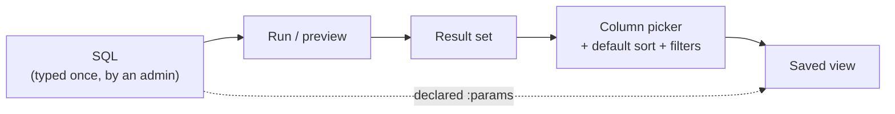
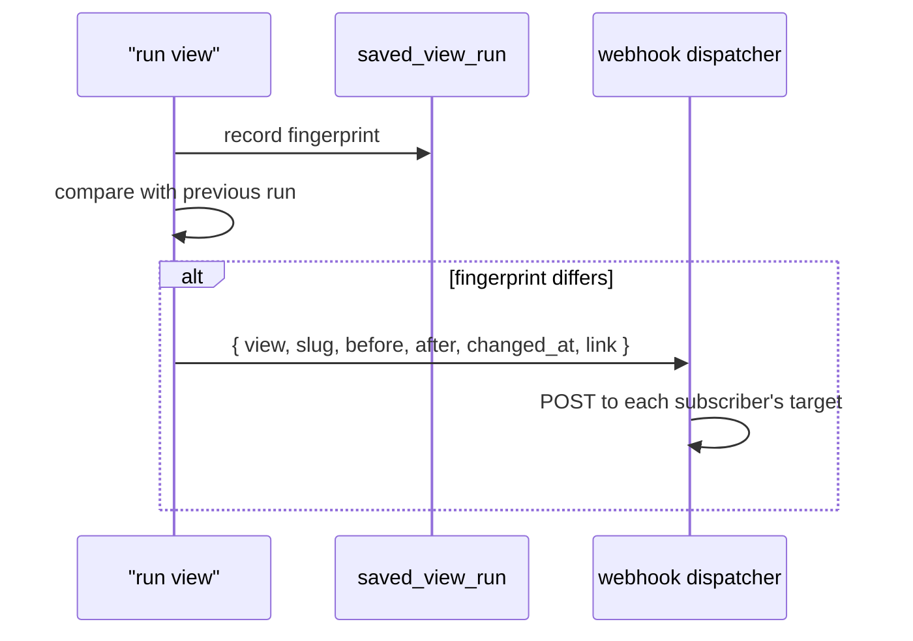

# View Builder — Implementation Plan

**Status:** DRAFT — for review · **Created:** 2026-09-18 · **Revision:** 1

| | |
|---|---|
| **Purpose** | Define what the View Builder is, what it may run, where a view is stored, and how it is built |
| **Scope** | `Administration › View builder` (`/admin/views`), the `/api/views` surface, and the storage of a saved view. **Not** the webhook transport — that is yours |
| **Grounded in** | [`docs/ideas/view-builder.md`](../ideas/view-builder.md), the 36 tables / 24 views in [`00-schema.sql`](../../data/sql/turso/00-schema.sql), the measured probes in §4 and §5 of this document, and the read-only posture in [`server/src/config/env.ts`](../../server/src/config/env.ts) |
| **Depends on** | A Vite dev proxy for `/api` → `127.0.0.1:5181` (§10.6). The builder cannot reach the API from the browser without it |
| **Supersedes** | — |

---

## 1. The answer in one line

**A saved view is a trusted SQL statement plus a declared parameter list and a display
configuration — not a drag-and-drop query generator.**

The note asks for "a user-friendly interface for selecting the columns and rows", but its own worked
example (*FIRST FUNDINGS ONLY*) is a first-row-per-group query that no column-and-row picker can
produce. §2 resolves that; §3 shows the example is also subtly ill-defined against this schema, which
means it is exactly the kind of view that needs a builder rather than a form.

---

## 2. Two different products are hiding in the note

The note contains a specification and an example, and they describe different tools.

| | **A — SQL-backed view** | **B — Picker-backed view** |
|---|---|---|
| You supply | the query | a table, some ticked columns, some conditions |
| Can express | *FIRST FUNDINGS ONLY* | *"open POs over 50k, sorted by vendor"* |
| Needs | a safe way to run typed SQL (§5) | a query generator |
| Failure mode | a wrong query gives a wrong answer | a needed question has no form that expresses it |
| In the note | the worked example | the prose *"selecting the columns and rows"* |

**Recommendation: A is the product, and it absorbs B.** The column and row pickers apply to the
**result** of the query, not to its construction:



That reading loses nothing from the note and gains the example. A picker cannot build *"the first
period each combination was funded"*, and building a picker good enough to try would be a
query-planner UI — a much larger project than the one being asked for.

**What this costs:** someone has to write SQL. §15 asks who.

---

## 3. What *FIRST FUNDINGS ONLY* actually requires

### 3.1 The example and its sample query are not the same query

| | The example table | The sample query |
|---|---|---|
| Grain | one row per **code combination** | one row, for **one** combination |
| Inputs | none | **seven** bind parameters (`:s1`…`:s7`) |
| Says | "when *each* combination was first funded" | "when *this* combination was first funded" |

So the sample query is the *inner* half of the example, run once per combination. The example needs
`PARTITION BY CODE_COMBINATION_ID` — which is precisely the piece a saved view should carry, and
precisely the piece the note's prose half would have had to re-express as a form.

### 3.2 Trap 1 — the authoritative date is not in `GL_BALANCES`

The sample query derives "first funded" from `GL_BALANCES.PERIOD_NAME`. This codebase already
documents that the authoritative funding date lives somewhere else. From
[`routes/funding.ts`](../../server/src/routes/funding.ts):

> `DEFAULT_EFFECTIVE_DATE` — *"The action date — the Budget Obligation or Entry date. This is the
> authoritative answer to 'when was this funded?', and it is the one date `GL_BALANCES` does not
> keep."*

`GL_BALANCES` gives the first funded **period**. `GL_JE_HEADERS.DEFAULT_EFFECTIVE_DATE` gives the
funding **date**. They are different questions, and the view's title picks one while the query answers
the other. **The builder cannot fix that, but it can stop hiding it** — §10.3 makes the column comment
visible next to the query.

### 3.3 Trap 2 — the schema says this question is ambiguous by design

Also from [`00-schema.sql`](../../data/sql/turso/00-schema.sql), on `GL_BUDGET_VERSIONS`:

> *"NOTE the grain inversion that matters for 'when was this first funded?': a budget version spans a
> **budget type**; funding is per **code combination**. The version's first period is NOT necessarily
> the code's first funded period."*

The sample query returns `version_first_period` alongside `first_allocation_period`, which is the
honest thing to do — and the reason two people could build this view and disagree about the answer
while both being right.

### 3.4 Trap 3 — against the sample, the answer is decorative

Per [`turso-sample-db-plan.md`](./turso-sample-db-plan.md) §5.3, the budget side is *"the only
hand-authored numbers"* in the sample. So a first-funding view pointed at the sample proves the
**plumbing**, not the answer. The builder's preview must not let that read as a business result —
same discipline as the ×1.0 budget caveat, and the same reason `Pending.tsx` names its reason.

---

## 4. Dialect: your own sample query does not run

Measured, not assumed. Both probes ran against a **copy** of `data/sql/turso/sample.db`:

```
PASS  Q4 Oracle FETCH FIRST        err  near "FETCH": syntax error
```

So the note's sample query fails as written, at its last clause. This is the repo's own documented
position ([`turso-sample-db-plan.md`](./turso-sample-db-plan.md) §3.3, §3.4) — and that document
already flags that `FETCH FIRST` **contradicts `data/sql/README.md`**, which mandates a `ROWNUM` wrap
for top-N because Oracle 11g (still common on EBS) lacks `FETCH FIRST`:

> *"That policy is correct for the Oracle files and wrong for the Turso copies … (Note this also means
> the `FETCH FIRST 1 ROW ONLY` used in `report-findings.md` §11.6/§11.7 contradicts the README's own
> policy; flagged as a separate open item, not fixed here.)"*

That open item is `data/reports/report-findings.md`, and the idea note's sample query takes the same
losing side as the report does. That contradiction is not a View Builder problem, but the View Builder
is where it becomes visible to a person, so:

| Construct | Status here | Named fix the builder should show |
|---|---|---|
| `FETCH FIRST n ROWS ONLY` | ❌ syntax error | `LIMIT n` |
| `ROWNUM` | ❌ `no such column` | subquery + `LIMIT`; a scalar `rownum()` returns 1 for **every** row |
| `CONNECT BY` | ❌ parse error | recursive CTE |
| `(+)` outer join | ❌ parse error | `LEFT JOIN` |
| `MERGE` | ❌ syntax error | `INSERT … ON CONFLICT DO UPDATE` |
| `SYS_CONTEXT(…)` | ❌ no such function | substitute the literal |
| `TRUNC(SYSDATE)` | ⚠️ **silently returns NULL** | the date-aware shim, or `date('now')` |
| `NVL`, `DECODE`, `TO_CHAR`, `LPAD`, `dual`, `SYSDATE` | ✅ shimmed | nothing — but see below |

**The shims only exist inside `scripts/turso-run.mjs`.** They are registered in *client* code, so the
same SQL that works through that script fails through the API and fails in the Turso dashboard. Two
consequences the plan must honour:

1. **The builder must not advertise compat mode.** Its dialect is portable SQLite. A user who learns
   `NVL` here has learned something that works in exactly one place.
2. **`TRUNC(SYSDATE)` is the one that matters**, because it fails *silently* — it is arithmetic
   `TRUNC`, not a date function, so `date(TRUNC(SYSDATE))` yields NULL with no error. The builder
   should lint for it specifically, since a NULL date in a first-funding view looks like "not funded".

**Recommendation: report the error verbatim, name the fix, and never rewrite silently.** An automatic
`FETCH FIRST` → `LIMIT` rewrite is *usually* right and occasionally changes the answer (it interacts
with ordering), and a silent rewrite that produces a plausible number is the failure mode this whole
project exists to avoid. Offer an explicit "convert" action that shows the diff.

---

## 5. Running SQL that a person typed — the security design

This is the part that decides whether the feature ships. Two probes were run to replace the guesses.
Results first, design second.

### 5.1 Measured behaviour

| # | What was tested | Result |
|---|---|---|
| C1 | `SELECT 1` (control, must pass) | ✅ 1 row |
| C2 | `SELECT FROM WHERE ((` (control, must fail) | ✅ `near "FROM": syntax error` |
| M1 | `prepare()` on `SELECT 1 AS a; DROP TABLE GL_LOOKUPS` | ⚠️ returned the SELECT, **tables unchanged at 36** — the second statement was silently discarded |
| M2 | `prepare('DROP TABLE PO_AGENTS').run()` | ❌ **compiles and runs** — stopped only by a foreign key |
| M3 | `exec()` on `SELECT 1 AS a; DROP TABLE PO_LINE_TYPES` | 🔴 **both statements ran — tables 36 → 35** |
| G1 | `query_only=ON`, then a `SELECT` | ✅ 31 rows |
| G2 | `query_only=ON`, then `CREATE TABLE` | ✅ `attempt to write a readonly database` |
| G3 | `query_only=ON`, then `CREATE TEMP TABLE` | ✅ blocked (better than assumed) |
| G4 | `query_only=ON`, then `ATTACH DATABASE ':memory:' AS side` | 🔴 **succeeded — the pragma does not cover this** |
| W2 | wrapping a statement with a trailing `;` in `SELECT * FROM (…) LIMIT n` | ❌ `near ";": syntax error` |
| W5 | wrapping a statement whose last line ends in `-- why` | ❌ `incomplete input` — the appended `) LIMIT n` lands inside the comment |
| W6 | same, with a newline before the appended clause | ✅ works |
| Q2 | `WITH … SELECT` nested inside a subquery | ✅ parses — the row-cap strategy is sound |

The two controls behaved correctly, so the passes above mean something.

### 5.2 The guards, in order of how much they actually hold

| Layer | What it is | Honest strength |
|---|---|---|
| **1. The token** | Point the API at a **read-only scoped Turso token** for the query path | **The only layer that cannot be bypassed.** Needs confirming in the Turso dashboard — open item §15.6 |
| **2. `prepare()`, never `exec()`** | `exec()` runs smuggled statements (M3); `prepare()` compiles only the first (M1) | Strong, and free |
| **3. Statement allowlist** | Single statement; first token ∈ `{SELECT, WITH}`; deny `ATTACH`, `DETACH`, `PRAGMA`, `load_extension`, and every write verb | **Required.** M2 proves the driver does not refuse writes. Must scan *outside* string literals and comments, or a literal containing `DROP` false-positives |
| **4. `PRAGMA query_only = ON`** | Blocks table **and** temp writes (G2, G3) | Real in local mode. **Does not cover `ATTACH` (G4).** Over remote HTTP there is no session-affinity guarantee, so a pragma set in one call may not apply to the next — treat it as local-only |
| **5. Reject `;` outright** | M1 shows the second statement is dropped **without an error** | Not a security guard — a *UX* guard. Silently discarding half of what someone typed is its own bug |

### 5.3 Resource caps, because this repo has the scar

The lesson recorded from the earlier two-sided-join incident: an unindexed join on a function of both
sides never returned, produced no error, and the process died without writing anything. A text box
that accepts arbitrary SQL is a machine for producing that.

| Cap | Mechanism | Note |
|---|---|---|
| Row cap | Wrap as `SELECT * FROM (user_sql\n) LIMIT n+1` — the trailing **newline is mandatory** (W5/W6), and a trailing `;` must be stripped first (W2) | Fetching `n+1` is how truncation is *detected* rather than assumed |
| Statement timeout | `Promise.race` against the `execute()`, then abandon | **Attach `.catch(() => {})` to the abandoned promise immediately** — a late rejection becomes an unhandled exception that can kill the process |
| Response cap | Hard ceiling on rows and bytes in the JSON body | Protects the browser, not the database |
| No `COUNT` before `SELECT` | — | A count doubles the cost of every preview |

**Note the row cap is not a performance cap.** SQLite still materialises the inner result before the
outer `LIMIT` is applied, so a cross join is slow regardless. The timeout is the only thing standing
between a user and a hung API, which is why it is in phase 1 rather than "later".

### 5.4 The posture, stated plainly

> **⚠ SUPERSEDED (dated).** The two sentences below were true when this was written. Authentication
> has since landed (`POST /api/auth/sign-in`, `GET /api/auth/session`, the `x-app-session` header,
> `server/src/auth/guard.ts`), and the `users` table is `app_user`. **The posture conclusion is
> unchanged, and that is the point worth keeping**: sessions exist, but **no route under
> `/api/views` asks for one**, so the run endpoint is still unauthenticated in fact. "No auth
> middleware exists" is still literally true — admission is a function each handler calls, so a
> route that never asks about identity never pays for the lookup. The recommendations below are
> unaffected and still correct.

**This server has no authentication.** Verified: no auth middleware exists, and
[`http/docs.ts`](../../server/src/http/docs.ts) already carries the comment *"the (absent, for now)
auth"*. There is also no `users` table (§6.1).

So the honest description of the run endpoint is **"admin-only by intent, unauthenticated in fact"** —
and a View Builder multiplies that. A view is a **data-exposure object**: sharing one shares whatever
it reads, and there is no row-level security anywhere in this stack.

Recommendations, all cheap:

- Keep `HOST=127.0.0.1` (the default) for now.
- Do not expose `/api/views/{id}/run` on a public origin until auth lands.
- Put the capability behind an explicit `VIEW_BUILDER_ENABLED` env gate defaulting to **off**, in the
  same spirit as `ALLOW_REMOTE_WRITES` — *"the choice to build CRUD does not imply the right to mutate
  a networked database on the strength of a typo."*
- Log every executed statement with its view id and duration.

---

## 6. Where a view lives

### 6.1 The facts that decide it

| Fact | Evidence |
|---|---|
| **No app-domain table exists.** The database holds Oracle objects only | `00-schema.sql` creates 36 tables + 24 views, all Oracle-shaped. `users`, `projects`, `portfolios` from [tracker plan](./oracle-project-tracker-plan.md) §7.4 are **proposed, not created** |
| **Remote writes are off by default** | `env.ts` — `allowWrites: bool('ALLOW_REMOTE_WRITES', false)` for turso, `true` for local |
| **The app's only persistence today is `localStorage`** | Rail expansion, theme, panel width — and nothing else. No app-owned record is stored anywhere |
| **The note wants subscriptions and notifications** | §"View Notifications" — and the webhook must be fired by *something*, which has to know the subscribers |

### 6.2 Recommendation: a real table, added additively

Views go in the database, in a **new** file `data/sql/turso/01-app.sql` — never edited into
`00-schema.sql`, which is the Oracle schema and is not to be modified.

```sql
-- 01-app.sql — the app's own tables. Separate from 00-schema.sql, which mirrors Oracle.
-- Naming is lower_snake_case to match the app domain proposed in tracker plan §7.4,
-- and to keep "this is ours, not Oracle's" visible in every query.
CREATE TABLE IF NOT EXISTS saved_view (
  id            TEXT PRIMARY KEY,
  slug          TEXT NOT NULL UNIQUE,        -- stable URL segment: /admin/views/first-fundings
  title         TEXT NOT NULL,
  description   TEXT,
  sql           TEXT NOT NULL,               -- ONE statement. Trusted, admin-authored.
  params_json   TEXT NOT NULL DEFAULT '[]',  -- declared binds: :s1 …  (§7.2)
  display_json  TEXT NOT NULL DEFAULT '{}',  -- column order + formats + default filters (§7.3)
  created_by    TEXT NOT NULL,               -- a free-text label until users exists (§6.3)
  status        TEXT NOT NULL DEFAULT 'draft'
                  CHECK (status IN ('draft','active','disabled')),
  created_at    TEXT NOT NULL,
  updated_at    TEXT NOT NULL
);

-- One row per change detected, so "was I already told?" has an answer.
CREATE TABLE IF NOT EXISTS saved_view_run (
  id           TEXT PRIMARY KEY,
  view_id      TEXT NOT NULL REFERENCES saved_view (id) ON DELETE CASCADE,
  ran_at       TEXT NOT NULL,
  duration_ms  INTEGER NOT NULL,
  row_count    INTEGER,
  fingerprint  TEXT,                          -- §8.2
  error        TEXT
);

CREATE TABLE IF NOT EXISTS saved_view_subscription (
  id           TEXT PRIMARY KEY,
  view_id      TEXT NOT NULL REFERENCES saved_view (id) ON DELETE CASCADE,
  subscriber   TEXT NOT NULL,                 -- free-text label until users exists
  channel      TEXT NOT NULL CHECK (channel IN ('in_app','webhook')),
  target       TEXT,                          -- the webhook URL; NULL for in_app
  created_at   TEXT NOT NULL
);
```

### 6.3 The identity problem, stated rather than papered over

There is no `users` table and no auth, so `created_by` and `subscriber` are **free-text labels**.
That means:

- A view is **global to the app**. Anyone can see and edit any view. This is a decision, not an
  accident — §15.2 asks whether it is the right one.
- Whoever typed the label is a claim, not a fact. The UI must not render it as identity ("Created by
  Anna" reads as a person; "Created by anna@wcpss" reads as a claim).
- When §7.4's `users` lands, these two columns become FKs and the label becomes a migration input.

### 6.4 Rejected alternatives

| Option | Why not |
|---|---|
| `localStorage` | Cannot deliver subscriptions — the webhook has no subscriber list. Fine for an **unsaved draft** so work survives a reload, which is worth doing |
| A JSON file in the repo | Not writable at runtime, and putting query text in git is a different review conversation |
| A Turso **view** per saved view (`CREATE VIEW`) | Requires DDL at runtime, which defeats the whole read-only posture in §5. And DDL cannot be parameterised, so a "view" with `:params` is impossible |

---

## 7. What a view *is*

### 7.1 Four things, and one of them is trusted

| Part | Content | Trust |
|---|---|---|
| **`sql`** | One `SELECT`/`WITH` statement | **Trusted.** The only reason this feature is safe at all |
| **`params_json`** | Declared binds: name, type, label, default | Validated; compiled to binds server-side |
| **`display_json`** | Column order, hidden columns, formats, default sort, default filters | Validated against the result's actual columns |
| **`title` / `slug` / `description`** | — | Validated |

### 7.2 Parameters are what make a view reusable

The note's sample query has seven parameters (`:s1`…`:s7`) — that is the shape to promote from an
ad-hoc query into a saved view:

```json
[
  { "name": "s1", "label": "Fund",      "type": "text",    "default": null },
  { "name": "s2", "label": "Purpose",   "type": "text",    "default": null },
  { "name": "s5", "label": "Level",     "type": "text",    "default": null, "from": "cost_center.level_code" }
]
```

libSQL binds `:name` natively, so a declared parameter maps to a bind with no interpolation. Three
validation rules that must produce errors rather than guesses:

- A `:token` present in the SQL but not declared → **400**, naming the token.
- A declared parameter absent from the SQL → a **warning**, not an error (it is often left declared
  between edits).
- A parameter with no default and no value → **400 before the query runs**, because the alternative
  is SQLite binding NULL and returning a plausibly empty result.

The optional `from` is worth having: a parameter can be offered as a picker over an existing endpoint
(`cost_center.level_code`), which is how a view becomes something a non-author can use.

### 7.3 Display config, and what happens when the columns change

`display_json` is keyed by the **column names the query returned**:

```json
{
  "columns": [
    { "key": "first_allocation_period", "label": "First funded period", "format": "text" },
    { "key": "net_amount", "label": "Funding amount", "format": "money" },
    { "key": "budget_name", "label": "Budget", "format": "text" }
  ],
  "hidden": ["budget_type_id", "period_num"],
  "sort": { "key": "first_allocation_period", "dir": "asc" }
}
```

**The rule for drift: a saved view must survive its own query changing.** If the SQL is edited and a
column disappears, the view renders the columns that *do* exist and shows a named notice —
*"`net_amount` is hidden because the query no longer returns it"* — rather than rendering an empty
table. This is the `Pending.tsx` principle applied to a column, and it is the difference between a
view that degrades and a view that looks broken.

Formats map onto the existing helpers in `app/src/data/format.ts` — no new formatter. The relevant
ones: `money` / `money0` (dollars, with and without cents), `num`, `pct` / `pctSlim`, `share`,
`isoDay`, `monthLabel` / `monthLong`, `pluralise`. Note there is **one direction of coercion** in that
file that a view must not fight: every numeric helper does `Number(n) || 0`, so a NULL amount renders
as `$0.00` rather than as blank. For a first-funding view that is the difference between "funded zero"
and "no funding row", so the default format for a nullable money column should be `text`, not `money`,
unless the author chooses otherwise.

---

## 8. Subscriptions and notifications

### 8.1 The hard part is not the webhook, it is "changed"

There is **no event source**. Nothing in this repo diffs two extract runs, and nothing observes a
table changing. So *"notify me when the view is updated"* currently has no referent. Options:

| Definition of "changed" | Works today? | Verdict |
|---|---|---|
| The extract run was published | There is no publish step to hook | Blocked on the extract pipeline |
| The view's **result fingerprint** differs from its last recorded run | ✅ Yes | **Recommended** |
| A row was inserted into the underlying tables | No trigger infrastructure | No |

### 8.2 Fingerprint

**fingerprint = a hash of (row count, and the first N values of a declared key column, in order).**
The key column is declared in `display_json` (`"fingerprint": { "key": "combination_key" }`) because
only the author knows what makes a row of *this* view distinct.

Two properties that make this the right primitive:

- It detects a change **without needing to know why** — so it works against the pipeline as it exists.
- It is cheap: one extra column projection, hashed in JS, no second query.

**It does not detect a change that preserves both the count and the key order.** The view must say so
on its subscription panel (*"notifies on row count or key-order changes"*), because a silent blind
spot in a notification feature is worse than a missing feature.

### 8.3 The shape I would build to, leaving the transport to you



Payload: **identifiers and a link, never the result set.** The rows may be large, and a webhook
endpoint is a second copy of the data with none of this app's access rules.

Delivery concerns to hand over with it: retries with backoff, one row per attempt (so a failing
subscriber is diagnosable), and a hard cap per run — an in-process dispatcher that retries forever is
how a webhook target takes down the API.

---

## 9. API surface

Following the repo's convention: `registerViewBuilder(api)` for the table-shaped part, plus a
`viewsRouter()` if the run path needs to sit outside the resource descriptor.

| Method | Path | `operationId` | Notes |
|---|---|---|---|
| `GET` | `/api/views` | `views_list` | Standard list envelope; `?q=`, `?status=` |
| `GET` | `/api/views/{id}` | `views_detail` | |
| `POST` | `/api/views` | `views_create` | Validates SQL against the §5 allowlist **before** storing |
| `PATCH` | `/api/views/{id}` | `views_update` | Same validation |
| `DELETE` | `/api/views/{id}` | `views_delete` | |
| **`POST`** | `/api/views/preview` | `views_preview` | Runs SQL **without saving**. This is the "preview" the note asks for |
| `POST` | `/api/views/{id}/run` | `views_run` | Runs a saved view with supplied parameter values; records `saved_view_run` |
| `GET` | `/api/views/{id}/runs` | `views_runs` | Run history + fingerprints |
| `GET`/`POST`/`DELETE` | `/api/views/{id}/subscriptions` | `views_subscriptions*` | |

**Three deliberate choices:**

- **`preview` is a `POST`, not a `GET` with `?sql=`.** SQL in a query string ends up in access logs,
  proxy logs and browser history; a body does not.
- **Validation happens on write, not on run.** Storing SQL that could never execute makes every later
  failure look like a database problem rather than a bad save.
- **`preview` and `run` are separate.** Preview must be callable on a `draft` view that may never be
  saved — otherwise "try it and see" costs a save.

---

## 10. The screen — `Administration › View builder`

### 10.1 Layout

```
┌─ page head ─────────────────────────────────────────────┐
│ View builder                          [ New view ]      │
│ Write a query, choose the columns, save it as a view.   │
├─ left: definition ───────────┬─ right: result ──────────┤
│ Title / slug / description   │ ▸ Error pane (verbatim)  │
│ ┌──────────────────────────┐ │   + named dialect fix    │
│ │ SELECT …  (textarea)     │ │ ┌──────────────────────┐ │
│ └──────────────────────────┘ │ │ result grid          │ │
│ ▸ Parameters                 │ │ (column picker on    │ │
│ ▸ Display                    │ │  the header row)     │ │
│ [Run] [Save] [Subscribe]     │ └──────────────────────┘ │
│                              │ showing 200 of 4,812     │
└──────────────────────────────┴──────────────────────────┘
```

### 10.2 Why a plain `<textarea>`

`app/package.json` has **three** runtime dependencies: `react`, `react-dom`, `react-router-dom`. A
code editor is 2 MB+ (Monaco) or a new dependency tree (CodeMirror 6). For a field that holds one SQL
statement, a monospace `<textarea>` with a tab key that inserts two spaces and a line-number gutter
is the proportionate choice. Revisit only if the editor becomes the main thing people use.

### 10.3 The error pane is a feature, not a message

It shows the driver's message **verbatim**, plus — when a known Oracle construct is recognised — the
named fix from the §4 table. Verbatim matters: `near "FETCH": syntax error` tells an Oracle developer
exactly what to look for, whereas "invalid query" sends them to the wrong place.

It should also surface the schema's own commentary where it applies. The `GL_BUDGET_VERSIONS` note in
§3.3 and the `DEFAULT_EFFECTIVE_DATE` note in §3.2 are the two that matter for the example view, and
both already exist as descriptions in `server/src/schemas/` — reuse them rather than restating them.

### 10.4 Reuse, don't reinvent

The page composes from classes that already exist, from three different stylesheets — which is worth
knowing before writing any CSS, because none of them are in `panel.css`:

| Class | Lives in |
|---|---|
| `.panel`, `.panel__head` | `app/src/styles/projects.css` |
| `.panel__body` | `app/src/styles/dashboard.css` |
| `.page-head`, `.accent-rule`, `.stack` | `app/src/styles/shell.css` |

**Only two things need new CSS**: the editor (a monospace font stack and a resize handle) and the
column picker. Everything else is composition, so a panel-composed page can be built before its own
stylesheet exists — which is the right order, since the layout is the part that should be settled by
looking at it.

### 10.5 Honest states

| State | What it says |
|---|---|
| No query yet | "Nothing to preview" + a link to the five ported queries in `data/sql/turso/queries/` as starting points |
| Truncated | *"Showing 200 of 4,812 — the preview is capped; the view is not"* |
| Never run | *"Not run yet"*, never `0 rows` |
| Error | Verbatim message + named fix |
| Column drifted | §7.3 |
| Subscribed | *"Notifies on row count or key-order changes"* — §8.2, not "notifies on any change" |

That last row is the same discipline as `Pending.tsx` naming its reason and the rail rendering `—`
rather than `0` for a count that has not loaded.

### 10.6 Prerequisite: the browser cannot reach the API

`app/vite.config.ts` declares no proxy, and the app fetches only `/oracle/output.json`. Without a
dev proxy, `/api/views/preview` from the browser hits the Vite server and 404s:

```ts
server: {
  port: 5180,
  strictPort: true,
  proxy: { '/api': { target: 'http://127.0.0.1:5181', changeOrigin: false } },
},
```

This is the same missing wire [Priority 3 of the API work] already carries for
`app/src/data/extract.ts`. **The View Builder is the second consumer, and the proxy is a hard
dependency of phase 1** — a builder with no API is a text box with no Run button.

---

## 11. Menu wiring

One leaf in the `admin` block of [`app/src/nav/menu.ts`](../../app/src/nav/menu.ts):

```ts
{
  label: 'View builder',
  to: '/admin/views',
  reads: 'app-side, plus whatever its queries read',
  built: false,                       // → true when the screen lands
  note:
    'Saved queries with a declared parameter list and a chosen set of columns. The ' +
    'SQL is authored, not generated — the schema has no form that can express the ' +
    'first-funding question. Reads whatever it is pointed at, which is why the ' +
    'capability is gated.',
  plan: 'docs/plans/view-builder.md',
},
```

The `Leaf` type carries `label`, `to`, `reads`, `built`, `note` and `plan` — there is no `api` field,
and no `id`; the path is the identity.

Two notes on wiring:

- `App.tsx` generates a route per `ALL_LEAVES` entry, so **no route needs adding** — registering the
  screen in the `SCREENS` map is the whole wiring. Until then the leaf resolves to `Pending.tsx`
  automatically, so the leaf can be added before the screen exists and will behave correctly.
- The two directions of drift are **not** symmetric, and only one is guarded. A `SCREENS` key with no
  matching leaf logs a `console.warn` in dev (`App.tsx`, the `import.meta.env.DEV` block) because
  such a screen would exist and be unreachable with nothing failing. A **leaf with no screen** is
  silent — it renders `Pending` and looks intentional. That asymmetry is the reason the leaf's
  `built` flag and the `SCREENS` map have to be changed in the same commit.
- The leaf currently under `/admin/combinations` says *"Nothing writes to it yet — which is also why
  the combination search page opens read-only."* View Builder becomes the **first thing that writes
  app-side**, so that sentence stops describing the app. Reword it in the same change.

---

## 12. Phasing

Each phase is independently useful, and phase 1 cannot corrupt anything.

| Phase | Delivers | Writes? | Gate |
|---|---|---|---|
| **1 — Run and preview** | The screen, the editor, `POST /api/views/preview`, all §5 guards, the dialect table, the result grid, the Vite proxy | **No** | Nothing persisted; `VIEW_BUILDER_ENABLED=0` by default |
| **2 — Save and share** | `01-app.sql`, `/api/views` CRUD, display config, `run` + run history, the browser-draft resilience | Yes, app-side only | `ALLOW_REMOTE_WRITES=1` reviewed |
| **3 — Subscribe** | `saved_view_subscription`, fingerprint on each run, the change comparison, the in-app notice | Yes | §15.5 answered |
| **4 — Webhook** | The dispatcher, retries, delivery log | Yes | Yours |
| **5 — Auth** | `users`, roles, `created_by` as an FK | — | Tracker plan §7.4 |

**Phase 1 is the demo.** It proves the dialect story, the guard set and the value of the feature
without creating the first app-owned table or the first write endpoint — which is a large reduction in
what can go wrong while the shape is still being agreed.

---

## 13. Verification gates

The builder is a feature whose failure modes are *silent wrong answers* and *hangs*, so the gates are
about behaviour under bad input. Same shape as the other smoke sections, and every gate needs a
control that must fail.

| # | Gate | Expected |
|---|---|---|
| V1 | `SELECT 1` preview | 200, one row |
| V2 | **Control:** `SELECT FROM WHERE ((` | 400 with the verbatim driver message — *not* 500 |
| V3 | `FETCH FIRST 1 ROW ONLY` | 400 + the named fix `LIMIT n` |
| V4 | `TRUNC(SYSDATE)` in the SQL | The lint fires (§4) — this is the silent one |
| V5 | `SELECT 1; DROP TABLE PO_LINE_TYPES` | **400 naming the `;`** — not a silent truncation to the first statement (M1) |
| V6 | `ATTACH DATABASE ':memory:' AS x` | **400** — the allowlist catches what `query_only` does not (G4) |
| V7 | `INSERT INTO …` | 400, and the table's row count is unchanged afterwards |
| V8 | A statement ending in `-- comment` | Runs (W6) — proves the newline is inserted |
| V9 | A statement with a trailing `;` | Runs (W2) — proves the strip happens before the wrap |
| V10 | An unbounded `SELECT * FROM GL_BALANCES` | Capped, reports truncation, and returns in bounded time |
| V11 | The §5.3 pathological join | Times out with a clear error, and **the process is still alive** |
| V12 | `query_only=ON`, then a write attempt in local mode | `attempt to write a readonly database` (G2) |
| V13 | A view whose declared column the query no longer returns | Renders, with the named notice (§7.3) |
| V14 | Undeclared `:token` | 400 naming the token |

V2, V5, V6 and V7 are the ones worth arguing about, because each one is a specific measured failure
this plan exists to prevent.

---

## 14. Risks

| Risk | Severity | Mitigation |
|---|---|---|
| An unauthenticated endpoint that runs typed SQL | **High** | §5.4: env gate default-off, `127.0.0.1`, read-only token, no public origin |
| A query that never returns | **High** | §5.3 timeout + `.catch(() => {})` on the abandoned promise; V10/V11 |
| `ATTACH` bypasses `query_only` | Medium | Allowlist deny-list (V6). Measured, not theoretical |
| A view shared by accident exposes data | Medium | §5.4 — no RLS exists; the UI must say a view is a read lens |
| A silent `TRUNC(SYSDATE)` NULL reads as "not funded" | Medium | §4 lint (V4) |
| First-funding numbers from the sample read as real | Medium | §3.4 caveat surfaced in the preview |
| Views accumulate and become an unaudited query surface | Medium | `saved_view_run` history; a `status` of `disabled` is enforced at run |
| The fingerprint misses a change | Low | §8.2 — stated in the UI rather than hidden |

---

## 15. Decisions I need from you

1. **Who writes the SQL?** Admin only, or any staff member? This is the single biggest determinant of
   how much of §5 is defence-in-depth versus load-bearing. My recommendation: **admin only, phase 1**.
2. **Is a view global or personal?** With no `users` table there is no third option that is honest.
   Recommendation: **global** now, FK later (§6.3) — but say so in the UI.
3. **Which objects may a view read?** All 60, or an allowlist of the reporting views (`V_*`) plus the
   staging tables? An allowlist makes the feature safer and narrower. Recommendation: **start with all
   60** (the same reach the rest of the API already has), and revisit if views get shared.
4. **Is *FIRST FUNDINGS ONLY* per combination (the example) or per budget version (the sample
   query)?** §3.1 and §3.3 show these are different answers, and both are defensible.
5. **What does "the view is updated" mean for a subscription** — a fingerprint change on the next run
   (§8.2), or the extract publishing a new run? The first works today.
6. **Can the remote token be made read-only?** §5.2 layer 1 is the only guard that cannot be bypassed,
   and it is the one thing I cannot verify from here.
7. **`display_json` column drift** — prefer a notice (§7.3), or refuse to render until fixed?
   Recommendation: notice.
8. **Does the report's `FETCH FIRST` usage need settling first?** §4 shows two documents in this repo
   disagree. The View Builder is where that gets noticed, not where it gets fixed.

---

## 16. Out of scope

- **A visual query generator.** No drag-and-drop tables, no join diagram (§2).
- **Silent Oracle→SQLite rewriting.** Reporting the fix is in scope; applying it is not (§4).
- **Writing back to Oracle.** The builder reads.
- **Row-level security.** A view shows what its SQL selects, to anyone who can open the view.
- **Scheduled email.** That is the webhook's job (§8.3 hands it over).
- **Views over views** (a saved view referencing another). Cheap to add later, and it makes
  invalidation a graph problem now.
- **Editing `00-schema.sql`.** The app tables go in a new file (§6.2).
- **Registering a view as a Turso `CREATE VIEW`.** §6.4.

---

## 17. Deliverables and build order

Phase 1 first; phases 2–4 add to the same files.

| # | File | Change |
|---|---|---|
| 1 | `server/src/db/query-guard.ts` | **New.** The §5.2 allowlist + §5.3 caps. Pure functions, unit-testable, no DB |
| 2 | `server/src/routes/views.ts` | **New.** `registerViewBuilder(api)` — preview first, then CRUD |
| 3 | `server/src/schemas/views.ts` | **New.** Zod shapes, including the declared-parameter shape |
| 4 | `server/src/config/env.ts` | Add `VIEW_BUILDER_ENABLED` (default **false**) and the row-cap/timeout knobs |
| 5 | `server/src/routes/index.ts` | Register the router. `meta.ts` is the precedent for the `xxxRouter()` style that the run path needs; a table-shaped `/api/views` would use `registerXxx(api)` |
| 6 | `server/src/scripts/smoke.ts` | A View Builder section: V1–V14 |
| 7 | `app/vite.config.ts` | The `/api` proxy — **prerequisite, do first** (§10.6) |
| 8 | `app/src/routes/ViewBuilder.tsx` | **New.** The screen (§10) |
| 9 | `app/src/styles/viewbuilder.css` | **New.** Editor + column picker only (§10.4). Follows the one-stylesheet-per-screen convention already set by `newproject.css` and `fundingsearch.css` |
| 10 | `app/src/App.tsx` | Add to `SCREENS` (`/admin/views`) |
| 11 | `app/src/nav/menu.ts` | The leaf (§11), `built: false` → `true` |
| 12 | `data/sql/turso/01-app.sql` | **Phase 2.** The three tables (§6.2) |
| 13 | `docs/plans/menu-groups.md` | Note that §4.2's Administration leaves are now implemented, and point at §6.2 here |
| 14 | `server/README.md` | The `views` domain, the guard, and the posture in §5.4 |

---

## 18. What I would do first

**Steps 1 and 7, in that order, before any UI exists.**

The query guard is the feature. If `FETCH FIRST` can be rejected with a useful message, if `ATTACH`
and `;` are refused, and if a runaway query times out without taking the process with it, then the
View Builder is a safe tool and the screen is ordinary work. If the guard is not right, the screen is
a liability with a nice layout — which is why §13 puts four of its gates on refusal rather than on
success.
